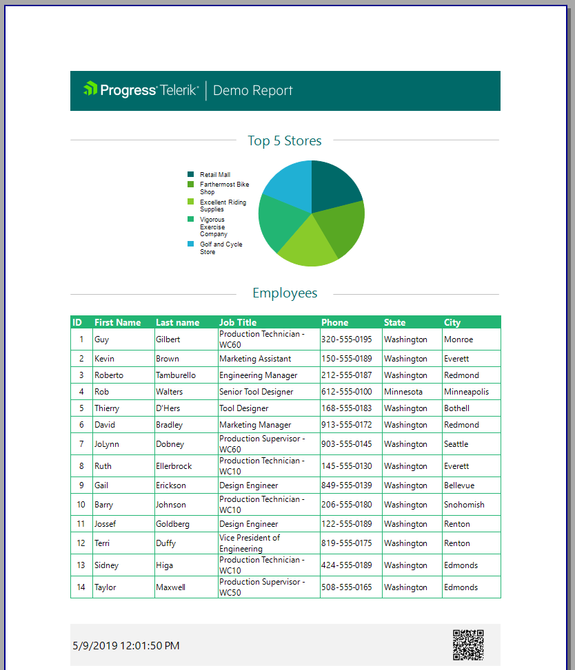

# Setting the Page Footer

This article is part of the Demo report guide on getting started with Telerik Reporting and demonstrates         how to display the current date and time as well as the [Barcode]() item.       

1. Click __pageFooterSection__  and add a Textbox which will display the current date and time.             

1. Set the __Value__  property __Expression__  to the Date and Time function               =Now().             

1. From the bar, select __Insert__  > __Barcode__  to add a Barcode item.             

1. Place the [https://docs.telerik.com/reporting/report-items-barcode-general]() link in the __Value__                field of the __Barcode__.             

1. Set the __BackgroundColor__  of the footer to 242, 242, 242.             

## Previewing the Result

Preview the result by clicking __Preview__  > __PrintPreview__.           

  

## Next Steps

* [Integrating the Report in.NET Framework Application]()

* [Parameterizing the Graph]()

* [How to Add Column Graph]()

## Previous Steps

* [First Steps]()

* [Creating the Demo Report]()

* [Setting the Page Header]()

* [Creating the Table and Populating it with Data]()

* [Creating the Graph]()

