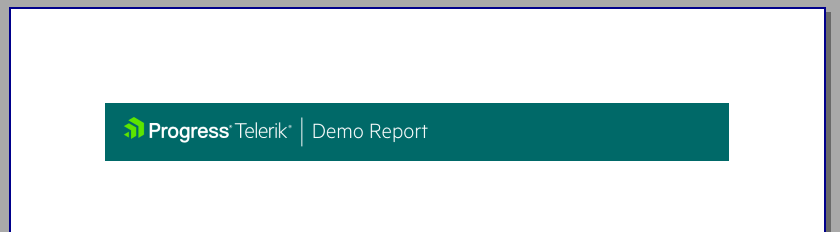

# Setting the Page Header

This article is part of the Demo report guide on getting started with Telerik Reporting and demonstrates         how to customize the page header by setting the background and adding a title and a logo.       

## Setting the Header and the Title

1. Click __pageHeaderSection__ .             

1. From the __Properties__  grid, select __Style__  > __BackgroundColor__                and set the __0, 105, 104__  color.             

1. From the bar, select __Insert__  to add the title. Click __TextBox__                to automatically place the [TextBox]() in the header.             

1. Set the __Value__  to be "Telerik". Add one more TextBox with text "Demo Report".             

1. Mark the textboxes and from the __Properties__  grid, make the following settings:             

   + __Style > Font__  should be Segoe UI.                 

   + __Style > Font Color__  set to __White__ .                 

1. Add a [Shape]() between the textboxes. Set the __ShapeType__  to be               __Vertical Line__  and the __LineColor__  property to be __White__ .             

## Adding the Logo

1. Go to __Insert__  and select [PictureBox]().             

1. Include the desired picture through the __Value__  property. If you need to adjust the size of the picture, use the __Sizing__  property.             

## Previewing the Result

Preview the result by clicking __Preview__  > __PrintPreview__ .           

  

## Next Steps

* [Creating the Table and Populating it with Data]()

* [Creating the Graph]()

* [Setting the Page Footer]()

* [Integrating the Report in .NET Framework Application]()

* [Parameterizing the Graph]()

* [How to Add Column Graph]()

## Previous Steps

* [First Steps]()

* [Creating the Demo Report]()
