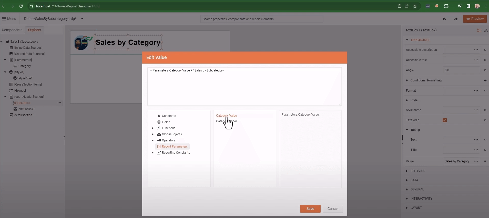
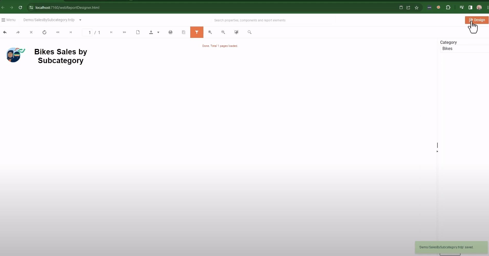
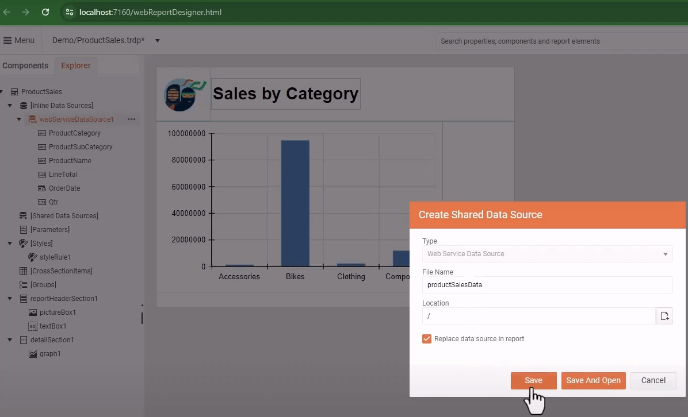
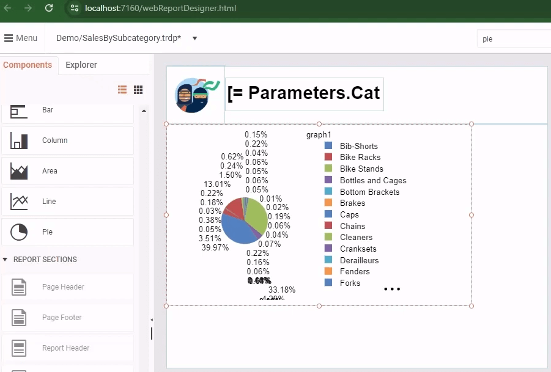
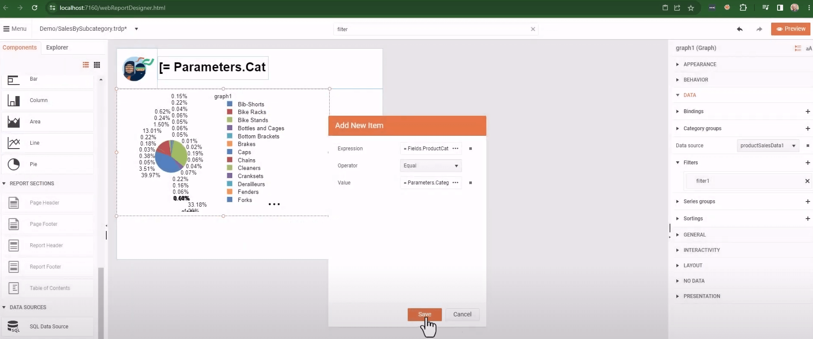

# Implement a Common Master-Detail Report Scenario

In this step-by-step tutorial, we will improve the basic report created in the previous tutorial [Embedding the Web Report Designer in .NET 8 and Creating Your First Report]() by adding a common business requirement to click a data series to show more details in a child report.

* First, we will create a second report to display the details data.
* Then, we will learn how to add a [SharedDataSource component]() to share data source between reports.
* Next, we will add and configure a [PieChart]() to the detailed report.
* Finally, we will learn how to add a [Drillthrough/Navigate To Report Action]() to the master report Column Chart.
* At the end, we will have a master report able to navigate to a child report with detailed data for the selected **Product Category**.

## Creating a Child Report

Our first goal is to create a new report within the Web Report Designer. It will serve as a child report for displaying the detailed data for the selected category from the main report we created previously:

1. Go to the main toolbar `Menu` and select `New Report`. The `Create Report` dialog opens:

	1. Let's name the report `SalesBySubcategory`.
	1. Let it be a `TRDP` report as the main one.
	1. Enter the same `Location` that is the _Demo_ subfolder.
	1. Click `Save` to apply the settings.

1. We'll remove the Page Header and Footer sections again.
1. We can add the same [Report Header]() as in the main report. We will copy it from the latter:

	1. Search for the `report header` in the Search box and add it to the child report.
	1. If necessary, increase its Height.
	1. Go to the main report and select `PictureBox` and `TextBox` from its Report Header.
	1. Open the `Context menu` by clicking on the ellipses (...) beside the selected items in the `Explorer` tab of the Menu. Select `Copy` to copy the items.

		

	1. Return to the child report, select the Report Header, and invoke its `Context menu` to `Paste` the selected items.

		

	1. Adjust the pasted items' positions, if necessary.

1. Next, we'll [add a Report Parameter]() that will receive the Category from the parent report.

	We will use the parameter to filter the data from the [WebServiceDataSource]().

	1. Search for the `report parameter` in the Search box.
	1. Select `+` to open the `Add New Item` dialog that lets you add a new parameter to the collection.
	1. Let's name the parameter `Category` and use the same for the `Text` property. The latter represents the label in the parameter's editor.
	1. We'll add the default `Value` _Bikes_ as we know this category exists.
	1. Mark the parameter as `Visible` in the user interface.
	1. Click `Save` to preserve the new parameter settings.

	

1. Let's update the report title to display the selected category available in the new Report Parameter:

	1. Select the TextBox in the Report Header.
	1. Click on the ellipses (...) beside its `Value` property in the Property editor. This opens the `Edit Value` dialog.
	1. Select the `Report Parameters` from the list on the left.
	1. Double-click on the `Category Value` from the middle list.
	1. Update the Expression by concatenating a string at the end to become `= Parameters.Category.Value + "Sales by Subcategory"`.

		

	1. `Save` and `Preview` the child report. The report should display the default category in the Report Header.

		

1. Configure the child report to reuse the DataSource from the main report:

	1. Convert the `WebServiceDataSource` from the main report to a [SharedDataSource]():

		1. Navigate to the main report.
		1. Select its WebServiceDataSource from the `Explorer` tab of the Menu.
		1. Invoke the `Context menu` by clicking on the ellipses (...) and selecting `Save As Shared Data Source`.

			

		1. In the opened `Create Shared Data Source` dialog, name the component `productSalesData` and check the `Replace data source in report` to let both reports use the SharedDataSource that is stored in the Assets manager.
		1. Click `Save` and ensure the `webServiceDataSource1` has been moved from `Inline Data Sources` to `Shared Data Sources`.

		

	1. Navigate back to the child report.

		1. Open the context menu of the `Shared Data Sources` and select `Add Existing Shared Data Source`.

			

		1. In the popped-up `Browse For Folder` dialog select `Shared Data Sources` on the left and choose the `productSalesData.sdsx` file, which is our shared data source that we just saved from the main report.

			

		1. Click `Save` and ensure the `productSalesData1` component appears under the `Shared Data Sources` of the child report.

1. Let's use the SharedDataSource to create our Pie Chart:

	1. Search for `pie` to bring up the `Configure Pie Chart` pane on the right side of the web report designer.
	1. Select the `Data Source`.
	1. Drag the `ProductSubcategory` field to the `Series` box. This way, we will create the Pie Chart slices from the Product SubCategories.

		

	1. Drag the `LineTotal` into the `Values` box. The aggregate function `Sum` is automatically applied to the field, so the Values of each Pie slice will be the sum of `LineTotal`.
	1. Click `Create` and you should see a Pie Chart that contains all the data from the DataSource.

		

	1. Since we want to see only the data for a specific category, we need to add a rule to filter the data based on the value of our report parameter.

		1. Search for `filters` and add a new filter to the Graph.
		1. Add as an Expression `=Fields.ProductCategory`.
		1. Select `Equal` as Operator.
		1. For `Value`, enter the value of the report parameter `= Parameters.Category.Value`.

			

		1. You should see an immediate update for the `Bikes` category since this is the parameter's default value.

	1. Format the Pie Chart:

		1. Hide the `Title`.
		1. Update the series by adding `DataPointLabelConnectors`:

			* Check the `DataPointLabelConnectorStyle` > `Visible` property.
			* Set `DataPointLabelOffset` to `5mm`.
			* For `DataPointLabelAlignment` use `OutsideColumn` from the dropdown.
			* Click `Save`.

		

	1. The live preview should display the updated Pie Chart in the `Design` view of the Web Report Designer.

	

1. Connect the main and the child report with the [Drillthrough Action]():

	1. Navigate to the main report.
	1. Search for `category group` in the Search box and select the `productCategoryGroup1`.
	1. In the `Edit Item` dialog go to `Action` and select `Navigate to report` from the dropdown.
	1. Set the _Report source_ `Type` to __UriReportSource__.
	1. Open the Assets manager from the icon next to `Uri` and select the `SalesBySubcategory.trdp` report from the `Demo` folder.
	1. Add a new Parameter to the `Parameters` collection of the _Report source_ with `Name` corresponding to the child report's parameter, i.e. `Category`, and `Value` being the value of the current product category field, i.e. `=Fields.ProductCategory`.
	1. Click `Save` to preserve the configuration.

	

1. Test how the reports interact:

	1. Navigate from the main report to the child report by clicking on a particular **Product Category** column in the Column Chart.
	1. Navigate back to the main report from the child report through the [Viewer's Toolbar](#toolbar) button __Navigate back in history__.

	

>note The entire process is demonstrated in the YouTube video tutorial [Getting Started with the Web Report Designer: Part 2](https://www.youtube.com/watch?v=DXKlgq-MYIU).

## See Also

* [Video tutorial 'Getting Started with the Web Report Designer: Part 2'](https://www.youtube.com/watch?v=DXKlgq-MYIU)
* [Video tutorial 'Getting Started with the Web Report Designer: Part 1'](https://www.youtube.com/watch?v=L-utkcB8-5c)
* [Embedding the Web Report Designer in .NET 8 and Creating Your First Report]()
* [Web Report Designer](%{slug telerikreporting/designing-reports/report-designer-tools/web-report-designer/overview%})
* [Demo Page for Telerik Reporting](https://demos.telerik.com/reporting)
* [Telerik Reporting Homepage](https://www.telerik.com/products/reporting)
* [Reporting Forums](https://www.telerik.com/forums/reporting)
* [Reporting Blog](https://www.telerik.com/blogs/tag/reporting)
* [Reporting Videos](https://www.telerik.com/videos/reporting)
* [Reporting Roadmap](https://www.telerik.com/support/whats-new/reporting/roadmap)
* [Reporting Pricing](https://www.telerik.com/purchase/individual/reporting)
* [Reporting Training](https://learn.telerik.com/learn/course/external/view/elearning/19/reporting-report-server-training)
