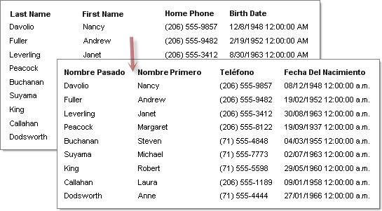

# Localizing Reports Overview

Localization is used to display the reports in the language of a specific culture. The article elaborates how to localize reports with resource files. The resource files format depends on the used Report Designer: 

* [Visual Studio Report Designer]() - RESX files. They are siblings to the report code file in the file system. For more information on the RESX file format see [Resources in.Resx File Format ](https://learn.microsoft.com/en-us/previous-versions/dotnet/netframework-3.0/ekyft91f(v=vs.85))
* [Standalone Report Designer]() - RES files that are part of the TRDP archive. The RES files contain a key-value list. The first row begins with a __key__ after the key follows whitespace and the __value__ surrounded in double quotation mark. After the last unescaped double quotation mark follows a new line. The key cannot contain any whitespace characters. The value can contain any character including whitespaces and double quotation mark but the double quotation mark should be escaped with another double quotation mark.

	>note The Standalone Report Designer supports two XML report formats (TRDP and TRDX). The localization mechanism described in this article is supported only in the TRDP report format. Currently, no out of the box solution is available for localizing TRDX report definitions. If TRDX report format with localization is required the recommended approach is to create a [user function](/designing-reports/connecting-to-data/expressions/extending-expressions/user-functions) that will accept resource key and optionally [string report parameter](/designing-reports/connecting-to-data/report-parameters/overview) specifying the culture code and return a localized string that is used for the report item property value.

* [Web Report Designer]() - The Web Report Designer doesn't support localization.

	>important __known issue__: The Web Report Designer doesn't expose the _Localizable_ and _Language_ properties of the Report. If you modify the Report in the web designer and save it, it will serialize it without these properties. For that reason, the Report localization informaton will be entirely removed.

Telerik Reporting uses a similar methodology for localization as Visual Studio uses for Windows Forms. The designer lets you define static text for the report (e.g. column headings, titles) in each language that you specify. A resource file is automatically created for each language to store translated text. For more background information on localizing applications see the MSDN article [Globalizing and Localizing Applications](https://learn.microsoft.com/en-us/previous-versions/visualstudio/visual-studio-2015/ide/globalizing-and-localizing-applications?view=vs-2015).

>caption Localized documents displayed in English and Spanish

To localize a report:

1. In the designer set the Report `Localizable` property to true. If at any point the `Localizable` property is set to false all the resource files are deleted and the report property values are filled with the currently selected language values.
1. Select a `Language` property value from the drop-down list in the properties window.
1. Set the target component Name property. Keeping the default auto generated name can result in new items inheriting deleted items localized values.
1. Translate the static text into the desired language indicated by the `Language` property.

>important Items cannot be added in localization mode. After localizing the report set the Language property to (Default) to add new items.

The report's runtime localization depends on the current thread's culture UI setting and must be already set in order the report to be processed with the correct resources.

The current thread's culture UI setting depends on the OS or the browser language settings.

To run the localized report in a specific language that is different from the thread's current culture UI setting:

1. Add Threading and Globalization namespaces to your application.
1. Set the current thread `CurrentUICulture` to a new instance of `CultureInfo`. The `CultureInfo` constructor takes the culture code of the language you want to display. For example "en-US" for United States English or "es-MX" for Mexican Spanish.
1. Optionally you can set the `CurrentCulture` for the current thread to the culture code of the language you wish to display. `CurrentCulture` affects dynamic data such as date, time and money formats. The "Birth Date" column date format in the figure above shows Month/Day/Year in English, but in Day/Month/Year format in the Spanish example.
1. Create a [report source object]() to specify the report, and assign it to the `ReportViewer.ReportSource` property. If you are using a `ReportViewer` in a Windows application, call the `ReportViewer.RefreshReport()` method. If you are using a web viewer, let the page send the request for getting the rendered report.

>important Note that the culture settings must be applied before creating an instance of the report. This ensures the correct report's resource file will be used on processing the document.

{{source=CodeSnippets\CS\API\Telerik\Reporting\LocalizationSnippets.cs region=SetThreadCulture}}
{{source=CodeSnippets\VB\API\Telerik\Reporting\LocalizationSnippets.vb region=SetThreadCulture}}

## Centralizing the localization of reports

Big applications with many reports tend to be hard to localize with the provided approach above, in such cases the recommended approach is creating a [User Function]() that accepts a resource key and optionally a string report parameter specifying the culture code. The function will return a localized string that is used for the report item property value.
