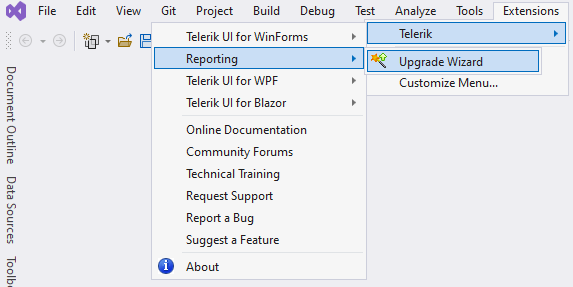

# Integration with Visual Studio

The **Visual Studio Extensions** for **Telerik Reporting** aim to help developers when creating applications with Telerik Reporting.

The extensions handle the following major points in the development process:

* [Visual Studio Report Designer]() - Creating new reports and importing reports from other formats in the Designer.

* [Upgrade Wizard]() - Upgrading Telerik Reporting to a newer version. The [Upgrade Wizard]() can be started by using the **Extensions > Telerik > Reporting > Upgrade Wizard** menu item:

     

* Toolbox configuration - During the [installation process]() of Telerik Reporting on your machine, the Telerik assemblies were added to Global Assemby Cache (GAC). In case of any problems related to the Visual Studio Telerik Reporting Toolbox items, please refer to [Troubleshooting]() article offering several tips.

## See Also

- [Upgrade Wizard]()
- [Troubleshooting Visual Studio Report Designer Problems]()
- [Installation Approaches for Telerik Reporting]()

