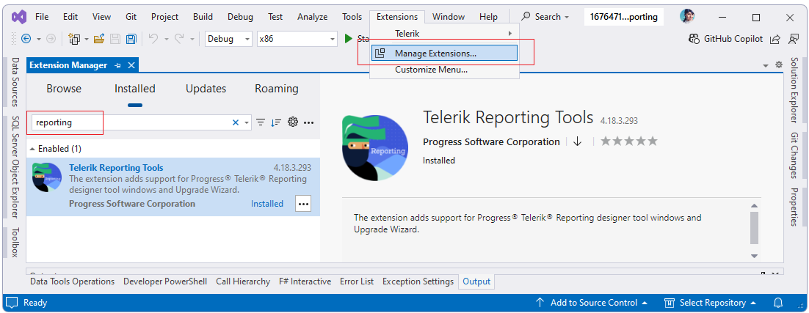
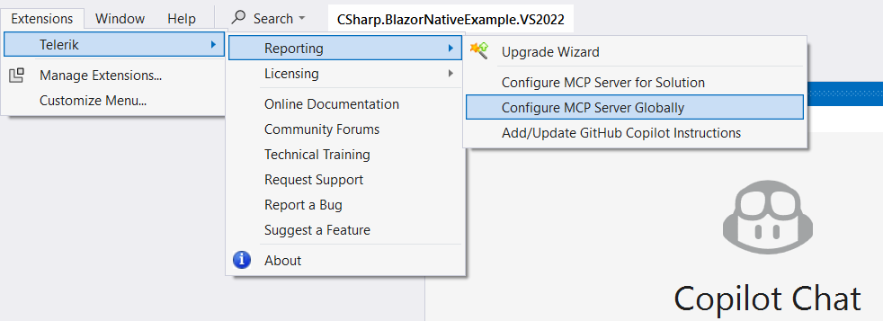
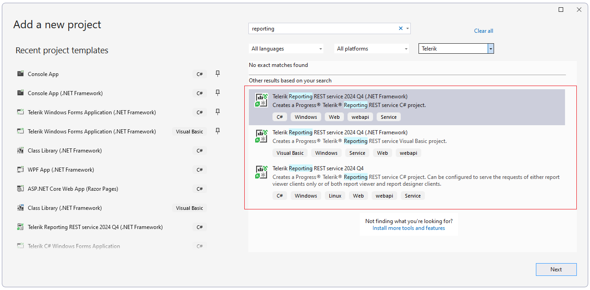
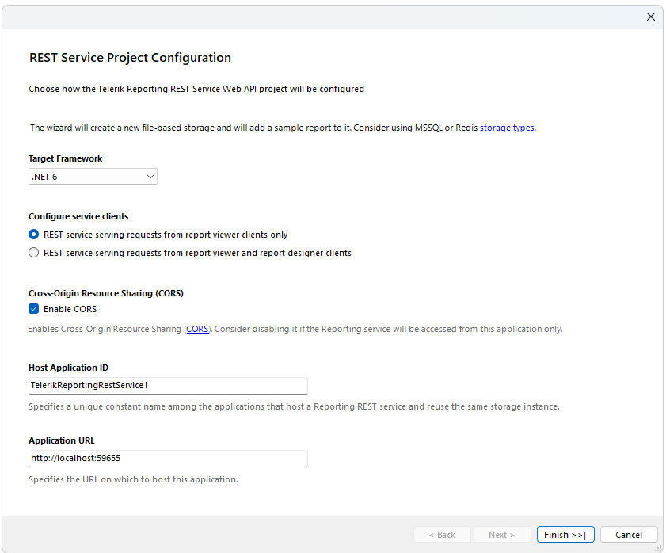
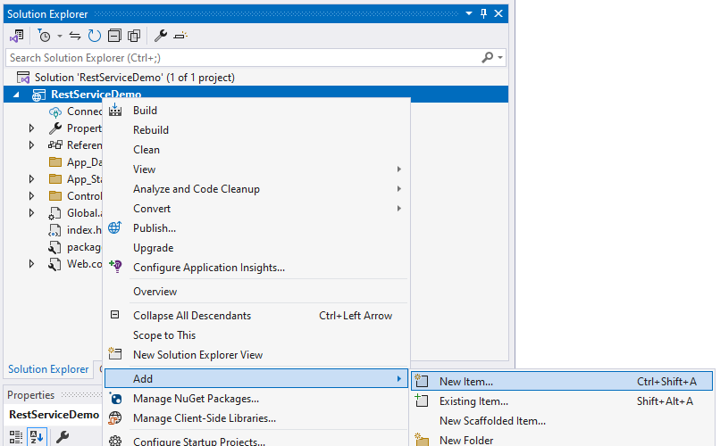
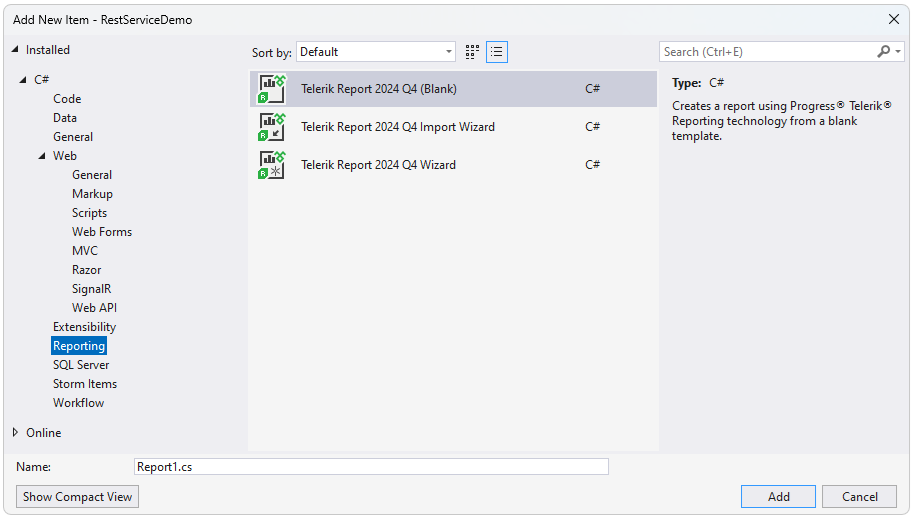
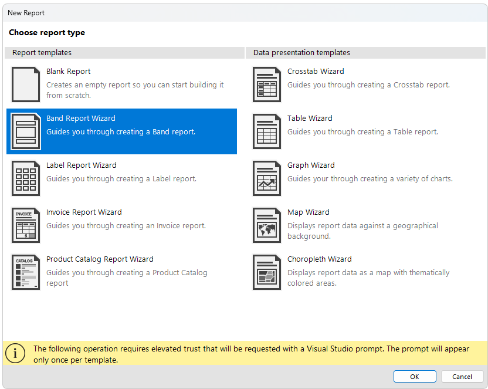
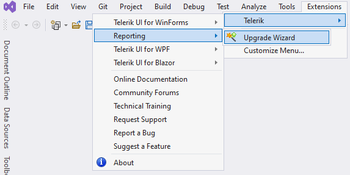
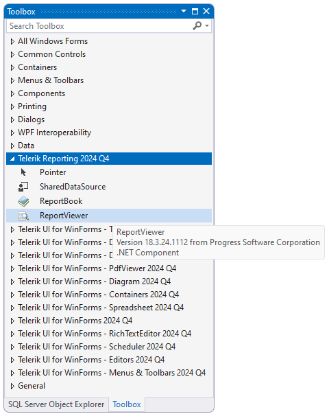

# Visual Studio Extensions

The Telerik Reporting Visual Studio extensions help you configure AI tooling, create Reporting projects and report items, and maintain existing .NET Framework projects from within Visual Studio.

After you install Telerik Reporting, the extensions are available from **Extensions > Telerik > Reporting** in Visual Studio.

Before you use any extension feature, make sure the extension is installed:

## What the Extensions Add

The Visual Studio extensions support the following development tasks:

- Configure the Telerik Reporting MCP Server globally or per solution.
- Add GitHub Copilot repository instructions for Reporting projects.
- Create new Telerik Reporting project types.
- Add new report items and launch report wizards.
- Upgrade or downgrade Telerik Reporting versions in .NET Framework projects.
- Enable the Visual Studio Report Designer and Toolbox items for supported projects.

## Setting up the Telerik Reporting MCP Server

Starting with the [Progress® Telerik® Reporting 2025 Q4 (19.3.25.1111)](https://www.telerik.com/support/whats-new/reporting/release-history/progress-telerik-reporting-2025-q4-19-3-25-1111) release, the [Telerik Reporting MCP Server](slug:ai-mcp-server-as-a-nuget) can now be set up using the [Telerik Reporting Visual Studio Extension](slug:reporting-integration-with-visual-studio).

Use this integration when you want GitHub Copilot or another Model Context Protocol (MCP)-compatible client to work with Telerik Reporting context directly from your development environment.

### Choose the Configuration Scope

The extension provides the following MCP-related commands:

- The `Configure MCP Server Globally` option creates (or updates if existing) the global `%USERPROFILE%\.mcp.json` file and adds the Telerik server entry.
- The `Configure MCP Server for Solution` option is visible only if you have a project opened in Visual Studio. The option creates (or updates if existing) the `.mcp.json` file in the solution directory.
- The `Add/Update GitHub Copilot Instructions` option is visible only if you have a project opened in Visual Studio. The option creates (_or updates if existing_) a [copilot-instructions.md](https://docs.github.com/en/copilot/how-tos/configure-custom-instructions/add-repository-instructions?tool=visualstudio) file in the `.github\` folder of the solution (`\SolutionDir\.github\copilot-instructions.md`), which includes extra context that is automatically used with the prompt given to the Copilot chat in Visual Studio.

Use the global option when you want the Telerik Reporting MCP Server available across multiple repositories on your machine. Use the solution option when you want the configuration stored with a specific solution.

### Set Up the MCP Server

To configure the MCP Server from Visual Studio:

1. Open Visual Studio.
1. Open **Extensions > Telerik > Reporting**.
1. Select **Configure MCP Server Globally** or **Configure MCP Server for Solution**.
1. If you are working in a solution and want Copilot to receive Telerik Reporting-specific repository instructions, select **Add/Update GitHub Copilot Instructions**.
1. Verify that the expected configuration file was created or updated.

After this setup, your MCP client can use the Telerik Reporting MCP Server configuration that the extension generated.

## Project Templates

After [installing Telerik Reporting](slug:telerikreporting/installation), the extensions add Telerik Reporting project templates to the **New Project** dialog in Visual Studio:

Use these templates when you want to start with a project that already contains the basic Telerik Reporting setup.

### Create a Telerik Reporting Project

To create a project from a Telerik Reporting template:

1. In Visual Studio, select **File > New > Project**.
1. Search for Telerik Reporting templates or filter the list until the Telerik Reporting templates appear.
1. Select the template that matches your scenario.
1. Complete the standard Visual Studio project creation steps.

If you select **Telerik Reporting REST service**, the **REST Service Project Configuration** wizard opens:

Use that wizard to configure the REST service properties for your project.

For hosting guidance after the project is created, refer to:

- [Host the Telerik Reporting REST Service in an ASP.NET Application](slug:telerikreporting/using-reports-in-applications/host-the-report-engine-remotely/telerik-reporting-rest-services/asp.net-web-api-implementation/how-to-add-telerik-reporting-rest-web-api-to-web-application)
- [Host the Telerik Reporting REST Service in ASP.NET Core with Minimal API](slug:how-to-host-reports-service-in-aspnet-core-in-net-6-with-minimal-api)

## Item Templates and Report Wizards

With the [installation of Telerik Reporting](slug:telerikreporting/installation), several [report item](slug:report_item) templates are added to the **New Item** dialog of Visual Studio:

### Add a New Reporting Item

To add a Telerik Reporting item to an existing project:

1. In **Solution Explorer**, right-click the target project.
1. Select **Add > New Item**.
1. Select the Telerik Reporting item template that matches your scenario.
1. Finish the item creation flow.

If you choose a wizard-based report template, the New Report Wizard opens:

Depending on your selection, the corresponding report wizard is displayed, for example the [Band Report Wizard](slug:telerikreporting/designing-reports/report-designer-tools/desktop-designers/tools/report-wizards/band-report-wizard/overview).

## Upgrade Wizard

The [Upgrade Wizard](slug:telerikreporting/designing-reports/report-designer-tools/desktop-designers/visual-studio-report-designer/upgrade-wizard) lets you upgrade or downgrade a .NET Framework project to any installed Telerik Reporting version.

To start the wizard, select **Extensions > Telerik > Reporting > Upgrade Wizard**:

Use the Upgrade Wizard when you need to align an existing .NET Framework project with a different installed Telerik Reporting version.

## Visual Studio Report Designer and Toolbox Support

After [installing Telerik Reporting](slug:telerikreporting/installation), you can use the [Visual Studio Report Designer](slug:telerikreporting/designing-reports/report-designer-tools/desktop-designers/visual-studio-report-designer/overview) in a .NET Framework project to create new reports and import reports from other formats.

During the [installation process](slug:telerikreporting/installation), Telerik Reporting assemblies are also added to the Global Assembly Cache (GAC). This enables the corresponding items in the Visual Studio Toolbox for .NET Framework projects:

If the Telerik Reporting Toolbox items do not appear as expected, refer to the [Troubleshooting](slug:telerik-reporting-toolbox-items-are-missing) article.

## See Also

- [Telerik Reporting MCP Server](slug:ai-mcp-server-as-a-nuget)
- [Upgrade Wizard](slug:telerikreporting/designing-reports/report-designer-tools/desktop-designers/visual-studio-report-designer/upgrade-wizard)
- [Visual Studio Report Designer](slug:telerikreporting/designing-reports/report-designer-tools/desktop-designers/visual-studio-report-designer/overview)
- [Troubleshooting Visual Studio Report Designer Problems](slug:telerikreporting/designing-reports/report-designer-tools/desktop-designers/visual-studio-report-designer/visual-studio-problems)
- [Installation Approaches for Telerik Reporting](slug:telerikreporting/installation)
