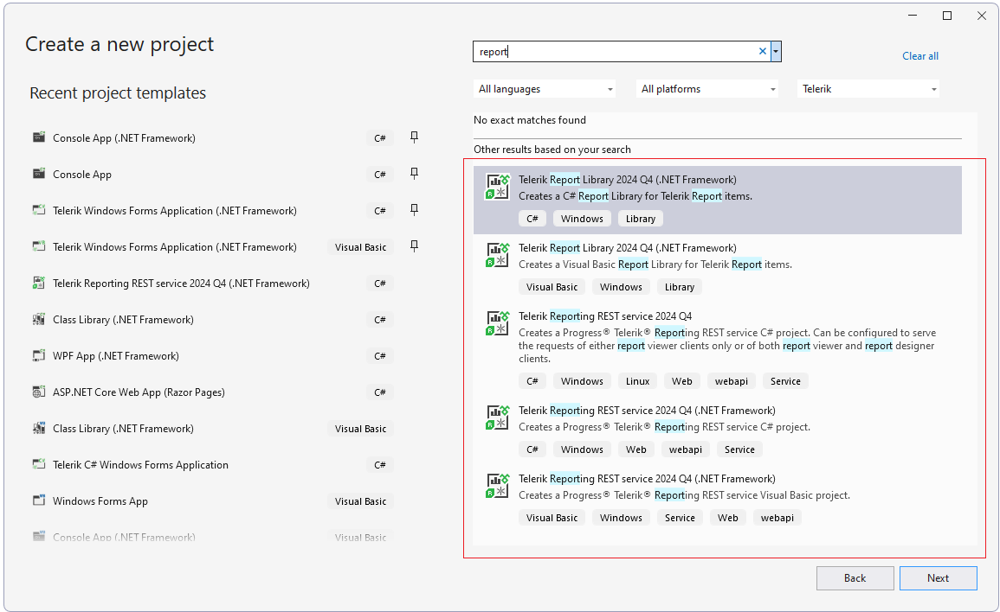

# Integration with Visual Studio

The **Visual Studio Extensions** for the **Telerik Reporting** product aim to help developers when creating applications with Telerik Reporting. They can be accessed through the *Extensions | Telerik | Reporting* menu.

Make sure that the extension is installed first:

  

The extensions handle the following major points in the development process:

## Project Templates

After [installing Telerik Reporting](), the extensions add several project templates to the **New Project** dialog of Visual Studio:

   

If you select the last option **Telerik Reporting REST service**, the **REST Service Project Configuration** wizard is launched:

  

A menu pops up that allows you to configure the REST Service properties:

[Hosting the Telerik Reporting REST Service in an ASP.NET Application]()

[Hosting the Telerik Reporting REST Service in ASP.NET Core in .NET 6+ with Minimal API]()

## Item Templates

With the [installation of Telerik Reporting](), several [report item]() templates are added to the **New Item** dialog of Visual Studio:

  

   

If you select the last option, the New Report Wizard is launched:

    

Depending on the user's selection, the respective wizard is displayed, e.g. [Band Report Wizard]().

## Upgrade Wizard

The [Upgrade Wizard]() allows you to upgrade Telerik Reporting to a newer version. It can be started by using the *Extensions > Telerik > Reporting > Upgrade Wizard* menu item:

 

After [installing Telerik Reporting]() you can benefit the [Visual Studio Report Designer]() which facilitates the creation of new reports and importing reports from other formats in the Designer.

During the [installation process]() of Telerik Reporting on your machine, the Telerik assemblies are added to Global Assemby Cache (GAC) as well. This enables the respective items in the Visual Studio Toolbox:

 

In case of any problems related to the Visual Studio Telerik Reporting Toolbox items, please refer to [Troubleshooting]() article offering several tips.

## See Also

- [Upgrade Wizard]()
- [Troubleshooting Visual Studio Report Designer Problems]()
- [Installation Approaches for Telerik Reporting]()

