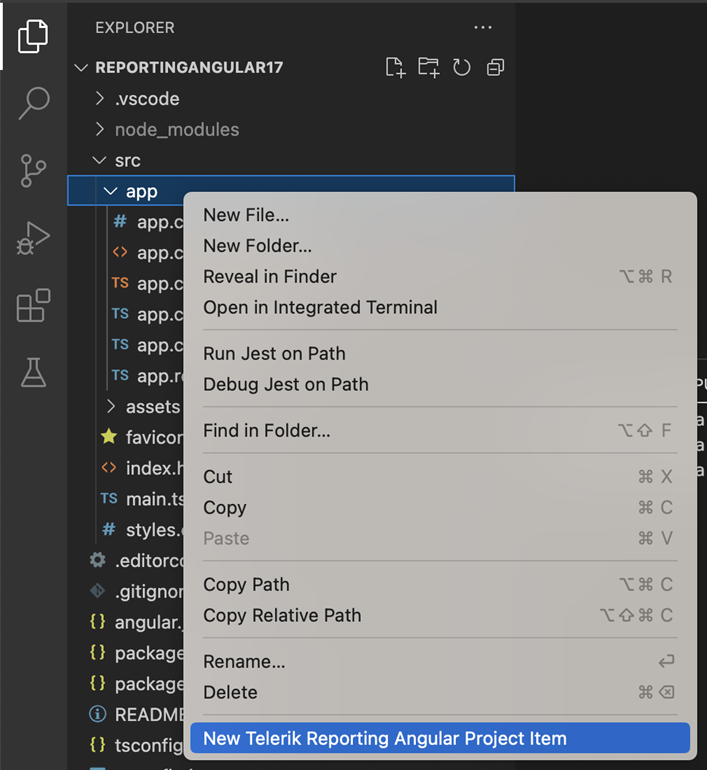
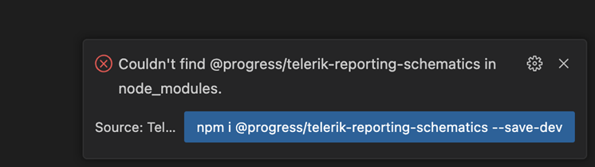
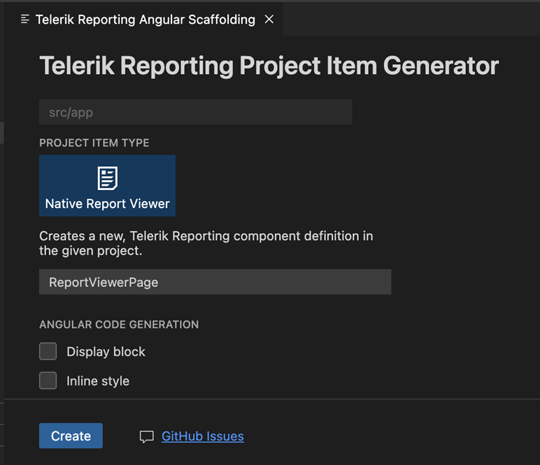
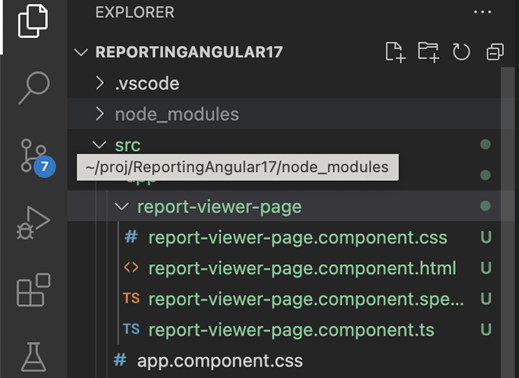

# Visual Studio Code Integration

The [Telerik Reporting Productivity Tools](https://marketplace.visualstudio.com/items?itemName=TelerikInc.telerik-reporting-productivity-tools) Extension for [Visual Studio Code](https://code.visualstudio.com/) provides scaffolding for the Telerik Reporting native Angular viewer.

To create a new test app, you can use the Angular CLI:

`ng new ReportingAngularApp`

1\. In VS Code, in the Explorer, within your Angular application source folder, right-click where you want to add a reporting component and select **New Telerik Reporting Angular Project Item**:

  

2\. VS Code will prompt you that @progress/telerik-reporting-schematics is missing. To install it, click `npm i ...` in the prompt.

   

3\. The Telerik Reporting Angular Scaffolding wizard will open, showing the available Angular component options.

   

4\. Configure your preferred options and click **Create**. This will generate an Angular component with a pre-configured Telerik Reporting Native Angular report viewer.

   

5\. Include the new component in your project. Add it to your routing or to the HTML of an existing component.

## See Also

* [Adding the Native Angular Report Viewer with the Project Item Generator]() 

