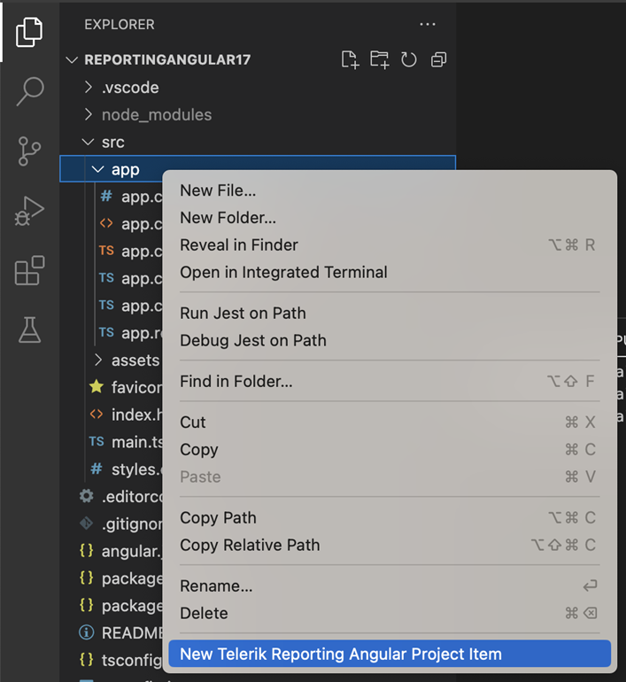
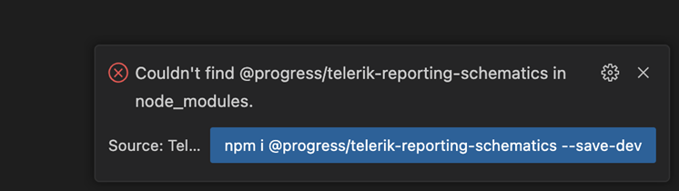
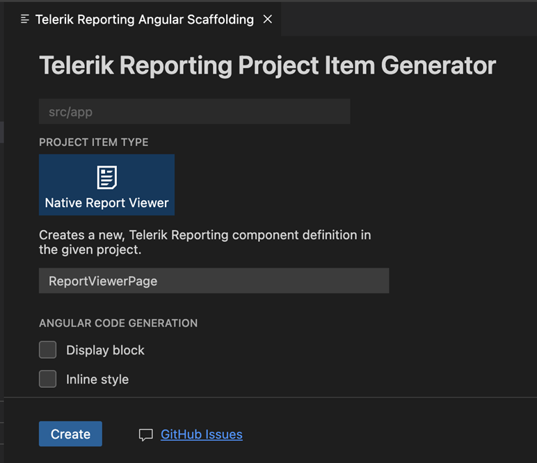
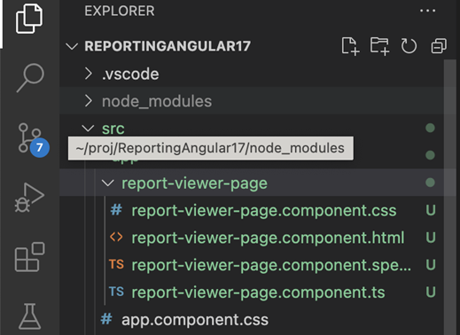

# Visual Studio Code Integration

The [Telerik Reporting Productivity Tools](https://marketplace.visualstudio.com/items?itemName=TelerikInc.telerik-reporting-productivity-tools) Extension for [Visual Studio Code](https://code.visualstudio.com/) provides scaffolding for the Telerik Reporting native Angular viewer.

## Creating a Reporting App in VS Code

Choose between creating a complete Reporting app and adding a Native Angular Report Viewer component to an Angular app.

### Create a Complete App from a Reporting Template

Install the [Telerik CLI](slug:reporting-telerik-cli), then run the following command in the VS Code integrated terminal:

```powershell
telerik create reporting --interactive
```

Select a template, enter a project name, and choose a target framework in the interactive prompts.

### Add a Viewer to an Existing Angular App

To create an Angular app for this workflow, use the Angular CLI:

```powershell
ng new ReportingAngularApp
```

> note The Telerik CLI includes a complete-app template for the Native Angular Report Viewer, in addition to the component generator described here. See the [Telerik CLI article](slug:reporting-telerik-cli) for details.

1\. In VS Code, in the Explorer, within your Angular application source folder, right-click where you want to add a reporting component and select **New Telerik Reporting Angular Project Item**:



2\. VS Code will prompt you that @progress/telerik-reporting-schematics is missing. To install it, click `npm i ...` in the prompt.



3\. The Telerik Reporting Angular Scaffolding wizard will open, showing the available Angular component options.



4\. Configure your preferred options and click **Create**. This will generate an Angular component with a pre-configured Telerik Reporting Native Angular report viewer.



5\. Include the new component in your project. Add it to your routing or to the HTML of an existing component.

## See Also

- [Adding the Native Angular Report Viewer with the Project Item Generator](slug:telerikreporting/using-reports-in-applications/display-reports-in-applications/web-application/native-angular-report-viewer/integrating-with-project-item-generator)
