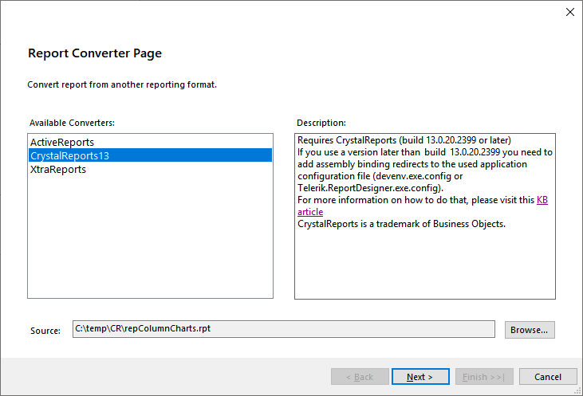

# Converting SAP Crystal Reports

This article explains how to convert a report created with SAP Crystal Reports to a Telerik Reporting report definition.

## Prerequisites

The Crystal Reports runtime should be installed on the machine.

## Changes Information

The latest Telerik Crystal Reports Converter is built against Crystal Reports 13.0.20.2399. It offers an improved conversion process, supports more report items, and provides a better user experience. It is actively developed and extended to cover more user scenarios.

Converting a Crystal Reports definition with a version lower than 13.0.2000 is not supported. We strongly recommend first upgrading such older Crystal Reports definitions to a supported version and then utilizing the latest Crystal Reports converter. If this is not an option, you can try an older converter available in Telerik Reporting R3 2019 or earlier versions. Note that this would result in a conversion with lower quality. More info is available in this KB article: [Converting reports from various versions of CrystalReports]().



## Conversion Process

The converter iterates through all the items in a Crystal Report (CR) instance and tries to map each report object to its corresponding item in Telerik Reporting. Unfortunately, the .NET model classes that represent the native Crystal Reports objects often do not expose all the properties of their underlying objects, which makes the complete conversion unattainable. The size, location, and styling of each CR object are converted as close as possible to the original. The specific object properties are listed below:

- **Report structure** - the header, footer, and details report sections are converted to their exact equivalents in Telerik Reporting. The visibility and suppression of the sections are not converted. The group headers and footers are converted into group sections in Telerik Reporting.
- **Data connections** – the supported connection types are OLEDB and ODBC. The converter creates a new SQLDataSource instance for each command created in Database Expert and sets its attributes like connection string, command text, and parameters. If the data connection used in the source report does not have a dedicated command or stored procedure, the converter will generate a _select _ from {tableName}\* statement for the SqlDataSource instance's CommandText property.
- **Report parameters** – if the data command used in the Crystal report has parameters, they will be converted as report parameters, regarding their type, visibility, and default values.
- **Field objects** – data-bound fields are converted to Telerik Reporting TextBox instances with their respective database field expressions, preserving the formatting.
- **Text objects** – converted into Telerik Reporting TextBox instances with static text, preserving the formatting.
- **Summary fields** – converted into Telerik Reporting TextBox instances. The converter recognizes and converts the following Crystal Reports summary expressions: _Sum, Count, Distinct Count, Minimum, Maximum, Average_.
- **Cross-Tab objects** – the provided .NET model does not contain any properties that would allow us to examine the Cross-Tab definition. The converted Telerik Reporting CrossTab item will have the same size and location, but a default structure containing empty cells.
- **SubReport objects** – the converter will create a Telerik Reporting SubReport item, preserving the size and location. The ReportSource property must be manually set.
- **Line and Box objects** – converted to Telerik Reporting Shape items.
- **PictureBox objects** – converted to Telerik Reporting PictureBox items. The converter will convert only PictureBox objects that obtain their image data from a database field.
- **Chart objects** – converted to Telerik Reporting Graph items. Supported chart types are `column`, `pie`, `doughnut`, `line`, `area`, and `scatter`. The provided .NET model does not contain all the properties necessary to completely convert the chart item, and default values are used instead. Such properties include stacked/clustered for column series and horizontal/vertical orientation of column charts.
- **Barcode** – the default barcode implementation in Crystal Reports is achieved through text objects with a specific barcode font that allows the creation of Code39-encoded barcodes. The converter generates Telerik Reporting Barcode items only for Crystal Reports text objects with a font name that contains the Code39 string.

- **Special fields** - The converter recognizes and converts the following Crystal Reports special fields: _PrintDate, PrintTime, ModificationDate, ModificationTime, DataDate, DataTime, RecordNumber, PageNumber, TotalPageCount, Page N of M_.

## Configuring the Report Designer to Use the Converter

To load the Crystal Reports assemblies needed for the conversion, proper binding redirects need to be added to the configuration file of the report designer application. When using the Standalone Report Designer, this file is _Telerik.ReportDesigner.exe.config_, placed in the _\Report Designer_ subfolder of the product installation category. When using the Visual Studio Report Designer, this file is _devenv.exe.config_, placed in the _\Common7\Ide_ subfolder of the Visual Studio installation directory. The binding redirects need to point to the version of the Crystal Reports runtime installed on the machine.

The Crystal Reports assemblies are stored in the machine’s GAC (Global Assembly Cache). The GAC folder for .NET Framework v.4.0 and later is _%windir%\Microsoft.NET\assembly_, and for earlier versions is _%windir%\assembly_. Search the GAC for assemblies named _CrystalDecisions.Shared.dll_ or _CrystalDecisions.CrystalReports.Engine.dll_. The assembly version can be obtained either from the assembly subfolder name, or by using the [gacutil.exe](https://learn.microsoft.com/en-us/dotnet/framework/tools/gacutil-exe-gac-tool):

```powershell
C:\WINDOWS\system32>gacutil -l CrystalDecisions.Shared
Microsoft (R).NET Global Assembly Cache Utility. Version 4.0.30319.0
Copyright (c) Microsoft Corporation. All rights reserved.
The Global Assembly Cache contains the following assemblies:
	CrystalDecisions.Shared, Version=13.0.3500.0, Culture=neutral, PublicKeyToken=692fbea5521e1304, processorArchitecture=MSIL
```

The output from the _gacutil.exe_ above shows that the current version of the installed Crystal Reports runtime assemblies is **13.0.3500.0**. Here is what the configuration file with added binding redirects will look like:

```XML
<runtime>
	<assemblyBinding xmlns="urn:schemas-microsoft-com:asm.v1">
		<dependentAssembly>
			<assemblyIdentity name="CrystalDecisions.CrystalReports.Engine" publicKeyToken="692fbea5521e1304" culture="neutral"/>
			<bindingRedirect oldVersion="0.0.0.0-13.0.3500.0" newVersion="13.0.3500.0"/>
		</dependentAssembly>
		<dependentAssembly>
			<assemblyIdentity name="CrystalDecisions.Shared" publicKeyToken="692fbea5521e1304" culture="neutral"/>
			<bindingRedirect oldVersion="0.0.0.0-13.0.3500.0" newVersion="13.0.3500.0"/>
		</dependentAssembly>
		<dependentAssembly>
			<assemblyIdentity name="CrystalDecisions.Enterprise.Framework" publicKeyToken="692fbea5521e1304" culture="neutral"/>
			<bindingRedirect oldVersion="0.0.0.0-13.0.3500.0" newVersion="13.0.3500.0"/>
		</dependentAssembly>
		<dependentAssembly>
			<assemblyIdentity name="CrystalDecisions.Enterprise.InfoStore" publicKeyToken="692fbea5521e1304" culture="neutral"/>
			<bindingRedirect oldVersion="0.0.0.0-13.0.3500.0" newVersion="13.0.3500.0"/>
		</dependentAssembly>
		<dependentAssembly>
			<assemblyIdentity name="CrystalDecisions.ReportAppServer.DataDefModel" publicKeyToken="692fbea5521e1304" culture="neutral"/>
			<bindingRedirect oldVersion="0.0.0.0-13.0.3500.0" newVersion="13.0.3500.0"/>
		</dependentAssembly>
		<dependentAssembly>
			<assemblyIdentity name="CrystalDecisions.ReportAppServer.ReportDefModel" publicKeyToken="692fbea5521e1304" culture="neutral"/>
			<bindingRedirect oldVersion="0.0.0.0-13.0.3500.0" newVersion="13.0.3500.0"/>
		</dependentAssembly>
	</assemblyBinding>
</runtime>
```

During the conversion process, the engine outputs warnings and information messages for the converted items in the Summary page. After reviewing the messages, the produced report can be edited further to achieve the desired functionality.

## See Also

- [Crystal Reports Product Matrix](https://wiki.scn.sap.com/wiki/display/BOBJ/Crystal+Reports+v.+9.1+to+SAP+Crystal+Reports+2013%2C+Runtime+Distribution+and+Supported+Operating+Systems)
