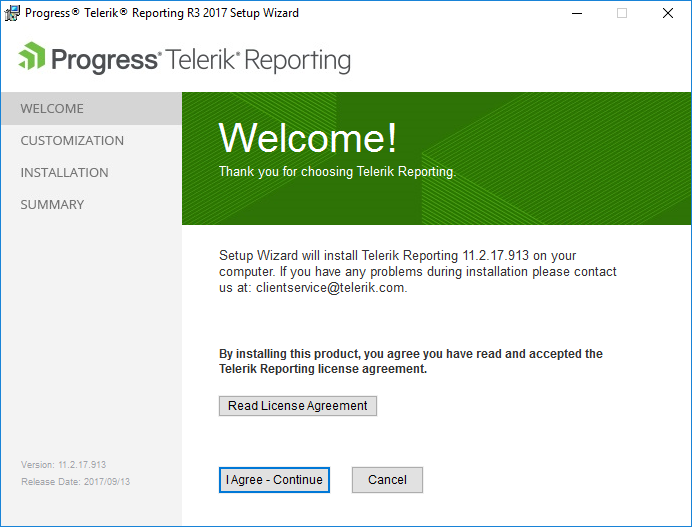
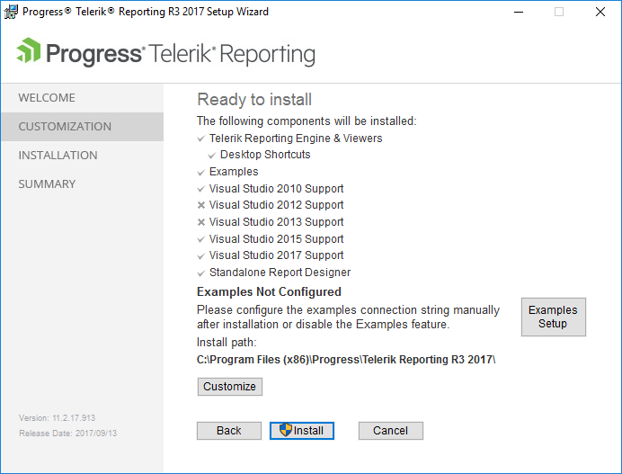
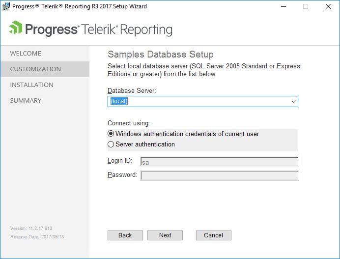

# Installation

Telerik Reporting supports several approaches for installing the product.       

*  [Downloading Telerik Control Panel](http://www.telerik.com/blogs/optimizing-use-of-the-telerik-control-panel) − To download and install the Control Panel, log into your[Telerik account](https://www.telerik.com/account/). Telerik Control Panel uses the product MSI file.           

*  [Using the Telerik NuGet private feed](https://nuget.telerik.com/v3/index.json) −The Telerik Reporting NuGet packages contain the libraries for.NET Core projects, the Reporting Engine, and the implementation of the[Reporting REST WebAPI-based service]() where you can use the packages with the standard.NET 4.6.1 framework. The NuGet packages do not include design-time support. To install the Telerik Reporting NuGet packages, log into your [Telerik account](https://www.telerik.com/account/).           

   >note The legacy https://nuget.telerik.com/nuget server will be deprecated. Make sure to switch to the new https://nuget.telerik.com/v3/index.json server, which is faster, lighter, and reduces the number of requests from your NuGet client. For more information on how to add a NuGet feed, refer to the [official Microsoft documentation](https://www.visualstudio.com/en-us/docs/package/nuget/consume).           

* Using the MSI installer−MSI files handle the automatic local installation of the product and its storing into a __Program Files__  > __Progress__  folder. They also create the necessary virtual folders and projects, and provide all required files for developing with Telerik Reporting.           

## Prerequisites

*  [System requirements](http://www.telerik.com/products/reporting/system-requirements) 

## Using the MSI Installer

To install Telerik Reporting through the MSI automatic installer file:         

1. Log into your [Telerik account](https://www.telerik.com/account).             

1. Click the __Downloads__  tab to view the available trial and commercial products.             

1. Select the __Telerik Reporting__  product.             

1. From the next page, download the MSI installation and the documentation files. The source code is available for download only for commercial-license holders.             

1. Download the automatic installation MSI file.

1. When the download completes, run ` Telerik_Reporting_[suiteversion].msi ` and follow the instructions of the Wizzard.             

To access internal builds:         

1. Log into your [Telerik account](https://www.telerik.com/account).             

1. For the latest internal builds, navigate to __Latest Internal Build__  under __Downloads__. For internal builds from earlier releases, select the respective Telerik Reporting version.             

>note The  __Downloads__  page lists previously downloaded products. For any missing products or product versions, contact the Sales team through the support ticketing system by submitting a [__General Feedback__](https://www.telerik.com/account/support-tickets/general-feedback)  thread.           

## Installing Telerik Reporting

1. In the dialog which appears after you execute the MSI file, confirm that you have read and accepted the License Agreement.               

  

1. In the next customization dialog, select the desired features.             

   + If Telerik Reporting does not locate a local SQL server instance on your machine or if your SQL browser service is stopped, the examples from the __Examples__  dialog option will be installed but the configuration files for the application will not have valid connection strings. However, you can still access the working demos on the [Telerik Reporting Demos page](http://demos.telerik.com/reporting).                 

   + To set up the examples and the used connection string, select __Examples Setup__. All local SQL Server 2005+ instances are supported.                 

   + The examples use the MS SQL Server [AdventureWorks database](http://msdn.microsoft.com/en-us/library/ms124659%28SQL.100%29.aspx). Unless already available on your machine, the AdventureWorks database will also be deployed locally.                 

   + Alternatively, you can install AdventureWorks by manually executing the SQL script from the installer. To use this option, navigate to __[InstallDir]/Examples/Data/AdventureWorks OLTP__. For the script to run correctly, uncomment the `SET @data_path = 'C:\Program Files\Microsoft SQL Server\90\Tools\Samples\AdventureWorks OLTP\';` statement and specify the correct path to the CVS data files which are in the same folder as the SQL script file.                   

  

1. (Applicable only if __Examples Setup__  was selected) In the __Setup Wizard__  dialog, select your __Database Server__  and the authentication for the connection. The Wizard detects all running instances and lists them in the input field.             

   >note To enable the Wizard to detect all running SQL Server instances, run the [SQL Server Browser Service](http://technet.microsoft.com/en-us/library/ms181087(v=sql.105).aspx).                 

  

## Directories and Assemblies

By default, the Wizard installs Telerik Reporting in the following locations:         

* For 64-bit machines, in ` C:\Program Files\Progress\Telerik Reporting {{site.suiteversion}}`.             

* For 32-bit machines, in ` C:\Program Files (x86)\Progress\Telerik Reporting {{site.suiteversion}}`.             

The assemblies targeting different versions of.NET are placed in separate folders, as shown in the list below:         

*.NET Framework - *\Bin* 

*.NET Standard - *\Bin\netstandard2.0* 

*.NET Core - *\Bin\netcoreapp3.1* 

*.NET 5 - *\Bin\net5.0*  and *\Bin\net5.0-windows* 

*.NET 6 - *\Bin\net6.0*  and *\Bin\net6.0-windows* 

>important Since.NET 6 is currently available as a Preview, compiling a.NET 6 application requires installing the latest [.NET 6 SDK](https://dotnet.microsoft.com/download/dotnet/6.0)  and using [Visual Studio 2019 Preview](https://visualstudio.microsoft.com/vs/preview/), or allowing to use the previews of the.NET SDK in the  __Tools/Environment/Preview Features__  in Visual Studio 2019.           

The following tables describe the folder structure for the redistributable assemblies.         

| Directory | Description |
| ------ | ------ |
|`...Progress\Telerik Reporting{{site.suiteversion}}\Bin`|* `Telerik.Reporting.dll` * `Telerik.ReportViewer.Mvc.dll` * `Telerik.ReportViewer.WebForms.dll` * `Telerik.ReportViewer.WinForms.dll` * `Telerik.ReportViewer.Silverlight.dll` * `Telerik.ReportViewer.Wpf.dll` * `Telerik.Reporting.Adomd.dll` * `Telerik.Reporting.Service.dll` * `Telerik.Reporting.Services.ServiceStack.dll` * `Telerik.Reporting.Services.WebApi.dll` * `Telerik.Reporting.XpsRendering.dll` * `Telerik.Reporting.OpenXmlRendering.dll` * `Telerik.Reporting.Cache.Database.dll`|
|`...Progress\Telerik Reporting{{site.suiteversion}}\Bin\netstandard2.0`|* `Telerik.Reporting.dll` * `Telerik.WebReportDesigner.Services.dll` * `Telerik.ReportViewer.Blazor.dll` * `Telerik.Reporting.WebServiceDataSource.dll` * `Telerik.Reporting.Services.HttpClient.dll` * `Telerik.Reporting.Services.AspNetCore.dll` * `Telerik.Reporting.OpenXmlRendering.2.7.2.dll` * `Telerik.Reporting.JsonSerialization.dll` * `Telerik.Reporting.Data.Schema.dll` * `Telerik.Reporting.Cache.StackExchangeRedis.dll` * `Telerik.Reporting.Cache.StackExchangeRedis.2.dll`|
|`...Progress\Telerik Reporting{{site.suiteversion}}\Bin\netcoreapp3.1`|* `Telerik.Reporting.Services.AspNetCore.dll` * `Telerik.WebReportDesigner.Services.dll` * `Telerik.ReportViewer.WinForms.dll` * `Telerik.ReportViewer.Wpf.dll` * `Telerik.ReportViewer.Wpf.Themes.dll`|
|`...Progress\Telerik Reporting{{site.suiteversion}}\Bin\net5.0`|* `Telerik.WebReportDesigner.Services.dll` * `Telerik.Reporting.Services.AspNetCore.dll`|
|`...Progress\Telerik Reporting{{site.suiteversion}}\Bin\net5.0-windows`|* `Telerik.ReportViewer.WinForms.dll` * `Telerik.ReportViewer.Wpf.dll` * `Telerik.ReportViewer.Wpf.Themes.dll` * `Telerik.ReportViewer.WinUI.dll` * `Telerik.ReportViewer.WinUI.Themes.dll` * `Telerik.WinUI.Controls\`|
|`...Progress\Telerik Reporting{{site.suiteversion}}\Bin\net6.0`|* `Telerik.WebReportDesigner.Services.dll` * `Telerik.Reporting.Services.AspNetCore.dll`|
|`...Progress\Telerik Reporting{{site.suiteversion}}\Bin\net6.0-windows`|* `Telerik.ReportViewer.WinForms.dll` * `Telerik.ReportViewer.Wpf.dll` * `Telerik.ReportViewer.Wpf.Themes.dll`|

The following table describes the folder structure for the installed samples.         

| Directory | Description |
| ------ | ------ |
|`...Progress\Telerik Reporting{{site.suiteversion}}\Examples\bin`|The external dependencies.|
|`...Progress\Telerik Reporting{{site.suiteversion}}\Examples\CSharp`|The C# example solutions.|
|`...Progress\Telerik Reporting{{site.suiteversion}}\Examples\Data`|The AdventureWorks OLTP database installation scripts.|
|`...Progress\Telerik Reporting{{site.suiteversion}}\Examples\VB`|The VB example solutions|

The following table describes the folder structure for the Standalone Report Designer.         

| Directory | Description |
| ------ | ------ |
|`...Progress\Telerik Reporting{{site.suiteversion}}\Report Designer`|The Standalone Report Designer.|
|`...Progress\Telerik Reporting{{site.suiteversion}}\Report Designer\Examples`|The example reports|

The following table describes the folder structure for miscellaneous ReportViewers files.         

| Directory | Description |
| ------ | ------ |
|`...Progress\Telerik Reporting{{site.suiteversion}}\Html5\ReportViewer`|The JavaScript and CSS files, and the template for the HTML5 Report Viewer.|
|`...Progress\Telerik Reporting{{site.suiteversion}}\Silverlight\Themes`|The Silverlight Report Viewer themes.|
|`...Progress\Telerik Reporting{{site.suiteversion}}\Wpf\Themes`|WPF Report Viewer themes|

The following table describes the folder structure for miscellaneous administrative utilities.         

| Directory | Description |
| ------ | ------ |
|`...Progress\Telerik Reporting{{site.suiteversion}}\Tools`|The Database Cache Configurator|

