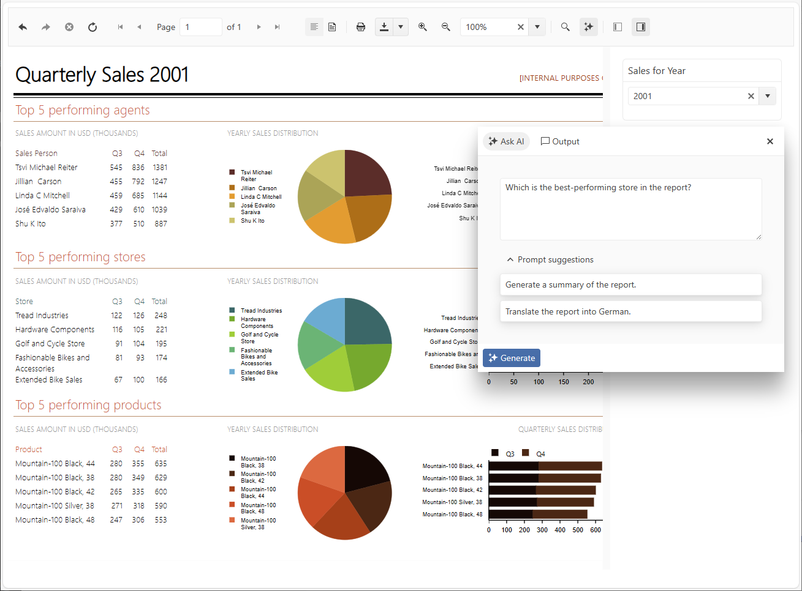
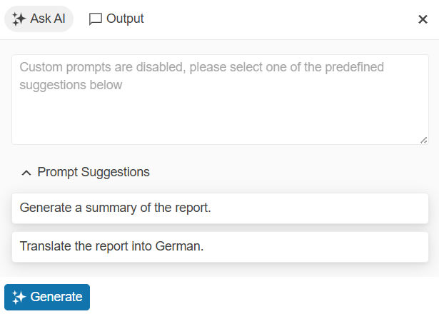
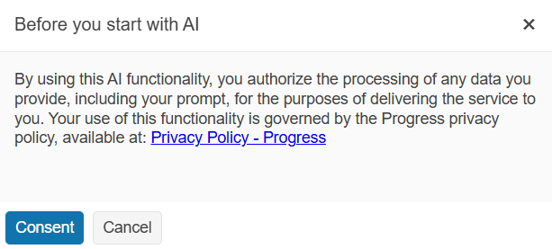

# AI-Powered Insights Overview

**AI Insights** is an AI-powered feature available during the report preview. It enables users to execute predefined or custom prompts on the core data of the previewed report, uncovering valuable insights, generating summaries, or answering specific questions. The feature also supports fine-tuning of the embedded Retrieval-Augmented Generation (RAG) algorithms, optimizing them to deliver accurate responses while minimizing token consumption.

>tip For a working example of this functionality, check the [AI Insights Report Demo](https://demos.telerik.com/reporting/ai-insights).



## Feature Concept

To bring the power of Generative AI (GenAI) into reporting workflows, we are introducing an **AI Prompt** dialog that integrates seamlessly in the report viewers. The dialog provides a convenient UI for sending predefined or custom prompts to an AI model, configured in the Reporting REST Service. The prompts and responses returned from the AI model are displayed in the Output panel of the dialog, allowing for easier tracking of the conversation.

The AI conversation maintains context throughout user's interaction with a specific report. All previous questions and responses are preserved and sent to the AI model as context, enabling more coherent and contextually relevant conversations. However, this context is automatically cleared when report parameters are changed or when navigating to a different report, ensuring that each report session starts with a fresh conversation thread.

The feature is supported by all [web report viewers]() and by the [WPF Report Viewer]() connected to a remote Reporting REST Service.

### Key Features:

- **Retrieval-Augmented Generation (RAG)**  
  When enabled, the option activates an algorithm that filters out the irrelevant report data, producing accurate responses with reduced token usage. By default, the feature is enabled.

  When enabled, you may configure the RAG through the [AIClient ragSettings element](##attributes-and-elements).

  You can disable the feature by setting the _AIClient allowRAG_ attribute to _false_.
  
- **Predefined Summary Prompts**  
  Users can choose from a set of predefined prompts tailored for common tasks like summarization, explanation, and data insights—boosting efficiency with minimal effort.

- **Custom AI Prompts**  
  Besides the predefined prompts, users can create and use custom prompts through the UI.

- **End-User Consent for Data Sharing**  
  To ensure transparency and compliance, the AI Prompt requests explicit consent from users before sharing any data with GenAI services.



## User Consent

Before using the AI Prompt dialog, users must give consent for the AI to process their provided text. This ensures transparency and user control over their data.



## Configuration

To enable the AI-powered insights functionality, you must provide a valid configuration that defines the AI client, model, and other essential details such as authentication credentials. This configuration also allows you to customize various aspects of the AI functionality, including user consent requirements, custom prompt permissions, and Retrieval-Augmented Generation (RAG) settings. The AI configuration is managed through the [report engine configuration](). For a complete list of available settings, check the table below. For an example configuration, check the [Example](#example) section.

| Setting | Description |
| ------ | ------ |
|friendlyName|This setting specifies the name corresponding to the type of AI client you wish to use. For example, setting friendlyName to "MicrosoftExtensionsAzureOpenAI" indicates that the Azure OpenAI client is being utilized.|
|model|This setting specifies the AI model to be used for generating responses. For example, setting the model to "gpt-4o-mini" indicates that the GPT-4o mini model variant is being utilized.|
|endpoint|This setting specifies the URL of the AI service endpoint.|
|credential|This setting specifies the authentication credentials required to access the AI service. It ensures that the AI client can securely connect to the specified endpoint.|
|requireConsent|A boolean configuration option that determines whether users must explicitly consent to the use of AI models before the AI report insights features can be utilized within the application.|
|allowCustomPrompts|This setting is set to true by default. If you set it to `false`, users will only be able to use the predefined prompts and will not be allowed to ask custom prompts.|
|predefinedPrompts|This setting specifies a list of predefined prompts that the AI client can use. Each prompt is defined by a text attribute, which contains the prompt's content.|
|allowRAG|This setting specifies whether the [Retrieval-Augmented Generation (RAG)](https://en.wikipedia.org/wiki/Retrieval-augmented_generation) is allowed. The default value is _true_. Available only on projects targeting .NET8 or higher.|
|ragSettings|These settings specify the configuration of the [Retrieval-Augmented Generation (RAG)](https://en.wikipedia.org/wiki/Retrieval-augmented_generation) when allowed by the _allowRAG_ setting. Available only on projects targeting .NET8 or higher.|

__AI clients__

There are four available options for the `friendlyName` setting:

| Client Type | Friendly Name |
| ------ | ------ |
|Microsoft.Extensions.AI.AzureAIInference|"MicrosoftExtensionsAzureAIInference"|
|Microsoft.Extensions.AI.OpenAI + Azure.AI.OpenAI|"MicrosoftExtensionsAzureOpenAI"|
|Microsoft.Extensions.AI.Ollama|"MicrosoftExtensionsOllama"|
|Microsoft.Extensions.AI.OpenAI|"MicrosoftExtensionsOpenAI"|

Depending on which option will be used, a corresponding `Telerik.Reporting.Telerik.Reporting.AI.Microsoft.Extensions.{name}` NuGet package must be installed in the project. In other words, please install one of the following packages before continuing with the configuration:

- `Telerik.Reporting.AI.Microsoft.Extensions.AzureAIInference`
- `Telerik.Reporting.AI.Microsoft.Extensions.AzureOpenAI`
- `Telerik.Reporting.AI.Microsoft.Extensions.Ollama`
- `Telerik.Reporting.AI.Microsoft.Extensions.OpenAI`

### Example

Below is an example of how to configure the project for the `AzureOpenAI` option.

````JSON
{
	"telerikReporting": {
		"AIClient": {
			"friendlyName": "MicrosoftExtensionsAzureOpenAI",
			"model": "gpt-4o-mini",
			"endpoint": "https://ai-explorations.openai.azure.com/",
			"credential": "...",
			"requireConsent": false,
			"allowCustomPrompts": false,
			"allowRAG": true,
			"predefinedPrompts": [
				{ "text": "Generate a summary of the report." },
				{ "text": "Translate the report into German." }
			],
			"ragSettings": {
				"tokenizationEncoding": "Set Encoding Name Here",
				"modelMaxInputTokenLimit": 15000,
				"maxNumberOfEmbeddingsSent": 15,
				"maxTokenSizeOfSingleEmbedding": 0,
				"splitTables": true
			}
		}
	}
}
````
````XML
<Telerik.Reporting>
	<AIClient
		friendlyName="MicrosoftExtensionsAzureOpenAI"
		model="gpt-4o-mini"
		endpoint="https://ai-explorations.openai.azure.com/"
		credential="..."
		requireConsent="false"
		allowCustomPrompts="false">
		<predefinedPrompts>
			<add text="Generate a summary of the report." />
			<add text="Translate the report into German." />
		</predefinedPrompts>
	</AIClient>
</Telerik.Reporting>
````

## Customization

The workflow of instantiating the AI client and passing a request to it can be customized by overriding the following methods of the [ReportsController](/api/telerik.reporting.services.webapi.reportscontrollerbase) class:
* [CreateAIThread(string, string, ClientReportSource)](/api/telerik.reporting.services.webapi.reportscontrollerbase#Telerik_Reporting_Services_WebApi_ReportsControllerBase_CreateAIThread_System_String_System_String_Telerik_Reporting_Services_WebApi_ClientReportSource_) - called when the AI Prompt dialog is to be displayed. In this method, the AI client is instantiated either using the settings provided in the application configuration file, or by using the `AIClientFactory` instance provided with the Reporting REST Service Configuration (see [Extensibility](#extensibility) below). Providing custom logic in the method allows to control the UI properties of the AI Prompt dialog: changing or disabling the consent message, enabling/disabling custom prompts, etc. This logic can be based on the currently previewed report, represented by the property `ClientReportSource`.

	* .NET

	````C#
/// <summary>
	/// Overrides the default <see cref="CreateAIThread(string, string, ClientReportSource)"/>, adding verification depending on the passed <see cref="ClientReportSource"/> parameter.
	/// </summary>
	/// <returns></returns>
	public override IActionResult CreateAIThread(string clientID, string instanceID, ClientReportSource reportSource)
	{
		if (reportSource.Report == "report-with-disabled-ai-insights.trdp")
		{
			return StatusCode(
				StatusCodes.Status403Forbidden,
				new
				{
					message = "An error has occurred.",
					exceptionMessage = "AI Insights functionality is not allowed for this report.",
					exceptionType = "Exception",
					stackTrace = (string?)null
				}
			);
		}
	
		return base.CreateAIThread(clientID, instanceID, reportSource);
	}
````


	* .NET Framework

	````C#
/// <summary>
	/// Overrides the default <see cref="CreateAIThread(string, string, ClientReportSource)"/>, adding verification depending on the passed <see cref="ClientReportSource"/> parameter.
	/// </summary>
	/// <returns></returns>
	public override HttpResponseMessage CreateAIThread(string clientID, string instanceID, ClientReportSource reportSource)
	{
		if (reportSource.Report == "SampleReport.trdp")
		{
			var errorResponse = new
			{
				message = "An error has occurred.",
				exceptionMessage = "AI Insights functionality is not allowed for this report.",
				exceptionType = "Exception",
				stackTrace = (string)null
			};
		
			return this.Request.CreateResponse(HttpStatusCode.Forbidden, errorResponse);
		}
		
		return base.CreateAIThread(clientID, instanceID, reportSource);
}
````


* [UpdateAIPrompts(ClientReportSource, AIThreadInfo)](/api/telerik.reporting.services.webapi.reportscontrollerbase#collapsible-Telerik_Reporting_Services_WebApi_ReportsControllerBase_UpdateAIPrompts_Telerik_Reporting_Services_WebApi_ClientReportSource_Telerik_Reporting_Services_Engine_AIThreadInfo_) - called internally during the execution of the `CreateAIThread()` method. Provides easier access to the predefined prompts, allowing to alter or disable them based on custom logic like the role of the currently logged user, or on the currently previewed report, represented by the property `ClientReportSource`.

	* .NET

	````C#
/// <summary>
	/// Modifies the collection of predefined prompts before displaying it in the AI Insights dialog.
	/// </summary>
	/// <param name="reportSource"></param>
	/// <param name="aiThreadInfo"></param>
	protected override void UpdateAIPrompts(ClientReportSource reportSource, AIThreadInfo aiThreadInfo)
	{
		if (reportSource.Report == "report-suitable-for-markdown-output.trdp")
		{
			aiThreadInfo.PredefinedPrompts.Add("Create a summary of the report in Markdown (.md) format.");
		}
		
		base.UpdateAIPrompts(reportSource, aiThreadInfo);
	}
````


	* .NET Framework

	````C#
/// <summary>
	/// Modifies the collection of predefined prompts before displaying it in the AI Insights dialog.
	/// </summary>
	/// <param name="reportSource"></param>
	/// <param name="aiThreadInfo"></param>
	protected override void UpdateAIPrompts(ClientReportSource reportSource, AIThreadInfo aiThreadInfo)
	{
		if (reportSource.Report == "report-suitable-for-markdown-output.trdp")
		{
			aiThreadInfo.PredefinedPrompts.Add("Create a summary of the report in Markdown (.md) format.");
		}
		
		base.UpdateAIPrompts(reportSource, aiThreadInfo);
}
````


* [GetAIResponse(string, string, string, string, AIQueryArgs)](/api/telerik.reporting.services.webapi.reportscontrollerbase#Telerik_Reporting_Services_WebApi_ReportsControllerBase_GetAIResponse_System_String_System_String_System_String_System_String_Telerik_Reporting_Services_Engine_AIQueryArgs_) - called every time when a prompt is sent to the AI model. Allows for examining or altering the prompt sent from the client, inspecting the state of the RAG optimization, or checking the estimated amount of tokens that the prompt will consume, by implementing a callback function assigned to the [ConfirmationCallback](/api/telerik.reporting.services.engine.aiqueryargs#collapsible-Telerik_Reporting_Services_Engine_AIQueryArgs_ConfirmationCallBack) property. Below, you will find several examples of how to override the `GetAIResponse` method to handle different scenarios.

	* .NET

	````C#
/// <summary>
	/// Modifies the prompt sent from the client before passing it to the LLM.
	/// </summary>
	/// <returns></returns>
	public override async Task<IActionResult> GetAIResponse(string clientID, string instanceID, string documentID, string threadID, AIQueryArgs args)
	{
		args.Query += $"{Environment.NewLine}Keep your response concise.";
		
		return await base.GetAIResponse(clientID, instanceID, documentID, threadID, args);
	}
````


	````C#
/// <summary>
	/// Examines the approximate tokens count and determines whether the prompt should be sent to the LLM.
	/// </summary>
	/// <returns></returns>
	public override async Task<IActionResult> GetAIResponse(string clientID, string instanceID, string documentID, string threadID, AIQueryArgs args)
	{
		const int MAX_TOKEN_COUNT = 500;
		args.ConfirmationCallBack = (AIRequestInfo info) =>
		{
			if (info.EstimatedTokensCount > MAX_TOKEN_COUNT)
			{
				return ConfirmationResult.CancelResult($"The estimated token count exceeds the allowed limit of {MAX_TOKEN_COUNT} tokens.");
			}
		
			return ConfirmationResult.ContinueResult();
		};
		
		return await base.GetAIResponse(clientID, instanceID, documentID, threadID, args);
	}
````


	````C#
/// <summary>
	/// Examines whether the RAG optimization is applied for the current prompt.
	/// </summary>
	/// <returns></returns>
	public override async Task<IActionResult> GetAIResponse(string clientID, string instanceID, string documentID, string threadID, AIQueryArgs args)
	{
		args.ConfirmationCallBack = (AIRequestInfo info) =>
		{
			if (info.Origin == AIRequestInfo.AIRequestOrigin.Client)
			{
				System.Diagnostics.Trace.TraceInformation($"RAG optimization is {info.RAGOptimization} for this prompt.");
			}
		
			return ConfirmationResult.ContinueResult();
		};
		
		return await base.GetAIResponse(clientID, instanceID, documentID, threadID, args);
	}
````


	* .NET Framework

	````C#
/// <summary>
	/// Modifies the prompt sent from the client before passing it to the LLM.
	/// </summary>
	/// <returns></returns>
	public override async Task<HttpResponseMessage> GetAIResponse(string clientID, string instanceID, string documentID, string threadID, AIQueryArgs args)
	{
		args.Query += $"{Environment.NewLine}Keep your response concise.";
		
		return await base.GetAIResponse(clientID, instanceID, documentID, threadID, args);
	}
````


	````C#
/// <summary>
	/// Examines the approximate tokens count and determines whether the prompt should be sent to the LLM.
	/// </summary>
	/// <returns></returns>
	public override async Task<HttpResponseMessage> GetAIResponse(string clientID, string instanceID, string documentID, string threadID, AIQueryArgs args)
	{
		const int MAX_TOKEN_COUNT = 500;
		args.ConfirmationCallBack = (AIRequestInfo info) =>
		{
			if (info.EstimatedTokensCount > MAX_TOKEN_COUNT)
			{
				return ConfirmationResult.CancelResult($"The estimated token count exceeds the allowed limit of {MAX_TOKEN_COUNT} tokens.");
			}
		
			return ConfirmationResult.ContinueResult();
		};
		
		return await base.GetAIResponse(clientID, instanceID, documentID, threadID, args);
	}
````


	````C#
/// <summary>
	/// Examines whether the RAG optimization is applied for the current prompt.
	/// </summary>
	/// <returns></returns>
	public override async Task<HttpResponseMessage> GetAIResponse(string clientID, string instanceID, string documentID, string threadID, AIQueryArgs args)
	{
		args.ConfirmationCallBack = (AIRequestInfo info) =>
		{
			if (info.Origin == AIRequestInfo.AIRequestOrigin.Client)
			{
				System.Diagnostics.Trace.TraceInformation($"RAG optimization is {info.RAGOptimization} for this prompt.");
			}
		
			return ConfirmationResult.ContinueResult();
		};
		
		return await base.GetAIResponse(clientID, instanceID, documentID, threadID, args);
	}
````


## Extensibility

If necessary, the Reporting engine can use a custom `Telerik.Reporting.AI.IClient` implementation, which can be registered in the Reporting REST Service configuration:

* .NET

	````C#
builder.Services.TryAddSingleton<IReportServiceConfiguration>(sp => new ReportServiceConfiguration
	{
		HostAppId = "MyApp",
		AIClientFactory = GetCustomAIClient,
		// ...
	});
	
	static Telerik.Reporting.AI.IClient GetCustomAIClient()
	{
		return new MyCustomAIClient(...);
	}
````


* .NET Framework

	````C#
public class CustomResolverReportsController : ReportsControllerBase
	{
		static ReportServiceConfiguration configurationInstance;
	
		static CustomResolverReportsController()
		{
			configurationInstance = new ReportServiceConfiguration
			{
				HostAppId = "MyApp",
				AIClientFactory = GetCustomAIClient,
				// ...
			};
		}
	}
	
	static Telerik.Reporting.AI.IClient GetCustomAIClient()
	{
		return new MyCustomAIClient(...);
	}
````


## See Also

* [AI Insights Report Demo](https://demos.telerik.com/reporting/ai-insights)
* [AIClient Element Overview]()
* [Interface IClient](https://docs.telerik.com/reporting/api/telerik.reporting.ai.iclient)
