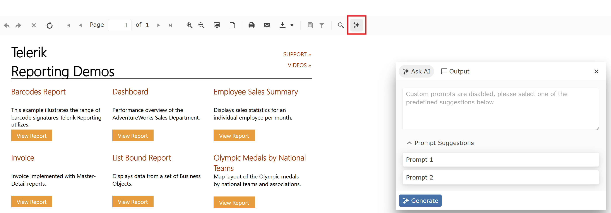
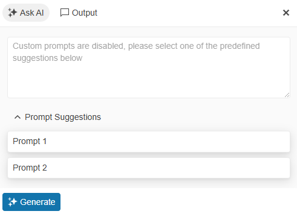
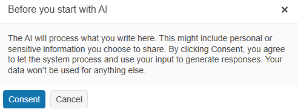

# AI-Powered Insights Overview

The AI-powered insights during report preview provide comprehensive capabilities, including response generation, prompt creation, AI output interaction, and execution of predefined commands.



## Feature Concept

To bring the power of Generative AI (GenAI) into reporting workflows, we are introducing a **AI Prompt** that integrates seamlessly with our [HTML5-based Report Viewers](). This feature is designed to enhance productivity and user experience by enabling intelligent interactions with report content.

>note The **AI Prompt** functionality will be made available for the other [Report Viewers]() as well, in the releases to come. 

### Key Features:

- **Predefined Summary Prompts**  
  Users can choose from a set of **predefined prompts** tailored for common tasks like summarization, explanation, and data insights—boosting efficiency with minimal effort.

- **Custom AI Prompts**
  Besides the predefined prompts, you can choose to allow custom prompts to be made by the end-users of the application.

- **End-User Consent for Data Sharing**  
  To ensure transparency and compliance, the **AI Prompt** will **request explicit consent** from users before sharing any data with GenAI services.

- **Flexible Context Selection**  
  Users can define the scope of the prompt by selecting:
  
  * The **entire document**
  * A **specific page**
  * A **range of pages**



## User Consent for AI Summaries

Before using the AI Prompt Dialog, users must give consent for the AI to process their provided text. This ensures transparency and user control over their data.



## Configure the AI

| Setting | Description |
| ------ | ------ |
|friendlyName|This setting specifies the name corresponding to the type of AI client you wish to use. For example, setting friendlyName to "MicrosoftExtensionsAzureOpenAI" indicates that the Azure OpenAI client is being utilized.|
|model|This setting specifies the AI model to be used for generating responses. For example, setting the model to "gpt-4o-mini" indicates that the GPT-4o mini model variant is being utilized.|
|endpoint|This setting specifies the URL of the AI service endpoint.|
|credential|This setting specifies the authentication credentials required to access the AI service. It ensures that the AI client can securely connect to the specified endpoint.|
|requireConsent|A boolean configuration option that determines whether users must explicitly consent to the use of AI models before the AI report insights features can be utilized within the application.|
|allowCustomPrompts|This setting is set to true by default. If you set it to `false`, users will only be able to use the predefined prompts and will not be allowed to ask custom prompts.|
|predefinedPrompts|This setting specifies a list of predefined prompts that the AI client can use. Each prompt is defined by a text attribute, which contains the prompt's content.|

__AI clients__

There are four available options for the `friendlyName` setting:

| Client Type | Friendly Name |
| ------ | ------ |
|Microsoft.Extensions.AI.AzureAIInference|"MicrosoftExtensionsAzureAIInference"|
|Microsoft.Extensions.AI.OpenAI + Azure.AI.OpenAI|"MicrosoftExtensionsAzureOpenAI"|
|Microsoft.Extensions.AI.Ollama|"MicrosoftExtensionsOllama"|
|Microsoft.Extensions.AI.OpenAI|"MicrosoftExtensionsOpenAI"|

Depending on which option will be used, a corresponding `Telerik.Reporting.Telerik.Reporting.AI.Microsoft.Extensions.{name}` NuGet package must be installed in the project. In other words, please install one of the following packages before continuing with the configuration:

- `Telerik.Reporting.AI.Microsoft.Extensions.AzureAIInference`
- `Telerik.Reporting.AI.Microsoft.Extensions.AzureOpenAI`
- `Telerik.Reporting.AI.Microsoft.Extensions.Ollama`
- `Telerik.Reporting.AI.Microsoft.Extensions.OpenAI`

Below is an example of how to configure the project for the `AzureOpenAI` option.

````JSON
{
	"telerikReporting": {
		"AIClient": {
			"friendlyName": "MicrosoftExtensionsAzureOpenAI",
			"model": "gpt-4o-mini",
			"endpoint": "https://ai-explorations.openai.azure.com/",
			"credential": "...",
			"requireConsent": false,
			"allowCustomPrompts": false,
			"predefinedPrompts": [
				{ "text": "Prompt 1" },
				{ "text": "Prompt 2" }
			]
		}
	}
}
````
````XML
 <Telerik.Reporting>
     <AIClient
         friendlyName="MicrosoftExtensionsAzureOpenAI"
         model="gpt-4o-mini"
         endpoint="https://ai-explorations.openai.azure.com/"
         credential="..."
         requireConsent="false"
         allowCustomPrompts="false">
         <predefinedPrompts>
             <add text="Prompt 1" />
             <add text="Prompt 2" />
         </predefinedPrompts>
     </AIClient>
 </Telerik.Reporting>
````

## Extensibility

If necessary, the Reporting engine can use a custom `Telerik.Reporting.AI.IClient` implementation, which can be registered in the Reporting REST Service configuration:

````C#
builder.Services.TryAddSingleton<IReportServiceConfiguration>(sp => new ReportServiceConfiguration
{
    HostAppId = "MyApp",
    AIClientFactory = GetCustomAIClient,
    ...
});

static Telerik.Reporting.AI.IClient GetCustomAIClient()
{
    return new MyCustomAIClient(...);
}
````

 >note The configured predefined prompts can be modified at runtime by overriding the `UpdateAIPrompts` method of the [ReportsController](/api/telerik.reporting.services.webapi.reportscontrollerbase) class.

## See Also

* [Overview of the AI Interactivity]()
* [AIClient Element Overview]()
* [Interface IClient](https://docs.telerik.com/reporting/api/telerik.reporting.ai.iclient)
