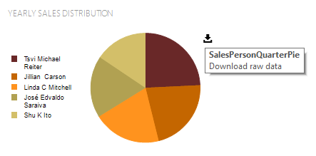
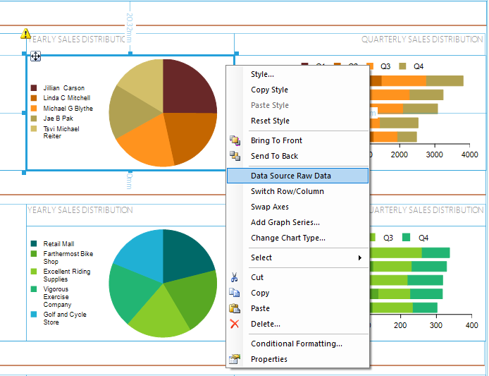

# Download Raw Data

The 'Download Raw Data' action allows the users to download the data associated with a particular [data item]() (e.g. List, Table, Graph, Map, and Report itself). The purpose of the action is to provide a quick way of examining the raw data used to databind data items during the report preview. This is useful when verifying data accuracy and gaining deeper insights into the underlying information.

In contrast with the other interactive actions, the 'Download Raw Data' action is not configurable in the designer. It is automatically created per each data item when the report is processed. The action is represented by a download icon displayed in the top-right corner of the data item when the mouse cursor hovers within its bounds.

When triggered, the 'Download Raw Data' action will open a Save File dialog, asking for a location where the data will be saved. Upon confirmation, the data used for the data item's binding will be fetched from its data context and exported to the specified location in CSV format. 

Downloading data from the items' data context means that it respects the same rules used for data binding. If a data item, e.g. a Table, is connected to a SqlDataSource instance, the 'Download Raw Data' action will fetch all the data in the data source. If a data item has its DataSource set with [Bindings]() to a parent item's data context, the downloaded data will contain only the subset applied on the item.

The filters defined in the item's [Filters]() collection will also be applied to the downloaded data.

## Support in Report Viewers

The action is currently supported in [WinForms Report Viewer]() in all supported target frameworks. Since WinForms Report Viewer is internally used when previewing reports in [Standalone Report Designer]() and [Visual Studio Report Designer](), the functionality is available there as well.

## Support in Report Designers

The export logic of the action is reused in features available during the designing of a report. The context menu of all data items has a new item - 'Data Source Raw Data' - which will open the Preview page of the corresponding data source Wizard. The Preview page has a button that will fetch the data source's data and save it in a local file.

# See Also

 * [Actions Overview]() 
 * [Interactive Action Events]() 
 * [Expressions]()
 * [Data Items]()
 * [SqlDataSource Wizard]()
