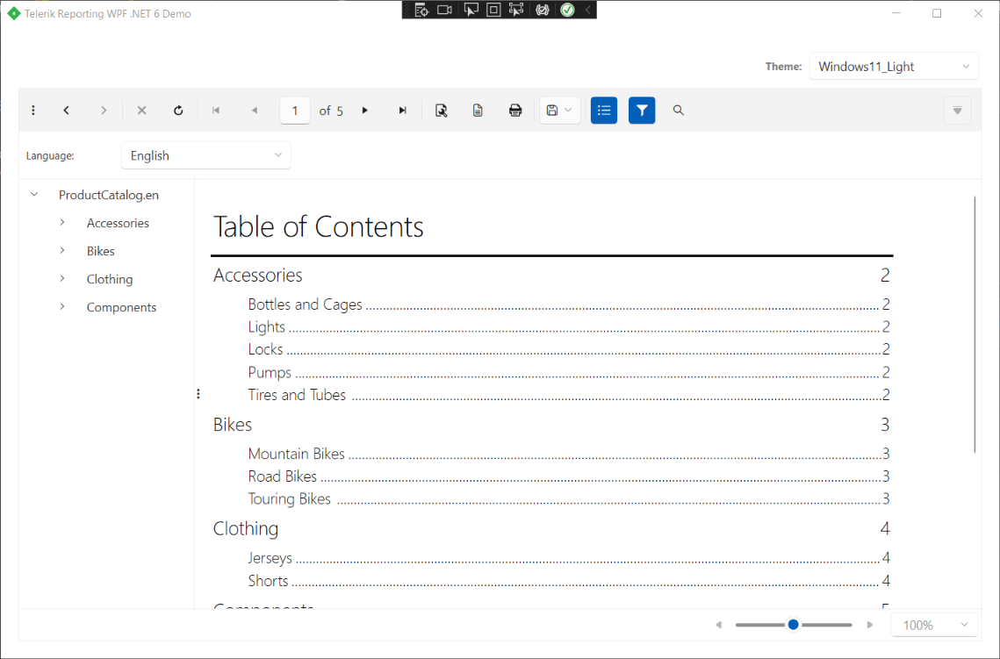

# Document Map Overview

A document map provides a set of navigational links to report items in the rendered report. A user can click links in the document map to jump to the report page that displays that item.

>note The Page Header section is skipped when jumping to a report page using a document map navigational link i.e., the report viewer/designer preview will always be positioned after the Page Header section.

The document map is also used to provide a set of navigational links to reports in a [Report Book]().

The Document map is defined by setting the [DocumentMapText](/api/Telerik.Reporting.ReportItemBase#Telerik_Reporting_ReportItemBase_DocumentMapText) and [BookmarkId](/api/Telerik.Reporting.ReportItemBase#Telerik_Reporting_ReportItemBase_BookmarkId) properties of any report item/group. The `BookmarkID` property should be unique for the whole [IReportDocument](/api/Telerik.Reporting.IReportDocument). If the `BookmarkID` is not set, then the Value of `DocumentMapText` is taken into account. Valid values are static text, expressions, or text with embedded expressions. The resulting text will be displayed in the document map tree.

To form the hierarchical structure of the document map, you may set the [DocumentMapText](/api/Telerik.Reporting.ReportItemBase#Telerik_Reporting_ReportItemBase_DocumentMapText) property of the report groups, the CrossTab/Table groups, the Detail section and the Report (useful for SubReports). For example, nested groups will create nested nodes in the tree. Each of the produced nodes will navigate to the most appropriate page and location in the rendered report. For example, bookmark of a report group will navigate to the group header (or first detail inside the group if header is not visible).

To add a node in the document map pointing to a report item, you may use the [DocumentMapText](/api/Telerik.Reporting.ReportItemBase#Telerik_Reporting_ReportItemBase_DocumentMapText) property of that item. Note that all report items (except the Detail section and the Report itself) produce leaf nodes in the document map tree. For example if you have a Panel item with TextBox item inside, and set the `DocumentMapText` property of both, the resulting nodes will be added as leaf siblings in the document map.

>note Report items positioned in the Page Header/Page Footer section of the report cannot be used to create nodes in the document map. Setting the [DocumentMapText](/api/Telerik.Reporting.ReportItemBase#Telerik_Reporting_ReportItemBase_DocumentMapText) property of such item will have no effect.

The order of items in the document map is according to the order of the report items in the report items' collection, and not by the order in which you have added [DocumentMapText](/api/Telerik.Reporting.ReportItemBase#Telerik_Reporting_ReportItemBase_DocumentMapText) to items.

>note The document map is intended for use in the __Designer Preview__ and in all __ReportViewers__. From the supported rendering extensions, only the PDF renders a document map as Bookmarks pane. All other rendering extensions ignore document maps.

## How to Add a Report Item to Document Map

You can add a document map, which acts like a table of contents. A user can click items in the document map to jump to areas within a report.

### Adding a report item to document map

1. In __Design view__, make sure the Properties pane is visible. Select the report item that you want to add to the document map. In the Properties pane, type the text that you want to appear in the document map in the [DocumentMapText](/api/Telerik.Reporting.ReportItemBase#Telerik_Reporting_ReportItemBase_DocumentMapText) property, or enter an expression that evaluates to a text. For example, type __Product Catalog__. If the [DocumentMapText](/api/Telerik.Reporting.ReportItemBase#Telerik_Reporting_ReportItemBase_DocumentMapText) does not evaluate to unique value, then a unique value should be set to the [BookmarkId](/api/Telerik.Reporting.ReportItemBase#Telerik_Reporting_ReportItemBase_BookmarkId) property.
1. Repeat step 1 for every report item that you want to appear in the document map.
1. Click __Preview__. The report runs and the document map displays the text you created. Click any link to jump to the report page and the exact location of that item.

>note Report items positioned in the Page Header/Page Footer section of the report cannot be used to create nodes in the document map. Setting the [DocumentMapText](/api/Telerik.Reporting.ReportItemBase#Telerik_Reporting_ReportItemBase_DocumentMapText) property of such item will have no effect.

### Hiding the document map when you view a report

You can run the report without initially displaying the document map by setting the `ReportViewer.DocumentMapVisible` property to `false` (true by default), and then click the Show/Hide button on the report viewer toolbar to toggle its display whenever needed.

If you want to restrict the user from showing/hiding the document map, you can hide the corresponding button by altering the viewer's `ShowDocumentMapButton` (true by default) property.

>note The order of items in the document map is according to the order of the report items in the report items' collection, and not by the order in which you have added [DocumentMapText](/api/Telerik.Reporting.ReportItemBase#Telerik_Reporting_ReportItemBase_DocumentMapText) to items.

## How to Add a Report group to Document Map

A user can click items in the document map to jump to areas within a report.

### Adding a Report group to document map

1. In __Design view__, right click outside the report sections, select View and open up the [Group Explorer]().
1. Select a report group to which you want to add a document map. The properties for the selected group appear in the __Properties__ pane.
1. In the [DocumentMapText](/api/Telerik.Reporting.Group#Telerik_Reporting_Group_DocumentMapText) property, type the text that you want to appear in the document map. Alternatively, click the ellipsis to open the __Expression__ dialog box to specify an expression that evaluates to a text. Typically for a group, the expression you type should match the group expression.
1. Click __OK__.
1. Repeat steps 1-4 for every group that you want to appear in the document map.
1. Run the report - the document map displays the group values. Click any document map node to jump to the report page with that item.

## How to Add a Table group to Document Map

A user can click items in the document map to jump to areas within a report.

### Adding a Table group to document map

1. In __Design view__, right click outside the report sections, select View and open up the [Group Explorer]().
1. Select a [Table](/api/Telerik.Reporting.Table), [Crosstab](/api/Telerik.Reporting.Crosstab) or [List](/api/Telerik.Reporting.List) report item, so the __Group Explorer__ shows the respective groups.
1. Select a group to which you want to add a document map, right click on it and select __Group Properties__. The properties for the selected group appear in the __Edit Table Group__ dialog.
1. In the [DocumentMapText](/api/Telerik.Reporting.TableGroup#Telerik_Reporting_TableGroup_DocumentMapText) property, type the text that you want to appear in the document map. Alternatively, click the ellipsis to open the __Expression__ dialog box to specify an expression that evaluates to a text. Typically for a group, the expression you type should match the group expression.
1. Click __OK__.
1. Repeat steps 1-4 for every group that you want to appear in the document map.
1. Run the report - the document map displays the group values. Click any document map node to jump to the report page with that item.
