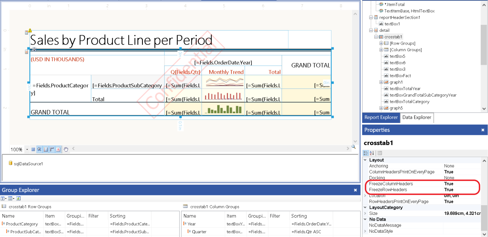
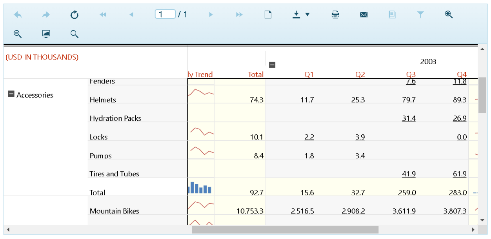

# Table Header Freezing Overview

Freezing the table headers prevents the row and/or column headers of a table from scrolling out of view while examining extensive data of a report document. All HTML5-based report viewers provide support for freezing in `Interactive` rendering mode and all report designers provide support for enabling the functionality. Header freezing is also supported in the Web Report Designer Preview mode.       

## Settings in the Report Designers

Each table or crosstab has [FreezeColumnHeaders](/api/Telerik.Reporting.Table#Telerik_Reporting_Table_FreezeColumnHeaders) and [FreezeRowHeaders](/api/Telerik.Reporting.Table#Telerik_Reporting_Table_FreezeRowHeaders) properties:         

* `FreezeColumnHeaders` keeps the column headers visible while scrolling vertically.             

* `FreezeRowHeaders` keeps the row headers visible while scrolling horizontally.             

To keep the table headers visible while scrolling:         

1. Select a table/crosstab component from the `Explorer` tab , or click the corner handle of a table data region, and then go to its `Properties` pane on the right.             

1. Under `Layout`, select which headers (row, column or both) should remain visible while scrolling.               

  

## Settings in the Report Viewers

The HTML5 Viewer automatically applies the freeze functionality in __[Interactive mode]()__ when it is enabled from the designers. The picture below shows a report with frozen row and column headers:           

  

## Behaviour

If the cells of the table headers have no or transparent background color, in order to preserve readability, their parent's background color is applied to them while scrolling.         

When `PageBreak` is set to a group, `FreezeRowHeaders` and `FreezeColumnHeaders` will work only if `RowHeadersPrintOnEveryPage`  and `ColumnHeadersPrintOnEveryPage` , respectively, are also set to true. Otherwise, the headers will be frozen only on the first page.         

>note Even though the List report item has `FreezeRowHeaders` and `FreezeColumnHeaders` in the Properties pane, it doesn't have any headers and therefore, this feature is not applicable to it.         

## See Also

 * [Interactive vs. Print Layout]()

 * [Understanding Crosstab Areas]()

 * [Understanding Pagination]()

 * [HTML Rendering Design Considerations]()
