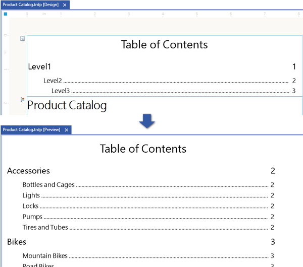
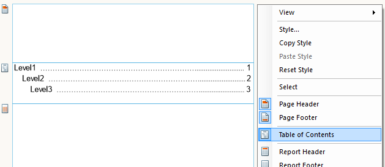
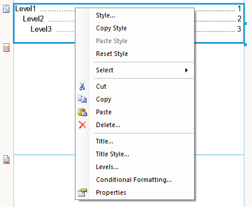

# Table of Contents Overview

The table of contents (TOC) provides a summary/overview of the report structure and a set of navigational links to report items in the rendered report, and displays the page numbers of the pages where these report items are located. The user can click the entries in the table of contents to navigate to the report page, which displays that item. The table of contents is part of the report and can be displayed before or after the report header/footer section. As such, it will be included in the page numbering of the report. The following image illustrates the table of contents section during design time and at run-time.

## Configuring a TOC Section on the Report

The table of contents can be added to the report by enabling it from the report's context menu:

>note The TOC section is designed to be displayed at the top/bottom of the entire report document. For that reason, the TOC section of the subreport is ignored.

### Structure

The position of the TOC section in the report can be controlled via the [Position](/api/Telerik.Reporting.TocSection#Telerik_Reporting_TocSection_Position) property. This property can be switched between four different states, which place the TOC before or after the report header or the report footer section.

At run-time, the table of contents entries are defined by the [TocText](/api/Telerik.Reporting.ReportItemBase#Telerik_Reporting_ReportItemBase_TocText) property of any report section/item/group. Valid values are static text, expressions, or text with embedded expressions. The resulting text will be displayed in the corresponding TOC entry. To form a hierarchical structure of the TOC, you need to set the TocText property of the report groups, the CrossTab/Table groups, the Detail section, and the Report (useful for SubReports). To add a report item to the TOC, you may use the [TocText](/api/Telerik.Reporting.ReportItemBase#Telerik_Reporting_ReportItemBase_TocText) property of that item. However, note that all report items (except the Detail section and the Report itself) produce leaf nodes in the TOC.

The table of contents definition contains a title and a hierarchy of levels. The title text can be configured using the [Title](/api/Telerik.Reporting.TocSection#Telerik_Reporting_TocSection_Title) property. Its style is controlled via the [TitleStyle](/api/Telerik.Reporting.TocSection#Telerik_Reporting_TocSection_TitleStyle) property.

The [Levels](/api/Telerik.Reporting.TocSection#Telerik_Reporting_TocSection_Levels) property contains the properties and styles for each TOC level. The hierarchy of levels corresponds to the hierarchical structure of the report sections, items, and groups for which the [TocText](/api/Telerik.Reporting.ReportItemBase#Telerik_Reporting_ReportItemBase_TocText) property is set. The properties and styles of a particular level in the Levels collection will be applied only to TOC entries for report sections/items/groups having the same level in the Report hierarchy.

When the Report hierarchy is deeper (has more levels) than the number of levels defined in the [Levels](/api/Telerik.Reporting.TocSection#Telerik_Reporting_TocSection_Levels) collection, the style of the last TOC level in the collection will be applied to the remaining TOC entries.

> When using a report book to combine different reports, each separate TOC will be displayed as part of the report it belongs to. To display a single TOC for all of the reports in the report book, you need to configure a [Report Book Table of Contents]().

>note TOC navigational links are handled internally as [Bookmark Actions](). When the report item/section/group does not have a [BookmarkId](/api/Telerik.Reporting.ReportItemBase#Telerik_Reporting_ReportItemBase_BookmarkId) value, a unique value will be automatically assigned to it at run-time. If you need to set the [BookmarkId](/api/Telerik.Reporting.ReportItemBase#Telerik_Reporting_ReportItemBase_BookmarkId) value, make sure that it is unique in the scope of the whole report (report book); otherwise, the TOC navigational links may not work correctly.

### Levels

The [Levels](/api/Telerik.Reporting.TocSection#Telerik_Reporting_TocSection_Levels) property of the TocSection contains a collection of levels. Each level has its own [LeaderSymbol](/api/Telerik.Reporting.TocLevel#Telerik_Reporting_TocLevel_LeaderSymbol) property, which defines a single character. This character is used to fill the space between the TOC text and the page number. The default character is a dot (.). To prevent the leader symbol from appearing between the text and the page number, you will need to delete this character. Each level also has a [Style](/api/Telerik.Reporting.Drawing#Telerik_Reporting_Drawing_Style) property. The style configured there will be applied to all of the TOC entry elements: text, leader symbol, and page number.

When adding a TOC section to the report for the first time, the [Levels](/api/Telerik.Reporting.TocSection#Telerik_Reporting_TocSection_Levels) collection will be empty. In this case, the TOC entries will be styled with a default style and leader symbol. You can add levels and configure them by clicking on the ellipsis button of the [Levels](/api/Telerik.Reporting.TocSection#Telerik_Reporting_TocSection_Levels) property to invoke the levels collection editor.

## Adding Content to the TOC Section

All [Report Items](), including the [Report itself](); [Report Sections](#report-sections); [Report Groiups]() and [Table Groups]() expose the property `TocText`. Its default value is null/empty string. You need to set this property to a valid [Expression]() if you want it to appear in the Report Table of Contents.

### Adding a Report Section to the Table of Contents

Set the TocText of the Report Header and Footer sections to generate a single Table of Contents item at the beginning and at the end, respectively.

>note Although the [Page Sections]() expose the property TocText, they won't appear in the Table of Contents.

### Adding a Report Item to the Table of Contents

You can add a table of contents to the report and click on entries in the table of contents to jump to specific areas within a report.

1. In __Design view__, make sure the Properties pane is visible. Select the report item you want to add to the table of contents. In the Properties pane, type the text that you want to appear in the table of contents in the [TocText](/api/Telerik.Reporting.ReportItemBase#Telerik_Reporting_ReportItemBase_TocText) property, or enter an expression that evaluates to a text.
1. Repeat step 1 for every report item you want to appear in the table of contents.
1. Enable the table of contents section from the report's context menu.
1. Click __Preview__. The report runs, and the table of contents displays the text you created. Click any link to jump to the report page and the exact location of that item.

>note Report items positioned in the Page Header/Page Footer section of the report cannot be used to create entries in the table of contents. Setting the [TocText](/api/Telerik.Reporting.ReportItemBase#Telerik_Reporting_ReportItemBase_TocText) property of such an item will have no effect.

>note The order of entries in the table of contents is according to the order of the report items in the report items' collection, and not by the order in which the items appear in the report. Thus, to build a hierarchical table of contents, it is recommended to set the [TocText](/api/Telerik.Reporting.ReportItemBase#Telerik_Reporting_ReportItemBase_TocText) of report/table groups instead of report items.
> 
> Alternatively, use the [Report Explorer]() to reorder the items in the corresponding container, so that they appear in the TOC in the desired sequence.

### Adding a Report Group to the Table of Contents

You can add a table of contents to the report and click on entries in the table of contents to jump to specific areas within a report.

1. In __Design view__, right-click outside the report sections, select View and open up the [Group Explorer]().
1. Select a report group that you want to appear in the table of contents. The properties for the selected group appear in the __Properties__ pane.
1. In the [TocText](/api/Telerik.Reporting.Group#Telerik_Reporting_Group_TocText) property, type the text you want to appear in the table of contents. Alternatively, click the ellipsis to open the __Expression__ dialog box to specify an expression that evaluates to a text. Typically for a group, the expression you type should match the group expression.
1. Click __OK__.
1. Repeat steps 1-4 for every group you want to appear in the table of contents.
1. Enable the table of contents section from the report's context menu.
1. Run the report - the table of contents displays the group values. Click any TOC entry to jump to the report page with that group instance.

### Adding a Table Group to Table of Contents

You can add a table of contents to the report and click on entries in the table of contents to jump to specific areas within a report.

1. In __Design view__, right-click outside the report sections, select View and open up the [Group Explorer]().
1. Select a [Table](/api/Telerik.Reporting.Table), [Crosstab](/api/Telerik.Reporting.Crosstab) or [List](/api/Telerik.Reporting.List) report item, so the __Group Explorer__ shows the respective groups.
1. Select a group you want to add to the table of contents, right-click it, and select __Group Properties__. The properties for the selected group appear in the __Edit Table Group__ dialog.
1. In the [TocText](/api/Telerik.Reporting.TableGroup#Telerik_Reporting_TableGroup_TocText) property, type the text you want to appear in the table of contents. Alternatively, click the ellipsis to open the __Expression__ dialog box to specify an expression that evaluates to a text. Typically for a group, the expression you type should match the group expression.
1. Click __OK__.
1. Repeat steps 1-5 for every group you want to appear in the table of contents.
1. Enable the table of contents section from the report's context menu.
1. Run the report - the table of contents displays the group values. Click any TOC entry to jump to the report page with that group instance.

## See Also

* [How to Add a Table of Contents to Report Book]()
