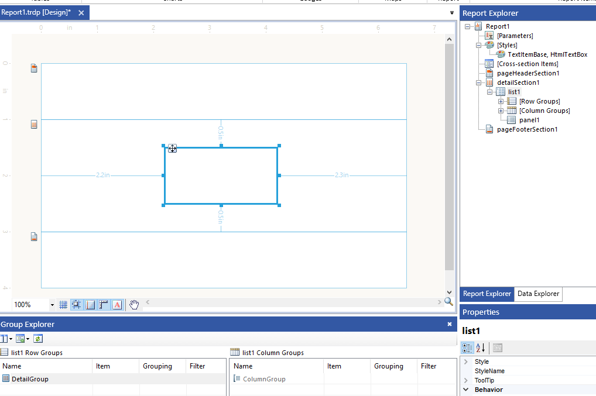
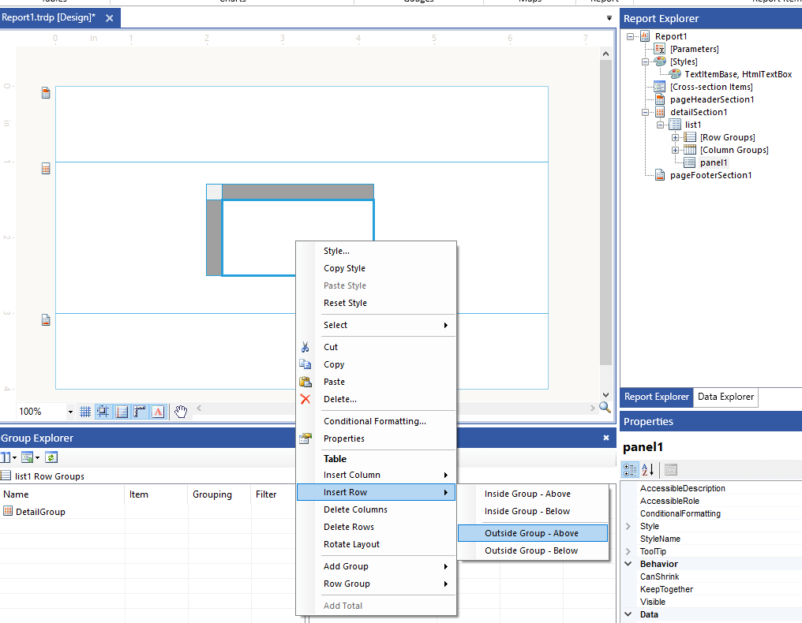
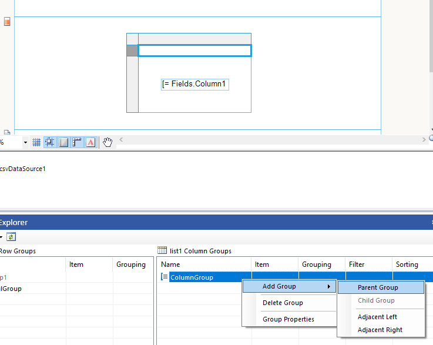
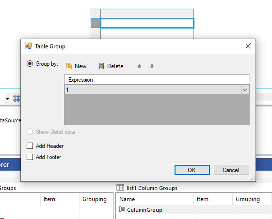

## Environment

<table>
	<tbody>
		<tr>
			<td>Product</td>
			<td>Progress® Telerik® Reporting</td>
		</tr>
		<tr>
			<td>Report Designers</td>
			<td>Visual Studio/Standalone Report Designer </td>
		</tr>
	</tbody>
</table>

## Description

When you add a [List data item](#list) in the report designer, it contains only a detail group with a [Panel]() inside:

In many scenarios, you may need to add and display Headers in the List that repeat on every page.

## Solution

The List is a variation of the Table as explained in the article [Template Variations of the Table Report Item]() and exposes the property [ColumnHeadersPrintOnEveryPage](/api/telerik.reporting.table#Telerik_Reporting_Table_ColumnHeadersPrintOnEveryPage). The property lets you print the Table Header on every page where the table/list appears.

By default, the List lacks the Table Header, so we must add it to use the property and display a header on every page. Here are the necessary steps:

1. Insert a Row into the List:

	* Right-click over the List to open the [Context Menu]()
	* Select `Insert Row` -> `Outside Group - Above`

	
	
	The new row is a header for your List. You may display aggregated values from the DataSource of the List like Totals, Averages, etc. This row cannot be displayed on every page.

1. Add a Parent Group to the Column group defined by the just inserted row:

	* Select the List and go to the [Group Explorer](). Ensure the Group Explorer is in _Extended Mode_ that displays the static groups.
	* Right-click over the column group to open the Context Menu
	* Select `Add Group` -> `Parent Group`. This opens the Table Group wizard:

		

	* Add a constant value, for example, `1` as a Grouping `Expression`. You may need to check and uncheck the _Add Header/Footer_ to enable the _OK_ button that will let you proceed:

		

	The wizard adds a new Table Header to the List. This is the header that respects the `ColumnHeadersPrintOnEveryPage` property.

1. (_optional_) Delete the row we added in _Step 1_ if you don't need it.

## See Also

* [Table Overview]()
* [Crosstab Areas]()
* [Table Cells, Rows, and Columns]()
