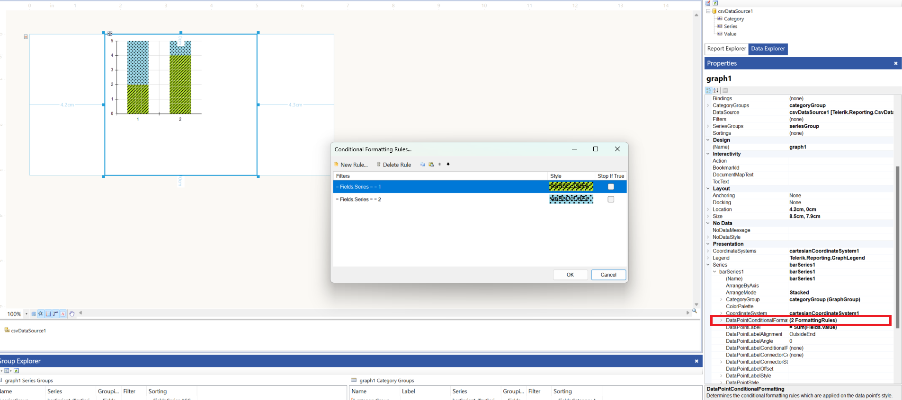

## Environment

<table>
  <tbody>
    <tr>
      <td>Product</td>
      <td>Progress® Telerik® Reporting</td>
    </tr>
  </tbody>
</table>

## Description

This article explains how to add pattern styles to graph column stack bars in Telerik Reporting using background images. The goal is to achieve visually appealing pattern styles similar to those seen in specific designs or screenshots.

This knowledge-base article also answers the following questions:
- How to use background images to create pattern styles in graph column stack bars?
- What kind of image should be used to create a specific pattern style in Telerik Reporting?
- How to adjust the density of a pattern style in graph column stack bars?

## Solution

To add a pattern style to graph column stack bars in Telerik Reporting, use the background image property of the graph column. Creating patterns involves using small images and taking advantage of the repeat functionality. The key is to adjust the size of the background image to control the pattern's density.

1. Create a small image (e.g., 10x10 pixels) using an image editing tool like Paint. This image will serve as the pattern. 
1. Save the image in an accessible location for your Telerik Report project.
1. In your Telerik Report Designer, select the graph column stack bar you wish to style. 
1. Set the `BackgroundImage` property of the graph column stack bar to the path of your created image. You can use [Conditional Formatting]() if you have a series group and you want different groups to have different patterns.

    
   
1. Use the `BackgroundRepeat` property to set how the image should repeat. This creates the pattern effect across the graph column stack bar.
1. Adjust the size of the image if necessary to control the pattern's density. Smaller images will create a denser pattern, while larger images will create a more sparse pattern.

By following these steps, you can achieve a pattern style similar to the desired design in your Telerik Report. Experiment with different sizes and designs of the background image to find the perfect pattern for your report.

## Sample Report

* [CustomPatternGraph.trdx](https://github.com/telerik/reporting-samples/blob/master/Sample%20Reports/CustomPatternGraph/CustomPatternGraph.trdx) 

## See Also

* [Telerik Reporting Graphs]()
* [Create a Graph with Column and Line Series]()
* [Change the Gap between the Bars in the Graph]()
