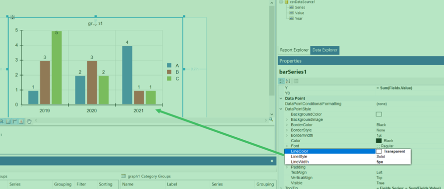

## Environment

| Product | Author |  

| --- | ---- |  

| Telerik Report Designer |[Desislava Yordanova](https://www.telerik.com/blogs/author/desislava-yordanova)| 

## Description

When creating bar charts in Telerik Reporting, you might need to add space between bars within the same category slot. By default, bars in the same category are displayed without space between them. This article explains how to achieve spacing between these bars as a workaround, enhancing the chart's visual appeal.

## Solution

To introduce space between bars in the same category, follow these steps:

1. Set the `LineColor` of the `BarSeries` `DataPointStyle` to `Transparent`. This action will make the borders of the bars invisible.
1. Add a positive value to the `LineWidth` property. This step effectively increases the size of the bar's border, creating the illusion of space between the bars.

Here is also how you may do this with C# code:

````CSharp
DataPointStyle.LineColor = Transparent;
DataPointStyle.LineWidth = 2;  // Adjust the value as needed 
````

**Note:** Applying this workaround will also affect the top and bottom parts of the bars, making them appear slightly thinner.

   

## Notes

This workaround manipulates the visual appearance of the bars to create the illusion of space between them. It's an effective method when the default appearance does not fit the required visual design of the report.

## See Also

* [Telerik Reporting Documentation]()
* [BarSeries Properties]()
