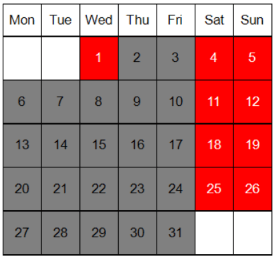
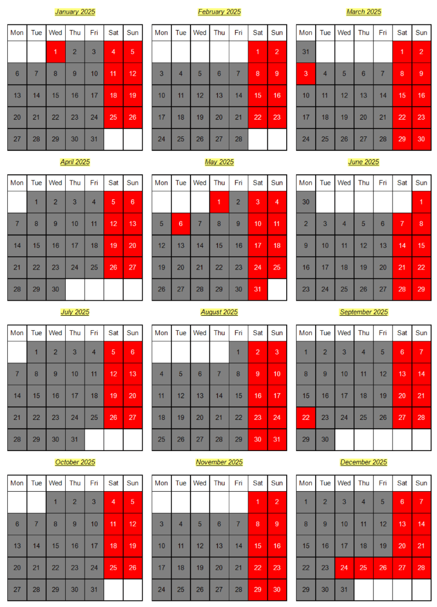

## Environment
<table>
<tbody>
<tr>
<td> Product </td>
<td> Reporting </td>
</tr>
</tbody>
</table>

## Description

I need to create a calendar within a Telerik Report that visually represents special days like Holidays. 

## Solution

To generate a calendar layout in Telerik Report, use a **List** item with the approach described in the KB article [Multi-Column Report - Across the Page and Then Down](). Each cell represents a day, with weeks laid out as rows. 

Additionally, you may create an outer grid with the Months of the Year using the same approach and an outer List, whose detail section will host the Months.

### Using a List for a single Month Calendar

1. Use a [List item](https://docs.telerik.com/reporting/knowledge-base/how-to-create-multi-column-report---across-the-page-and-then-down) to create a calendar layout.
1. Set the number of columns to 7 (days in a week).
1. Use the **Bindings** feature to dynamically change the text and background color for selected days.
1. Add a new parent Row Group (Outside Group > Above) to the List for a Row Header with the Weekday names.
1. Use the following expression to set the weekday headers starting with Monday. You may change it accordingly if you prefer the Calendar to start with Sunday or another day:

	= Switch(Fields.Index % 7, 0, "Mon", 1, "Tue", 2, "Wed", 3, "Thu", 4, "Fri", 5, "Sat", "Sun")

Here is a sample of how the January 2025 calendar looks:

### Using an outer List for a Year Calendar

1. Place the calendar list inside an outer list detail Panel and apply the same 'across and then down' approach for the outer list. Set the number of columns as preferred. For example, if you want three months horizontally and four vertically, the number of columns should be 3.
1. Use Panels on the sides and below the Month list to ensure the months in the Year calendar are separated.
1. If you want to show also Month names, you should add a middle List between the Month and Year lists.
	* The detail section should contain both the Month list with its side panels, and above it the Month name in a TextBox or HtmlTextBox.
	* The TextBox/HtmlTextBox with month name should be Docked to the top of its parent Panel. This ensures the month name will be displayed above the whole week.

This is the whole 2025 calendar created with the above approach. You may downloas the demo report from the reporting-samples repo :

### Resources

Refer to the following resources for detailed examples:
- [Creating a Calendar Report with Telerik Reporting](https://www.telerik.com/blogs/creating-a-calendar-report-with-telerik-reporting)
- [Designing a Calendar/Schedule Report](https://www.telerik.com/forums/designing-a-calendar-schedule-report)
- [Multi-Column Report - Across the Page and Then Down](https://docs.telerik.com/reporting/knowledge-base/how-to-create-multi-column-report---across-the-page-and-then-down)
- [Using Expressions and Bindings](https://docs.telerik.com/reporting/designing-reports/connecting-to-data/expressions/using-expressions/bindings)

## See Also

- [Table and Crosstab Overview](https://docs.telerik.com/reporting/table-working-with-table-cross-table-list-items)
- [Multi-Column Report Example](https://docs.telerik.com/reporting/knowledge-base/how-to-create-multi-column-report---across-the-page-and-then-down)
- [Expressions and Bindings](https://docs.telerik.com/reporting/designing-reports/connecting-to-data/expressions/using-expressions/bindings)
