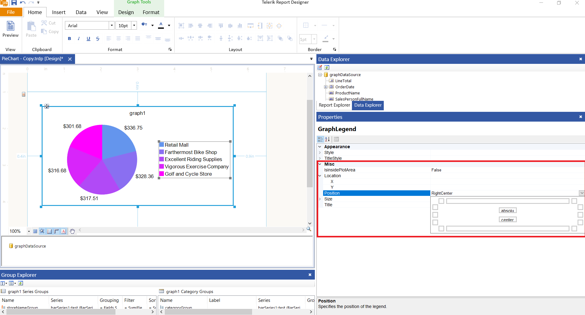
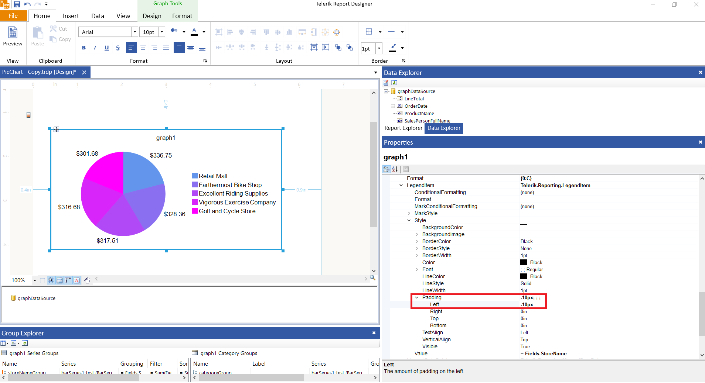

## Environment

<table>
  <tbody>
    <tr>
      <td>Product</td>
      <td>Progress® Telerik® Reporting</td>
    </tr>
  </tbody>
</table>

## Description

In Telerik Reporting, adjusting the position of the legend markers relative to the legend text can enhance the readability and aesthetic appeal of your reports. This knowledge-base article also answers the following questions:

- How can I customize the legend item padding in Telerik Reporting?
- Is it possible to adjust the spacing between legend markers and text?
- What methods are available for styling the legend in Telerik Reporting?

## Solution

### Using the Map Legend Styling and Formatting

We may use the [Position](/api/telerik.reporting.graphlegend#Telerik_Reporting_GraphLegend_Position) property of the [GraphLegend](/api/telerik.reporting.graphlegend) to adjust the position of the Graph Legend: 

### Adjusting Legend Text Padding

For more precise control over the spacing between the legend markers and the text, the `Series.LegendItem.Style.Padding` property offers a flexible solution. By applying negative padding, you can move the legend text closer to the markers. The `Padding` property affects the space around the legend text, allowing for fine-tuning of its position relative to the legend markers.

This image demonstrates how to customize the left padding of the legend item's style, effectively moving the text closer to the legend markers. Adjust the padding value according to your specific layout requirements.

## See Also

* [API Reference: GraphSeriesBase.LegendItem Property](/api/telerik.reporting.graphseriesbase#collapsible-Telerik_Reporting_GraphSeriesBase_LegendItem)
* [Formatting a Map Legend in Telerik Reporting]()
