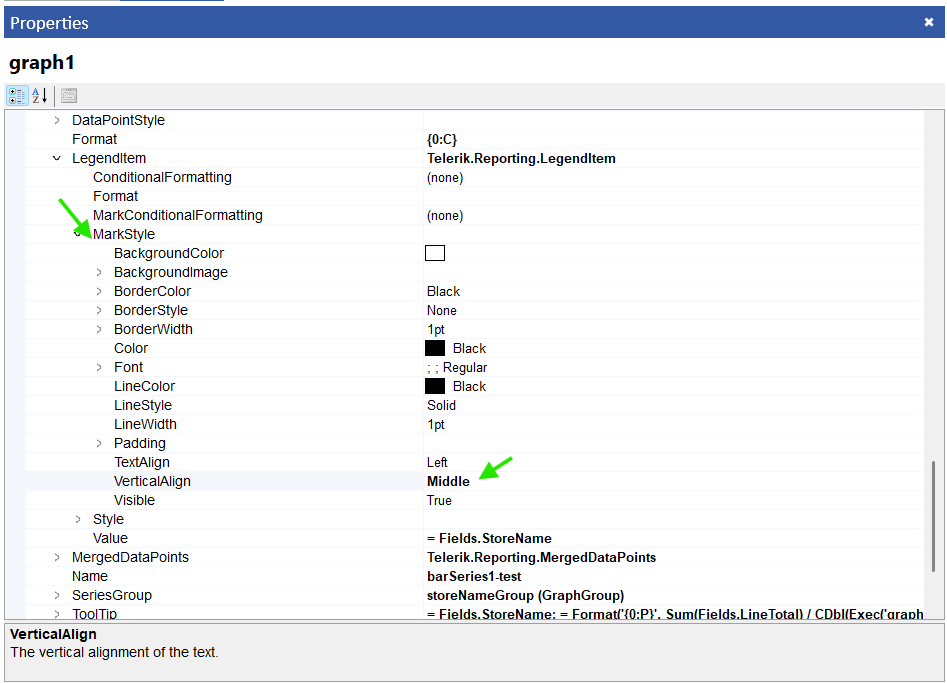

## Description
When designing reports, aligning the [Graph]() legend's mark and text correctly is crucial for readability and aesthetics. This knowledge-based article explains how to adjust the legend text alignment in a graph within Telerik Reporting. Also answers the following questions:

- How do I center align the legend mark in Telerik Reporting?
- What property adjusts the legend mark alignment in a graph?
- How can I ensure my graph's legend mark is properly centered?

## Environment
<table>
  <tbody>
      <tr>
        <td>Product</td>
        <td>Progress® Telerik® Reporting</td>
      </tr>
      <tr>
        <td>Report Item</td>
        <td>Graph</td>
      </tr>
    </tbody>
</table>

## Solution

To center align the legend text in a graph component, follow these steps:

1. Select the [Graph]() item in the report.
1. Expand to the [Series](/api/telerik.reporting.graphseries) collection proeprty of the graph.
1. Choose the series for which you want to adjust the Legend mark alignment.
1. From the [LegendItem](/api/telerik.reporting.graphseriesbase#Telerik_Reporting_GraphSeriesBase_LegendItem) dropdown, select the [MarkStyle](/api/telerik.reporting.legenditem#Telerik_Reporting_LegendItem_MarkStyle) property.
1. Adjust the [VerticalAlign](/api/telerik.reporting.drawing.style#Telerik_Reporting_Drawing_Style_VerticalAlign) property within [MarkStyle](/api/telerik.reporting.legenditem#Telerik_Reporting_LegendItem_MarkStyle) to set the alignment box to the middle, vertically aligning the legend mark in the center within the legend box.

## See Also
* [Graph Product Documentation]()
* [Styling the Graph]()
* [Report Items Overview]()
