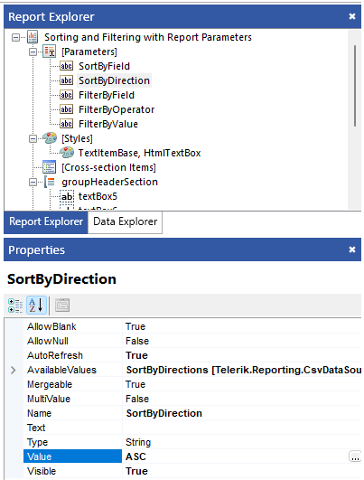
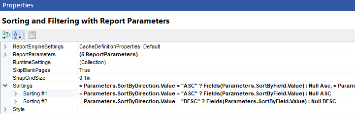
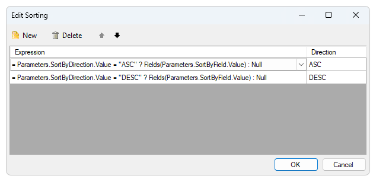
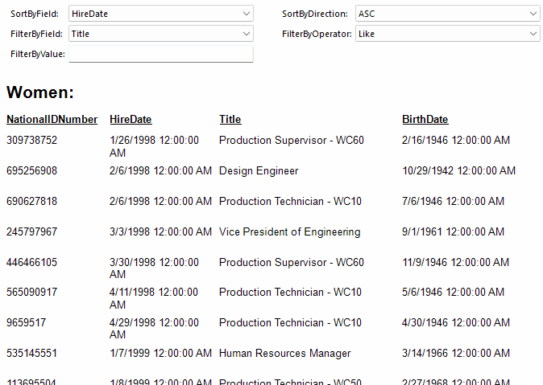

## Environment

| Version | Product | Author |  

| --- | --- | ---- |  

| 18.1.24.514| Telerik Reporting|[Desislava Yordanova](https://www.telerik.com/blogs/author/desislava-yordanova)| 

## Description

Learn how to change the sort direction dynamically of a group within a report based on the value of a parameter. The group should be sorted either in descending order or ascending order. 

## Solution

To dynamically control the sort direction of a group based on a parameter, follow these steps:

1. Define a report parameter with the appropriate value type, for example, `SortByDirection`. This parameter will will be used in the expression for sorting the data to achieve interactivity. The **AvailableValues** are: 'ASC' and 'DESC'.

     

2. In the report designer, navigate to the report properties. Then, the SortByDirections parameter can be used for the report's **Sortings** collection:

      
 
      

3. Apply the changes and preview the report. The sorting direction of the specified group will change based on the value of the `SortByDirection` parameter.

   

>note A sample report can be found in the [Sample Reports folder](https://github.com/telerik/reporting-samples/tree/master/Sample%20Reports) >> Sorting and Filtering with Report Parameters.trdp.

For more information on sorting data in reports and using report parameters, refer to the following Telerik Documentation articles:
- [Ordering Data]()
- [How to Add Report Parameters]()

## Notes

- Interactive sorting, allowing users to toggle between ascending and descending order (without any parameter), can also be achieved using sorting actions. For more details, see [Sorting Action Overview]().

## See Also

- [Report Parameters Documentation]()
- [Sorting Data in Reports]()
- [Sorting Action in Reports]()
