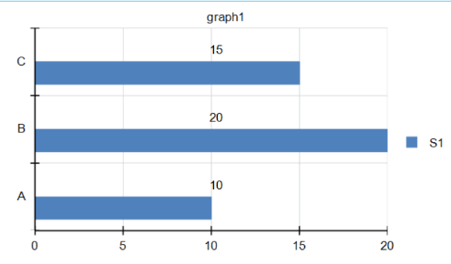
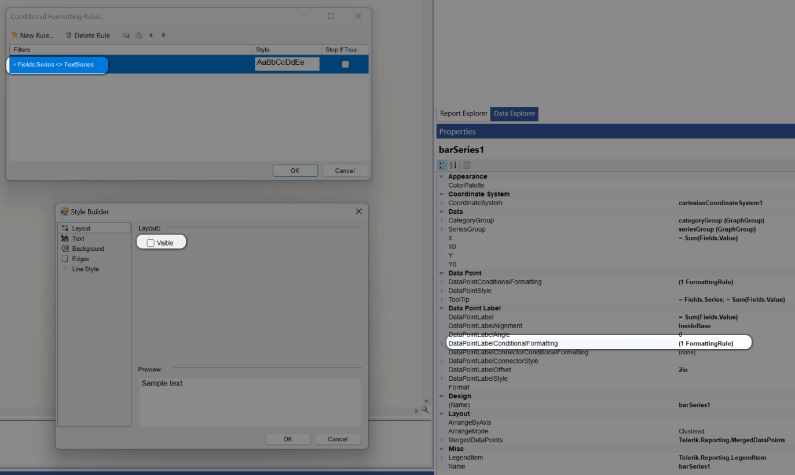
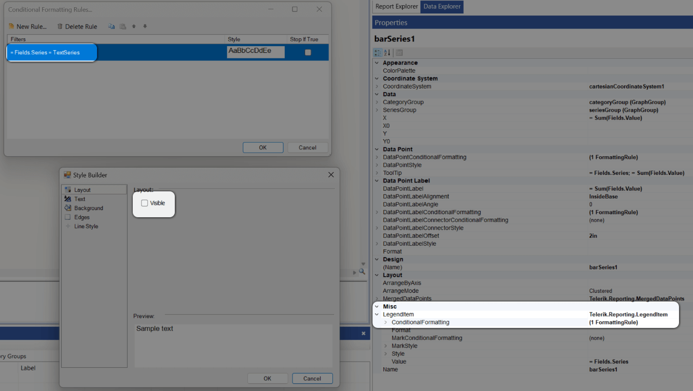

## Environment

<table>
<tbody>
<tr>
<td>Product</td>
<td>Reporting</td>
</tr>
</tbody>
</table>

## Description

I have a bar graph where the data point label is positioned in the vertical center of the horizontal bar. I want the label to align with the top of the bar instead of being centered inside the bar. Is there a way to achieve this?

This knowledge base article also answers the following questions:
- How to position the data point label at the top of the horizontal bar in a graph?
- How to format and hide series labels in bar graphs?

Here is the desired output:

## Solution

To achieve the desired vertical alignment of the data point label at the top of the horizontal bar, use a workaround with a dummy series to simulate the label position. Follow these steps:

1. Duplicate the original series to create a new dummy series specifically for the data point label. Name this series, for example, `TextSeries`.
1. Apply [Conditional Formatting]() to make the dummy series transparent:

	- Set the `BackgroundColor` property of the dummy series to `Transparent`:

	

1. Add similar Conditional Formatting to hide the label on the original series:

	- This ensures the original series does not display overlapping labels.

	

1. Hide the dummy series from the legend:

	- Use Conditional Formatting to exclude the dummy series from appearing in the graph's legend.

	

By following these steps, the dummy series will display the data point labels aligned at the top of the bar, while the original series will remain unaffected.

Download the [demo report BarChartWithDataPointLabelAbove.trdx](https://github.com/telerik/reporting-samples/blob/master/Sample%20Reports/BarChartWithDataPointLabelAbove.trdx) from the reporting-samples repo.

## See Also

- [Conditional Formatting]()
- [Creating and Customizing Bar Charts]()
- [Designing Reports]()
- [Graph]()
