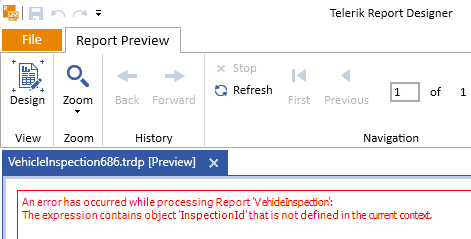
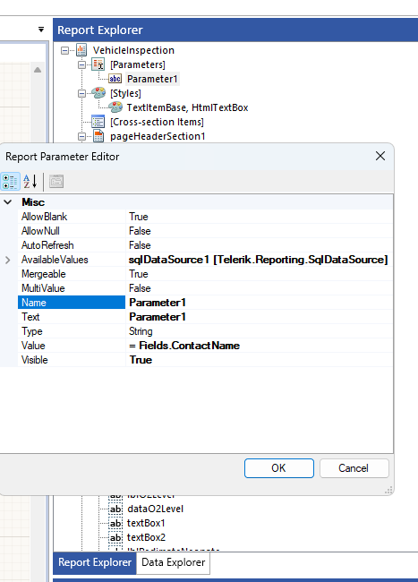
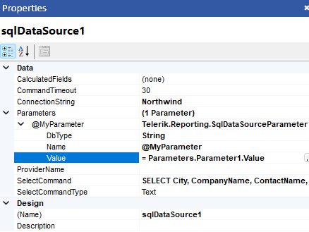

## Environment

| Version | Product | Author |  
| --- | --- | ---- |  
| 17.0.23.118| Standalone Report Designer |[Desislava Yordanova](https://www.telerik.com/blogs/author/desislava-yordanova)| 

## Description

While using the [Standalone Report Designer](), I encountered an error during the preview: "The expression contains object 'InspectionId' that is not defined in the current context." 

   

I have configured a parameter, and my select statement includes this parameter. Although executing the query with a design time value returns one record from the data view, the preview fails with the mentioned error. This KB article also answers the following questions:
- How do I link SQL data source parameters to report parameters in Telerik Reporting?
- What steps should I follow to ensure my report parameters are recognized during the preview?
- Why is my report parameter not found in the current context during the preview?

## Solution

To resolve the issue where a report parameter is not recognized in the report preview, ensure that the report parameter is correctly defined in the report's parameters collection and linked to the SqlDataSource component.

1. Verify that the report parameter is added to the report parameters collection. Refer to the [Report Parameters Overview]() for guidance on defining report parameters.

    >caption Report Parameter

          

2. Ensure that each SqlDataSource parameter is linked to an expression, such as a report parameter value, in the report definition. SqlDataSource parameters cannot directly receive values from the ReportSource.Parameters collection. Review the [Using Parameters with the SqlDataSource Component]() for more details.

    >caption SqlDataSourceParameter

            

3. In your report definition, connect the SqlDataSource parameter to the report parameter through the SqlDataSource's SelectCommand. This involves setting up a SqlDataSourceParameter that references the report parameter.

4. For detailed steps on adding and configuring report parameters, consult the [Approaches for Adding Report Parameters]() guide.

By following these steps, you ensure that your report parameters are correctly recognized during the preview, preventing errors related to undefined objects in the current context.

## See Also

- [Report Parameters Overview]()
- [Using Parameters with the SqlDataSource Component]()
- [Approaches for Adding Report Parameters]()
- [Standalone Report Designer]()

---
