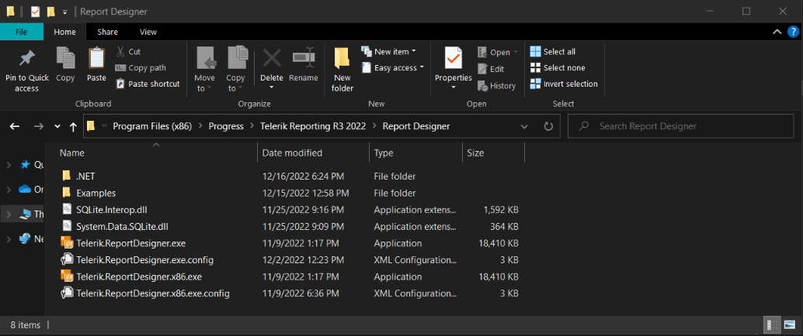
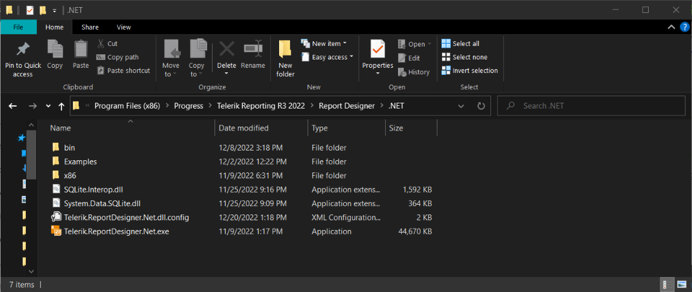

## Environment

<table>
	<tbody>
		<tr>
			<td>Product Version</td>
			<td>12.2.18.1017</td>
		</tr>
		<tr>
			<td>Product</td>
			<td>Progress® Telerik® Reporting</td>
		</tr>
	</tbody>
</table>

## Description

Configuring the SQLite ADO.NET Provider for the Stand-alone Report Designer requires a few steps. If one is missed, the DataSource provider will not work in the Report Designer. Follow the below steps to get this working.

## Solutions

### Solution for the old Standalone Report Designer

**Step 1** Download the SQLite installer per your desired version of the `.NET Framework` from the [System.Data.Sqlite](http://system.data.sqlite.org/index.html/doc/trunk/www/downloads.wiki) Downloads page.

**Step 2** Copy the `System.Data.Sqlite.dll` and `SQLite.Interop.dll` assemblies from the System.Data.Sqlite installation directory to the Report Designer installation directory.

- SQLite Installation: `C:\Program Files\System.Data.SQLite\2015\bin`
- Telerik Reporting Installation: `C:\Program Files (x86)\Progress\Telerik Reporting {{site.suiteversion}}\Report Designer`

The Telerik Reporting directory will look like the following:



**Step 3** Add the DbProvider Factory declaration to the appropriate Stand-alone Report Designer configuration file. `Telerik.ReportDesigner.exe.config` is for 64-bit (x64) and `Telerik.ReportDesigner.x86.exe.config` is for 32-bit (x86).

>note When updating the configuration file, use the version that matches the installed SQLite ADO.NET Provider, i.e., `64-bit (x64)` or `32-bit (x86)`.

````XML
<system.data>
		<DbProviderFactories>
				<remove invariant="System.Data.SQLite" />
				<add name="SQLite Data Provider" invariant="System.Data.SQLite" description=".NET Framework Data Provider for SQLite"
							type="System.Data.SQLite.SQLiteFactory, System.Data.SQLite, Version=1.0.117.0, Culture=neutral, PublicKeyToken=db937bc2d44ff139" />
		</DbProviderFactories>
</system.data>
````

**Step 4** Install the [SQLite/SQLServer Compact Toolbox](https://marketplace.visualstudio.com/items?itemName=ErikEJ.SQLServerCompactSQLiteToolbox) extension in visual studio. This will give you a similar experience to using Access.

### Solution for the new .NET Standalone Report Designer

>note The .NET Standalone Report Designer was released with the 16.2.22.914 version (R3 2022 release).

**Step 1** Download the SQLite Binaries built for `.NET Standard 2.0` or `.NET Standard 2.1` from the [System.Data.Sqlite](http://system.data.sqlite.org/index.html/doc/trunk/www/downloads.wiki) Downloads page.

**Step 2** Unpackage the zip with the binaries and copy the `System.Data.Sqlite.dll` file to the .NET Report Designer installation directory.

**Step 3** Download SQLite binaries built for `.NET Framework.4.X` from the [System.Data.Sqlite](http://system.data.sqlite.org/index.html/doc/trunk/www/downloads.wiki) page, for example [sqlite-netFx40-binary-x64-2010-1.0.117.0.zip](https://system.data.sqlite.org/downloads/1.0.117.0/sqlite-netFx40-binary-x64-2010-1.0.117.0.zip). Then unpackage the archive and copy the `SQLite.Interop.dll` assembly to the . NET Report Designer installation directory.



The .NET 6 Standalone Report Designer will automatically locate and load the SQLite assemblies, thus the data provider will appear in the SqlDataSource wizard dropdown. There is no need to edit the configuration of the .NET Report Designer - [Differences between the .NET and .NET Framework designers' functionality](#differences-between-the-net-and-net-framework-designers-functionality)

## See Also

* [System.Data.Sqlite](http://system.data.sqlite.org/index.html/doc/trunk/www/downloads.wiki)
* [SQLite/SQLServer Compact Toolbox](https://marketplace.visualstudio.com/items?itemName=ErikEJ.SQLServerCompactSQLiteToolbox)
* [How-To use SQLite with Telerik Reporting Standalone Report Designer](https://telerikhelper.net/2016/12/29/how-to-use-sqlite-with-telerik-reporting-standalone-report-designer/)
