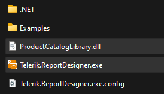
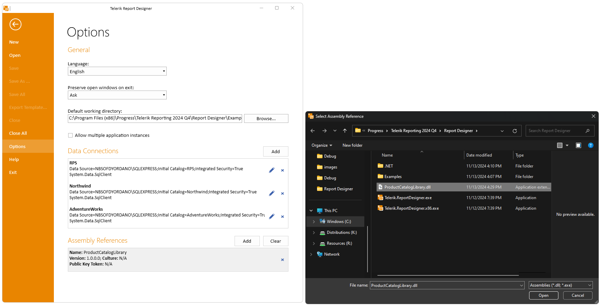

## Environment

| Version | Product | Author |  
| --- | --- | ---- |  
| 18.1.24.514| Telerik Reporting|[Desislava Yordanova](https://www.telerik.com/blogs/author/desislava-yordanova)| 

## Description

This tutorial shows how to convert Telerik.Reporting.Report objects created with the Visual Studio Report Designer to `.trdp` format for various reasons, such as ease of use or distribution. This KB article also answers the following questions:
- How can I manage .cs reports in the Standalone Report Designer?
- Is it possible to convert code-based reports to the TRDP format?
- What steps should I follow to transition from .cs report files to .trdp in Telerik Reporting?

## Solution

Let's start with a Class library project that contains the reports:

   

The project targets .NET Framework 4.6.2:

    

>note For projects targeting .NET, it is necessary to use the Standalone Report Designer for .NET. 

To convert a `.cs` report to a `.trdp` report, use the [Standalone Report Designer](). This tool allows for importing `.dll` files produced from projects containing `Telerik.Reporting.Report` objects, facilitating the conversion process.

### Steps for Conversion

1. **Compile the Project**: Ensure your project containing the `.cs` report files is compiled successfully, generating a `.dll` file which includes the `Telerik.Reporting.Report` objects.

1. Copy the produced dll (e.g. ProductCatalogLibrary.dll) and paste it next to the exe of the appropriate report designer considering the Target framework of the project:

     

1. **Open Standalone Report Designer**: Launch the Telerik [Standalone Report Designer]().

1. **Add an Assembly Reference** to the Standalone Report Designer: [Extending Report Designer to Recognize Custom Assemblies]().

      

1. **Import the DLL**: From the Report Designer, select to import reports, and navigate to the `.dll` file produced by your project from the first step above. The Standalone Report Designer will launch the [Import Report Wizard]() and will list all reports available in the `.dll` for import. Follow the wizard:

       

       
    
        

      

1. **Save as TRDP**: After successfully importing the `.cs` reports, save them in the `.trdp` format using the Standalone Report Designer's save functionality.

      

## See Also

- [Standalone Report Designer Overview]()
- [How to Import Reports Created with the VS Report Designer]()
- [Extending Report Designer at a Glance]()
