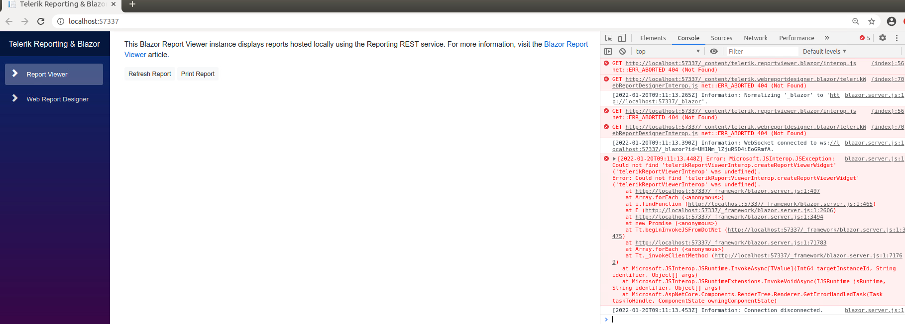

## Environment

<table>
	<tr>
		<td>Product</td>
		<td>Progress® Telerik® Reporting</td>
	</tr>
	<tr>
		<td>Report Viewer</td>
		<td>Blazor Report Viewer</td>
	</tr>
</table>

## Description
The [Blazor Report Viewer]() is not showing up on the page and there are errors in the console.



## Possible Causes

- The **interop.js** dependency of the Blazor viewer is not referenced at the end of the body element of the **Pages/_Host.cshtml (Blazor Server)** or **wwwroot/index.html (Blazor WebAssembly)**;
- The **interop.js** dependency of the Blazor viewer is referenced but with **incorrect casing**. In this case, the Blazor viewer will show up if the project is running on Windows but on Linux, it will throw an error in the console that the interop file is not found;

## Solution

The following is an example of correctly referencing the Blazor viewer's interop.js file and should be the solution for both cases:

````cshtml
<script src="_content/Telerik.ReportViewer.Blazor/interop.js" defer /script>
````

