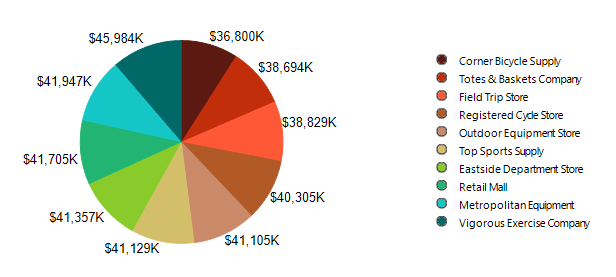

  
## Description  
 How to change the default Graph's legend item markers with a custom ones?  
  
## Solution  
The Graph uses the same markers for its series and their respective legend items. Occasionally it makes sense to substitute the legend markers with custom ones for a better presentation effect. This can be achieved using a background image that supports transparency (i.e. PNG) and set it as [LegendItem](../properties-t-telerik-reporting-legenditem).[MarkStyle](../p-telerik-reporting-legenditem-markstyle).[BackgroundImage](../p-telerik-reporting-drawing-style-backgroundimage). 
 The transparent area on the image will allow the default series color to be displayed on the legend marker. 
 Using this approach, the pie chart legend can be presented using circular marks, as shown below:  

## Note
The default series marker is created using drawing path primitives, therefore it is scalable without quality loss. Using a background image, however, might lead to distorted images on higher zoom levels, because of the resized raster images.  
  

