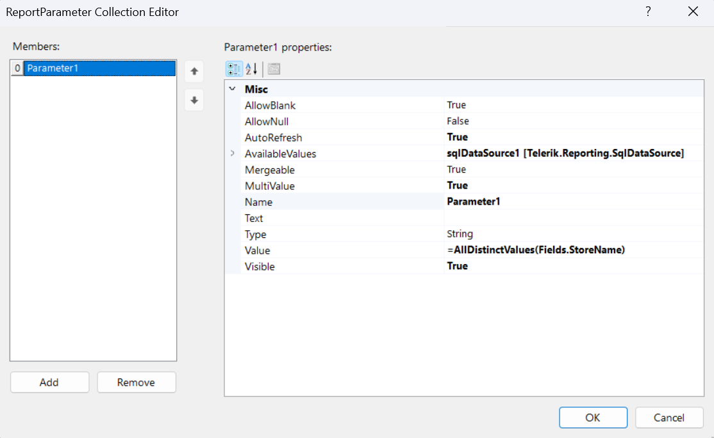
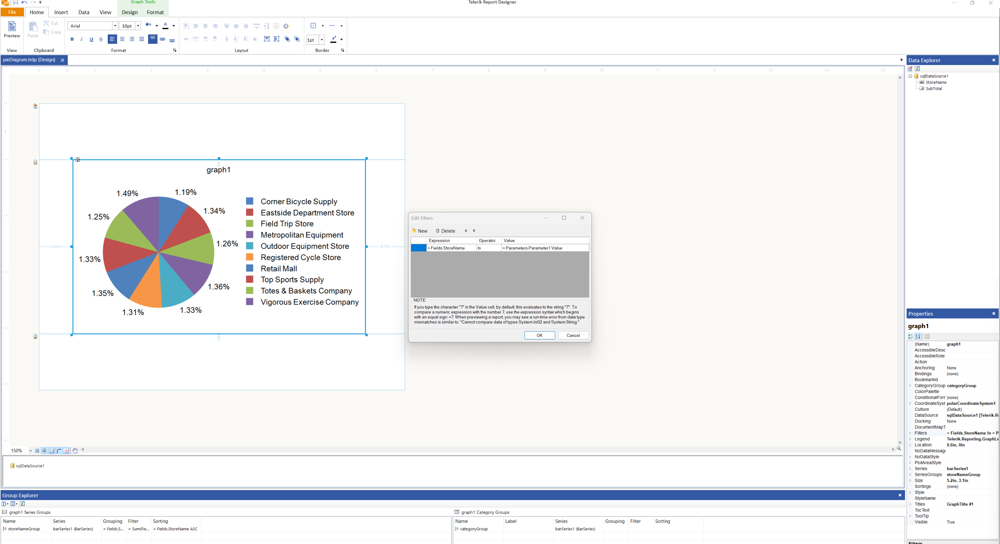

## Environment

| Product | Progress® Telerik® Reporting |
| --- | --- |
| Version | 18.1.24.514 |

## Description

Creating a pie chart that supports filtering with a multivalue report parameter that allows for dynamic data visualization based on user selection. This KB article also answers the following questions:

- How can I add multiple parameters to a Telerik Reporting pie chart?
- How do I apply filtering based on these parameters?
- What steps are necessary to allow end-user selection for pie chart data?

## Solution

To create and filter a pie chart with multiple parameters in Telerik Reporting, follow these steps:

1. **Create a Pie Chart:** Refer to the [Creating and Customizing Pie Charts]() documentation for detailed instructions on how to create a sample Pie chart.
1. **Create Report Parameters:** These parameters will be connected to the graph filter for dynamic data visualization. For guidance on adding report parameters, refer to - [Approaches for Adding Report Parameters]().
1. **Configure the [Report Parameter Collection Editor]():** We will create a `MultiValue` report parameter that will be used to filter the data but all values will be selected initially. In the "Report Parameter Collection Editor", set the `MultiValue` option to `True` and adjust the `Value`. Use the `Edit Expression` dialog to select `"Functions" -> "Aggregates" -> "AllDistinctValues"`. The expression for the `Value` property of the report parameter will then be `= AllDistinctValue(Fields.StoreName)`. This configuration allows the parameter to accept multiple values for filtering and select all distinct options for the `ValueMember`.

    

1. **Connect the Parameter to the Pie Chart Filter:** To enable filtering based on the parameter, access the pie chart's `Edit Filters` option and set the `Operator` to `In`. This connects the report parameter to the chart, enabling end-user selection and filtering - [Adding Filtering to Graph Item]().\

    

## See Also

- [Approaches for Adding Report Parameters]()
- [Creating and Customizing Pie Charts]()
- [Adding Filtering to Graph Item]()
