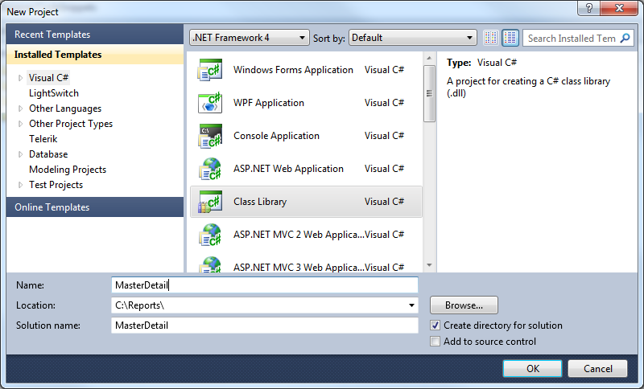
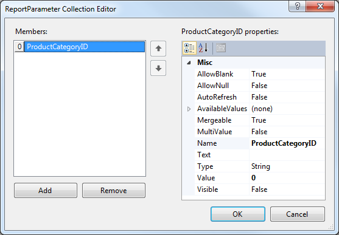
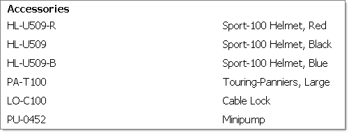

## Environment

<table>
	<tbody>
		<tr>
			<td>Product</td>
			<td>Progress® Telerik® Reporting</td>
		</tr>
	</tbody>
</table>


## Description

How can I create a Master-Detail report by using a `SubReport` report item that contains the detail data in Visual Studio Report Designer?

## Solution

To achieve the desired scenario:

1. [Create the detail report](#creating-the-detail-report)
1. [Create a report parameter and a filter that uses the report parameter](#configuring-the-report-parameter-and-filter) 
1. [Create the master report](#creating-the-master-report) 
1. [Configure the SubReport item](#configuring-the-subreport-item)

The master report data in this example consists of product categories from the AdventureWorks database. The detail report displays product names and numbers. The example uses the [Report Parameter]() to filter the detail report by a product category.

### Creating the Detail Report in Visual Studio Report Designer

1. Create a new class library named `MasterDetail` that will contain the reports.

	

1. Add a new Telerik Report item to the project through __Add New item__ -> __Reporting__ -> __Telerik Reporting [VERSION] Wizard__ -> __Blank Report__. Name it `DetailReport`.
1. From the upper left corner of design surface, click the report selector to select the report.
1. Navigate to the `DataSource` property of the report, open it, select **Add New Data Source** and choose [**SqlDataSource Component**]().
1. Set up the data connection to the AdventureWorks database, save it so you can use it later on when creating the master report. Click **Next**. Enter the following SQL statement. Click **Finish** in the DataSource wizard.

	````SQL
SELECT
		P.Name,ProductID,ProductNumber,PC.ProductCategoryID
	FROM
		Production.Product P,
		Production.ProductSubcategory PS,
		Production.ProductCategory PC
	WHERE
		P.ProductSubcategoryID=PS.ProductSubcategoryID
		AND PS.ProductCategoryID=PC.ProductCategoryID
````


1. Remove the page header and page footer sections. Open the [Data Explorer]() and add the __ProductNumber__ and __Name__ fields to the detail section of the report.

The detail report in the designer will now look like the following.


### Configuring the Report Parameter and Filter

Now you have to create a report parameter and a filter that uses the report parameter. The master report passes in the current **ProductCategoryID** for each record and the detail report prints all products that have that **ProductCategoryID**.

1. In the __Property Window__, navigate to the __ReportParameters__ property and click the ellipses.
1. In the ReportParameter Collection Editor, click the __Add__ button. In the **Name** property for the parameter enter __ProductCategoryID__. Enter zero for the __Value__  property.

	

1. In the __Property Window__, navigate to the __Filters__ property and click the ellipses.
1. Click the __New__ button to create a new filter. In the __Expression__ drop-down for the filter select **=Fields.ProductCategoryID**. Leave the operator at the default equals to (**=**) sign. In the __Value__  property drop-down, select the **=Parameters.ProductCategoryID.Value** report parameter you created earlier.

	

1. Click the __OK__ button to close the dialog.

### Creating the Master Report

The master report will contain only a simple listing of product categories.

1. Add a new report item to the project and name it **MasterReport**.
1. The [Report Wizard]() will show automatically when you select __Telerik Report [VERSION] Wizard - Band Report Wizard__.
1. On the __Choose Data Source__ page of the wizard, click the __Add New Data Source__ button and select [**SqlDataSource Component**](). On the __Choose Your Data Connection__ page of the wizard, select the saved database connection you created for the detail report. Click the __Next__ button.
1. Enter the SQL statement below and click the __Next__ button.

	````SQL
SELECT ProductCategoryID,Name FROM Production.ProductCategory
````


1. In the __Design Data Layout__ page of the wizard, add the __Name__ column to the detail section and click the **Next** button. Continue accepting the defaults until you finish the process.

### Configuring the SubReport Item

This step ties both reports together by using a `SubReport` to display the details and by passing the current **ProductCategoryID** from each record of the master report to the detail. The detail report uses the parameter to filter the data to products for the specified product category only. 

1. Resize the detail section to create some vertical room for a `SubReport` item.
1. Drag a [`SubReport`]() from the Toolbox to the detail section of the report.
1. In the **Properties** window for the `SubReport`, open the [**ReportSource**]() dialog, select __Type name__ ([`TypeReportSource`](/reporting/api/Telerik.Reporting.TypeReportSource)), and set it to the **DetailReport**. Note that you have to build the project first in order for the types to appear in the wizard.
1. Click the __Edit Parameters__ button to display the __Edit Parameters__ dialog.
1. Click the __New__ button to define a parameter.
1. Set the __Parameter Name__ to __ProductCategoryID__ and the parameter value to __=Fields.ProductCategoryID__.
1. Click the __OK__ button to close the parameters dialog. Click __OK__ again to close the **Report Source** dialog.

	

Click the **Preview** button to preview the MasterReport. Note that the product numbers and names from the detail report are displayed under each product category from the master report.



>note You can create the same report layout with the Standalone Report Designer, where subreports can be specified by a path to a TRDX file or by directly placing the XML of the sub report in the provided `SubReport.ReportSource` editor.
