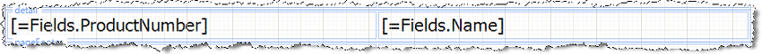
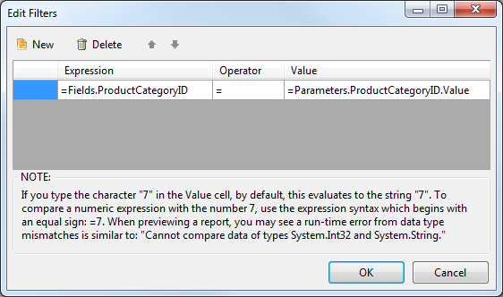
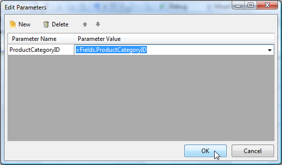

## Environment

<table>
	<tbody>
		<tr>
			<td>Product</td>
			<td>Progress® Telerik® Reporting</td>
		</tr>
	</tbody>
</table>

## Description

How can I create a Master-Detail report by using a `SubReport` report item that contains the detail data in Visual Studio Report Designer?

## Solution

To achieve the desired scenario:

1. [Create the detail report](#creating-the-detail-report)
1. [Create a report parameter and a filter that uses the report parameter](#configuring-the-report-parameter-and-filter)
1. [Create the master report](#creating-the-master-report)
1. [Configure the SubReport item](#configuring-the-subreport-item)

The master report data in this example consists of product categories from the AdventureWorks database. The detail report displays product names and numbers. The example uses the [Report Parameter]() to filter the detail report by a product category.

### Creating the Detail Report in Visual Studio Report Designer

1. Create a new class library named `MasterDetail` that will contain the reports.

   

1. Add a new Telerik Report item to the project through **Add New item** -> **Reporting** -> **Telerik Reporting [VERSION] Wizard** -> **Blank Report**. Name it `DetailReport`.
1. From the upper left corner of design surface, click the report selector to select the report.
1. Navigate to the `DataSource` property of the report, open it, select **Add New Data Source** and choose [**SqlDataSource Component**]().
1. Set up the data connection to the AdventureWorks database, save it so you can use it later on when creating the master report. Click **Next**. Enter the following SQL statement. Click **Finish** in the DataSource wizard.

   ```SQL
   SELECT
   	P.Name,ProductID,ProductNumber,PC.ProductCategoryID
   FROM
   	Production.Product P,
   	Production.ProductSubcategory PS,
   	Production.ProductCategory PC
   WHERE
   	P.ProductSubcategoryID=PS.ProductSubcategoryID
   	AND PS.ProductCategoryID=PC.ProductCategoryID
   ```

1. Remove the page header and page footer sections. Open the [Data Explorer]() and add the **ProductNumber** and **Name** fields to the detail section of the report.

The detail report in the designer will now look like the following.



### Configuring the Report Parameter and Filter

Now, create a report parameter and a filter that uses the report parameter. The master report passes in the current **ProductCategoryID** for each record and the detail report prints all products that have that **ProductCategoryID**.

1. In the **Property Window**, navigate to the **ReportParameters** property and click the ellipses.
1. In the ReportParameter Collection Editor, click the **Add** button. In the **Name** property for the parameter enter **ProductCategoryID**. Enter zero for the **Value**  property.

   

1. In the **Property Window**, navigate to the **Filters** property and click the ellipses.
1. Click the **New** button to create a new filter. In the **Expression** drop-down for the filter select **=Fields.ProductCategoryID**. Leave the operator at the default equals to (**=**) sign. In the **Value**  property drop-down, select the **=Parameters.ProductCategoryID.Value** report parameter you created earlier.

   

1. Click the **OK** button to close the dialog.

### Creating the Master Report

The master report will contain only a simple listing of product categories.

1. Add a new report item to the project and name it **MasterReport**.
1. The [Report Wizard]() will show automatically when you select **Telerik Report [VERSION] Wizard - Band Report Wizard**.
1. On the **Choose Data Source** page of the wizard, click the **Add New Data Source** button and select [**SqlDataSource Component**](). On the **Choose Your Data Connection** page of the wizard, select the saved database connection you created for the detail report. Click the **Next** button.
1. Enter the SQL statement below and click the **Next** button.

   ```SQL
   SELECT ProductCategoryID,Name FROM Production.ProductCategory
   ```

1. In the **Design Data Layout** page of the wizard, add the **Name** column to the detail section and click the **Next** button. Continue accepting the defaults until you finish the process.

### Configuring the SubReport Item

This step ties both reports together by using a `SubReport` to display the details and by passing the current **ProductCategoryID** from each record of the master report to the detail.

The detail report uses the parameter to filter the data to products for the specified product category only.

1. Resize the detail section to create some vertical room for a `SubReport` item.
1. Drag a [`SubReport`]() from the Toolbox to the detail section of the report.
1. In the **Properties** window for the `SubReport`, open the [**ReportSource**]() dialog, select **Type name** ([`TypeReportSource`](/reporting/api/Telerik.Reporting.TypeReportSource)), and set it to the **DetailReport**. Note that you have to build the project first in order for the types to appear in the wizard.
1. Click the **Edit Parameters** button to display the **Edit Parameters** dialog.
1. Click the **New** button to define a parameter.
1. Set the **Parameter Name** to **ProductCategoryID** and the parameter value to **=Fields.ProductCategoryID**.
1. Click the **OK** button to close the parameters dialog. Click **OK** again to close the **Report Source** dialog.

   

Click the **Preview** button to preview the MasterReport. Note that the product numbers and names from the detail report are displayed under each product category from the master report.


> tip You can create the same report layout with the Standalone Report Designer, where subreports can be specified by a path to a TRDX file or by directly placing the XML of the sub report in the provided `SubReport.ReportSource` editor.
