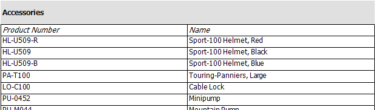

## Environment

<table>
	<tbody>
		<tr>
			<td>Product</td>
			<td>Progress® Telerik® Reporting</td>
		</tr>
	</tbody>
</table>

## Description

How can I create a Master-Detail report by using a Table report item that contains the detail data in Visual Studio Report Designer?

## Solution

To achieve the desired scenario:

1. [Create the master report](#creating-the-master-report)
1. [Create the detail table](#creating-the-detail-table)
1. [Configure the table filter](#configuring-the-table-filter)

The master report data in this example consists of product categories from the AdventureWorks database. The detail table displays product names and numbers. The example uses the [`ReportItem.DataObject`]() to filter the detail table by a product category.

## Creating the Master Report

The master report will contain only a simple listing of product categories.

1. Create a new [Telerik Report Library]() to contain the report. As a result, the __Choose Report Type__ dialog opens.
1. Select __Band Report Wizard__ and enter a name for the report class.
1. On the __Choose Data Source__ page of the Band Report Wizard, click the __Add New Data Source__ button and select the [SqlDataSource Component](). On the __Choose Your Data Connection__ page of the wizard, set up the data connection to the AdventureWorks database, save it so you can use it later when creating the Table item. Click __Next__.

1. Enter the SQL statement below and click the __Next__ button.

	````SQL
SELECT ProductCategoryID, Name FROM Production.ProductCategory
````


1. In the __Design Data Layout__ page of the wizard, add the __Name__ column to the detail section and click the Next button. Continue taking the defaults until you finish the Wizard.

## Creating the Detail Table

1. Resize the detail section to create some vertical space for the Table item.
1. Drag the __Table Wizard__ item from the Visual Studio Toolbox to the detail section of the report.
1. On the __Choose Data Source__ page of the Table Wizard, click the __Add New Data Source__ button and select the [SqlDataSource Component](). On the __Choose Your Data Connection__ page of the wizard, select the already created data connection and click __Next__.
1. Enter the following SQL statement. Click **Finish**.

	````SQL
SELECT
		P.Name,ProductID,ProductNumber,PC.ProductCategoryID
	FROM
		Production.Product P,
		Production.ProductSubcategory PS,
		Production.ProductCategory PC
	WHERE
		P.ProductSubcategoryID=PS.ProductSubcategoryID
		AND PS.ProductCategoryID=PC.ProductCategoryID
````


1. In the __Arrange Fields__ page of the Table Wizard, add the __ProductNumber__ and __Name__ fields to the Table columns and click the **Next** button. Continue taking the defaults until you finish the process.

## Configuring the Table Filter

This step creates a filter that uses the [`ReportItem.DataObject`]() property to pass in the current `ProductCategoryID` for each record and the detail table prints all products that have that `ProductCategoryID`.

1. Select the Table item.
1. In the __Property__ window, navigate to the __Filters__ property and click the ellipses.
1. Click the __New__ button to create a new filter. In the __Expression__ drop-down for the filter, select `=Fields.ProductCategoryID`. Leave the operator at the default equals to (`=`) sign. In the __Value__ property drop-down, enter the `=ReportItem.DataObject.ProductCategoryID` expression.

	

1. Click the __OK__  button to close the dialog.

Click the **Preview** button to preview the report. Note that product numbers and names from the detail table are displayed under each product category from the master report.

	

>You can create the same report layout with the [Standalone Report Designer]().
