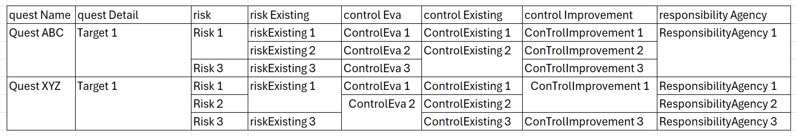

## Environment

<table>
	<tbody>
		<tr>
			<td>Product</td>
			<td>Progress® Telerik® Reporting</td>
		</tr>
	</tbody>
</table>

## Description

I want to merge neighbor cells with identical content in a table or crosstab. The desired result is shown in the following image.



## Solution

We will create the desired layout combining two different approaches for the left and right-hand columns of the Crosstab.

* You can use the Table Row Groups feature in Telerik Reporting to achieve the required merging on the left side of the Crosstab. It comes automatically with the grouping. Here are the steps:

	1. Open or create the report in Telerik Report Designer.
	1. Use the [Crosstab Wizard]() to add a Crosstab to your report.
	1. Group the Crosstab on the corresponding columns from the Crosstab DataSource. In the context of the sample TRDP report, these are the fields `questName`, `questDetail`, and `risk`. The designer will create the necessary groupings and merge the corresponding cells automatically.

* The second part is to merge the cells with identical content in the detail part of the Crosstab, including those that belong to different groups. Let's apply different styles to the table borders to mimic this merging. We will use proper [Expressions]() for the Values of the merged cells to avoid content multiplication in the merged cell:

	1. Set all `Bottom` borders to `None`.
	1. Set the `Top` border of a repeated value to `None` and the one of a new value to `Solid`. Here is a sample expression for the [Binding]() of the property `Style.BorderStyle.Top` of the last column in our sample:

		````Expression
= If(Previous(Fields.responsibilityAgency) is Not Null,
			(Fields.responsibilityAgency = Previous(Fields.responsibilityAgency)) ?
				'None' : 'Solid',
			If(Previous('risk', Fields.responsibilityAgency) is Not Null,
				(Fields.responsibilityAgency = Previous('risk', Last(Fields.responsibilityAgency))) ?
					'None' : 'Solid',
				If(Previous('questDetail', Fields.responsibilityAgency) is Not Null,
					(Fields.responsibilityAgency = Previous('questDetail', Last(Fields.responsibilityAgency))) ?
						'None' : 'Solid',
					'Solid'))))
````


	1. Set the cell Value to an empty string for a repeated value and to the corresponding Expression (for example, Field) for a new value. Here is a sample Expression for the same column of our demo:

		````Expression
= If(Previous(Fields.responsibilityAgency) is Not Null,
			(Fields.responsibilityAgency = Previous(Fields.responsibilityAgency)) ?
				'' : Fields.responsibilityAgency,
			If(Previous('risk', Fields.responsibilityAgency) is Not Null,
				(Fields.responsibilityAgency = Previous('risk', Last(Fields.responsibilityAgency))) ?
					'' : Fields.responsibilityAgency,
				If(Previous('questDetail', Fields.responsibilityAgency) is Not Null,
					(Fields.responsibilityAgency = Previous('questDetail', Last(Fields.responsibilityAgency))) ?
						'' : Fields.responsibilityAgency,
					Fields.responsibilityAgency)))
````

	We used the `Previous` [Data Function]() to check whether a value repeats the previous one in the column group.

		When the value is the first for the current group, it needs to be compared with the last one from the previous group in the parent scope, hence the use of the `Last` [aggregate function]() in these cases.

		More precisely, the function `Previous` finds the previous instance of the specified scope - the corresponding table group, for example, `risk`. If there is no such instance, i.e. the current group instance is the first one, the returned value is `Null`. If the previous group instance is found, the `Last` function returns the last value of the particular field in this (i.e. previous) group instance. The value is compared with the field value in the current group instance, which is the first for the current group.

	1. Repeat the previous steps for each detail crosstab column, changing only the Expression (for example, the name of the Field).
	1. Save and run the report to see the merged cells in the Crosstab.

## Notes

* Make sure to adjust the expressions and values based on your specific report and data.
* The sample merges cells among the groups `questDetail` and `risk`. You may add merging with the top-level group `guestName` by changing the Expressions to test for repeated value also in this group. For example, the Top Border Style Expression will become:

	````Expression
= If(Previous(Fields.responsibilityAgency) is Not Null,
		(Fields.responsibilityAgency = Previous(Fields.responsibilityAgency)) ?
			'None' : 'Solid',
		If(Previous('risk', Fields.responsibilityAgency) is Not Null,
			(Fields.responsibilityAgency = Previous('risk', Last(Fields.responsibilityAgency))) ?
				'None' : 'Solid',
			If(Previous('questDetail', Fields.responsibilityAgency) is Not Null,
				(Fields.responsibilityAgency = Previous('questDetail', Last(Fields.responsibilityAgency))) ?
					'None' : 'Solid',
				If(Previous('questName', Fields.responsibilityAgency) is Not Null,
					(Fields.responsibilityAgency = Previous('questName', Last(Fields.responsibilityAgency))) ?
						'None' : 'Solid',
					'Solid'))))
````


## Example

Download the sample report [MergedTableCells.trdp in our reporting-samples Github repository](https://github.com/telerik/reporting-samples/blob/master/Sample%20Reports/MergedTableCells.trdx).

## See Also

* [Telerik Reporting Documentation](https://docs.telerik.com/reporting/overview)
* [Telerik Reporting Forum](https://www.telerik.com/forums/reporting)
* [Telerik Reporting Demos](https://demos.telerik.com/reporting/)
