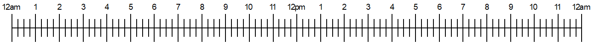

## Environment
<table>
<tbody>
<tr>
<td> Product </td>
<td> Progress® Telerik® Reporting </td>
</tr>
</tbody>
</table>

## Description

I need to create a timeline graphic with the Report Designer that displays time detail and attendance. The timeline should visually showcase mismatches between entered attendance and hours clocked by employees. It needs to include a scale from 12 am to 12 am and use visual elements to represent time, attendance, and mismatches with distinct colors.

This knowledge base article also answers the following questions:
- How to replicate a timeline design in Telerik Reporting?
- How to use PictureBox and List items to build a timeline in Telerik Reporting?
- How to visualize mismatches between time and attendance in Telerik Reporting?

## Solution

To create a timeline graphic, use a combination of [PictureBox]() and [List](#list) items. Below are the steps to achieve the desired result:

1. **Create PictureBox for Scale**:

	Add a PictureBox to the report to display the fixed time scale from 12 am to 12 am. Here is a sample one:
	
	

1. **Prepare Data Source**:

	Convert the existing data source to include numerical representation for the entered attendance ("Attendance" in the JSON below) and hours clocked by employees ("Details" in the JSON below). Both should include the following activities:
	
	* actual attendance hours (colors Green for "Details" and Blue for "Attendance")
	* mismatches (Red color)
	* hours without attendance (White color)
	
	Each array may contain multiple items for each activity type. Use a structure like this:

	````JSON
[{
		"Details":[
			{
				"Index": 0,
				"Color": "White",
				"Length": 6
			},
			{
				"Index": 1,
				"Color": "Green",
				"Length": 10
			},
			{
				"Index": 2,
				"Color": "Red",
				"Length": 2
			},
			{
				"Index": 3,
				"Color": "White",
				"Length": 6
			}
		],
		"Attendance":[
			{
				"Index": 0,
				"Color": "White",
				"Length": 8
			},
			{
				"Index": 1,
				"Color": "Blue",
				"Length": 8
			},
			{
				"Index": 2,
				"Color": "Red",
				"Length": 2
			},
			{
				"Index": 3,
				"Color": "White",
				"Length": 6
			}
		]
	}]
````

	* Ensure the `Index` field is unique for each array item. This is essential for the List column groups to be introduced later.
	* The total sum of all "Length" fields in each array should be 24.

1. **Configure Lists for the Timeline Bars**:

	* Add two Lists—one for "Detail" and one for "Attendance".
	* Ensure the Lists have the smallest possible Width as they can only grow in runtime.
	* [Bind]() each List DataSource to its respective field (`Details` and `Attendance`) from the main data source.
	* Set the List's `RowGrouping` to a constant value (e.g., `1`) to ensure a single row.
	* Configure `ColumnGrouping` to the `Index` field for dynamic column generation based on the data. Since each Index is unique, there will be as many columns as records in the "Detail" and "Attendance".

1. **Style Panels in List**:

	* Set the background color of each panel dynamically using binding: `= Fields.Color`.
	* Adjust the width of each panel dynamically using binding: `= Fields.Length * 0.25 + "in"`. Modify the multiplier `0.25` to match the scale length.

1. **Align Lists to Scale**:

	Position the Lists below the PictureBox to ensure alignment with the time scale. The total "Length" is always 24, hence the multiplier `0.25` should be used with PictureBox/Scale that is `24*0.25 in = 6 in` long.


## See Also

* [PictureBox Documentation]()
* [List Item Documentation](#list)
