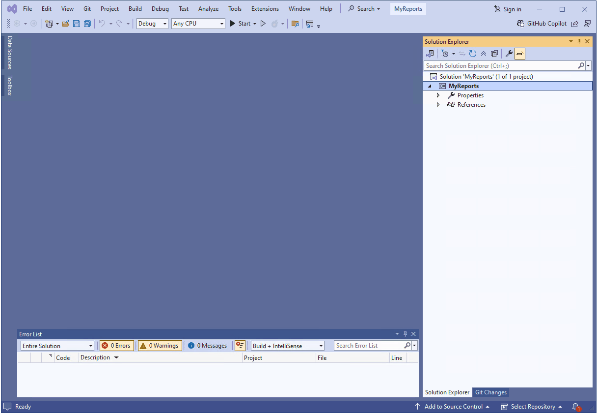

## Environment

| Version | Product | Author | 
| ---- | ---- | ---- |
|  | Visual Studio Report Designer |[Desislava Yordanova](https://www.telerik.com/blogs/author/desislava-yordanova)| 

## Description

This tutorial shows how to create and utilize custom [user functions]() in the [Visual Studio Report Designer]().

## Solution

Let's start with creating a Class library (**.NET Framework**) project and add a **Report** class using the [Item Templates]() in Visual Studio. 

### User Functions Defined in the Report class

If your custom user function as a **public static** (**Public Shared** in *VB.NET*) method is a part of the current Report class:

````C#
public partial class Report1 : Telerik.Reporting.Report
{
    public Report1()
    {
        InitializeComponent();
    }

    [Function(IsVisible = true, Category = "My Functions", Namespace = "My", Description = "Say Hi")]
    public static string Greet(string name)
    {
        return string.Format("Hello, {0}", name);
    }
}
````

It can be invoked from an expression by its name, specifying the necessary parameters in the braces, e.g., setting the **Value** of a **TextBox** to:

`= Greet("Dess")`

   

### User Functions Defined in an External Assembly

1. If your custom user functions are linked from an external assembly (e.g., MyFunctions.dll), for the designer to recognize them, you will have to extend the configuration of the start application. 

	For the Visual Studio Report Designer, this is the **'devenv.exe.config'** file that resides in *'C:\Program Files (x86)\Microsoft Visual Studio X.0\Common7\IDE'* by default (it is recommended to create a backup copy before modifying it). 

	>important Do not forget to close the Visual Studio instance before modifying its configuration file. Run `Notepad` (or other editing tool) as an administrator to perform the changes.

	````XML
	<configSections>
			<section
				name="Telerik.Reporting"
				type="Telerik.Reporting.Configuration.ReportingConfigurationSection, Telerik.Reporting"
				allowLocation="true"
				allowDefinition="Everywhere"/>
	</configSections>
	<Telerik.Reporting>
		<AssemblyReferences>
			<add name="MyFunctions" />
		</AssemblyReferences>
	</Telerik.Reporting>
	````


1. Copy the custom assembly in the same folder as the devenv.exe.config.
1. You can type the expression by specifying the full name of the function and passing a parameter of the expected type. - `= MyFunctions.GetImageFromURL("image url")`

The custom function accepts an image URL and returns an Image object that can be assigned to a PictureBox item.

<!-- COMMENTED BECAUSE OF MISSING GIF
   
-->

## See Also

- [Visual Studio Templates]()
- [Custom User Functions]()
