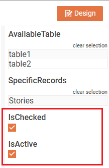
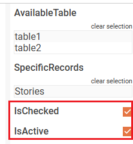
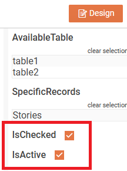
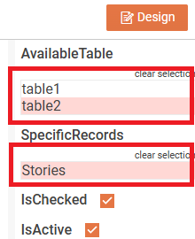
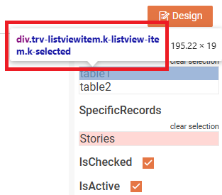

## Environment

| Version | Product | Author |  
| --- | --- | ---- |  
| 18.3.24.1112 | Telerik Web Report Designer |[Desislava Yordanova](https://www.telerik.com/blogs/author/desislava-yordanova)| 

## Description

Customizing the style of the report parameters area and highlighting selections can enhance the usability and visual appeal of the Web Report Designer. This article demonstrates how to adjust the layout of CheckBox parameters and apply a darker color to selected items in the parameters area.

This knowledge base article explains how to customize the parameters area in the [Web Report Designer]() using **CSS** and **JavaScript**.

## Solution

Let's start with a sample report that offers **IsActive** and **IsChecked** Boolean report parameters. They are presented as checkboxes in th Web Report Designer:

  

However, the checkmark is displayed below the header text. If you want to align horizontally the checkmark next to the text, it is necessary to:

1. Modify the **webReportDesigner.html** and insert the following JavaScript in the `<script type="text/javascript">` section. This script utilizes the `viewerInitializing` event to apply [CSS Flex Container](https://www.w3schools.com/css/css3_flexbox_container.asp) styling to CheckBox parameters.

The **viewerInitializing** event is used to add the reportViewerOptions.pageReady event handler that accesses the check boxes by using the style class ".trv-parameter-editor-boolean" and apply the CSS Flex Container: 

```javascript
<script type="text/javascript">
        function onViewerInitializing(e, args) {
            args.reportViewerOptions.pageReady = (e, args) => {   
                $(".trv-parameter-editor-boolean").parent().parent().parent().css("display", "flex"); 
            };
        }
        $(document).ready(function () {
 
            // For a complete overview over all the options used to initialize Web Report Designer, check:
            // https://docs.telerik.com/reporting/designing-reports/report-designer-tools/web-report-designer/web-report-designer-initialization
            $("#webReportDesigner").telerik_WebReportDesigner({
                toolboxArea: {
                    layout: "list" //Change to "grid" to display the contents of the Components area in a flow grid layout.
                },
                serviceUrl: "api/reportdesigner/",
                report: "Reportbool.trdp",
                viewerInitializing: onViewerInitializing,
                startMode: "design", // Change to "preview" to start the designer in a preview mode
            }).data("telerik_WebDesigner");
        });
</script>
```
Now, the checkmark is displayed on the same horizontal line: 

   

2. To bring the CheckBox closer to its header text, add the following CSS in the `<head>` of your HTML file for the Web Report Designer:

```css
<style>
    #webReportDesigner .trv-parameter-header {
        width: auto;
        margin-right: 15px;
    }
</style>
```

    

3. To highlight the selected listview items, extend the CSS style further:

```css
<style>
    #webReportDesigner .trv-parameter-header {
        width: auto;
        margin-right: 15px;
    }
    #webReportDesigner .trv-listviewitem.k-listview-item.k-selected {
        background-color: rgba(255, 99, 88, 0.25); /* Adjust the RGB color as desired */
    }
</style>
```

   

In order to identify the CSS class, feel free to inspect the respective HTML element on the page:

    

>note Replace `#webReportDesigner` with the actual ID of your Web Report Designer element if it differs.

These adjustments will improve the layout and visual feedback in the parameters area of the Web Report Designer. Inspect the HTML elements to identify specific CSS classes if further customization is needed.

## See Also

- [Web Report Designer Overview]()
- [Kendo Widgets Requirements](#kendo-widgets-requirements)
- [ViewerInitializing Event](#viewerinitializing)
- [PageReady Event]()
- [CSS Flexbox Container](https://www.w3schools.com/css/css3_flexbox_container.asp)
