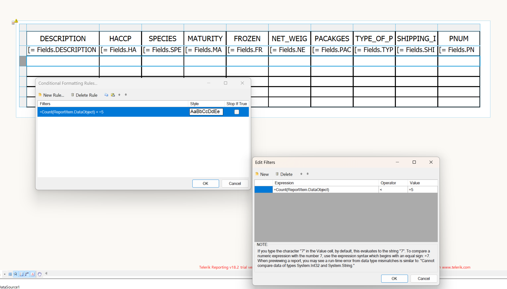

## Environment

<table>
  <tbody>
    <tr>
      <td>Product</td>
      <td>Progress® Telerik® Reporting</td>
    </tr>
  <tbody>
</table>

## Description

I need to output a fixed number of statement rows per page in a Telerik Reporting table. Specifically, I want to display 10 rows per page, even if the actual data contains fewer than 10 statement rows, ensuring the table frame always contains 10 rows. This KB article also answers the following questions:

- How can I ensure my Telerik Reporting table shows a set number of rows?
- Is it possible to display empty rows in a Telerik Reporting table when there's less data?
- Can I use conditional formatting to manage the row count in a Telerik Reporting table?

## Solution

To achieve a fixed number of detail lines in a Telerik Reporting table layout, follow these approaches:

### Solution 1: Using Dummy Rows with Conditional Formatting

1. **Add Dummy Rows**: Manually add five dummy rows to your table.
1. **Apply Conditional Formatting**: Use [conditional formatting]() to make the dummy rows invisible by default.
1. **Show Dummy Rows Based on Data Count**: Adjust the visibility conditionally based on the number of actual data entries. For example, if your dataset returns fewer than 10 rows, the conditional formatting will reveal enough dummy rows to ensure the table always displays 10 rows.

### Solution 2: Creating a Custom ObjectDataSource

1. **Create a Custom ObjectDataSource**: Implement a custom [ObjectDataSource]() that ensures your dataset always includes a minimum of 10 records. This might involve adding empty or placeholder records to the data returned by your data source.
1. **Bind to the Table**: Use this ObjectDataSource as the data source for your table in the report.

## Additional Resources

Download a [Sample Report](https://github.com/telerik/reporting-samples/blob/master/Sample%20Reports/MinTableRows.trdp) from our GitHub Reporting-Samples repository.
 
## See Also

* [Conditional Formatting]()
* [ObjectDataSource Component]()
