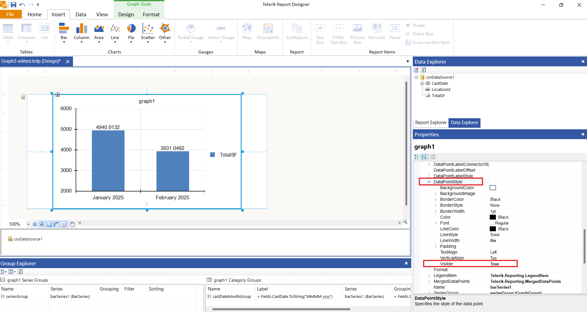
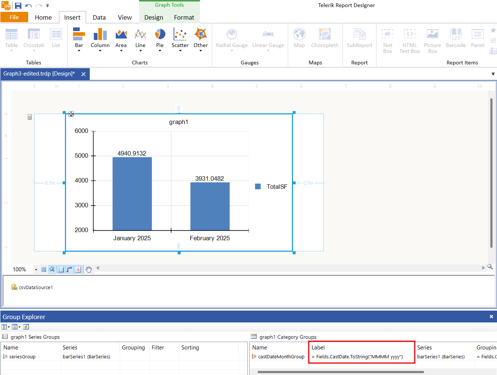

## Environment

<table>
   <tbody>
      <tr>
         <td> Product </td>
         <td> Reporting </td>
      </tr>
   </tbody>
</table>

## Description

I want to display the total for each month at the top of the column in a Column Chart and format the month and year at the bottom of the X-axis. I need steps to achieve this functionality.

## Solution

To display the monthly totals at the top of each column and format the X-axis dates:

1. Change the `DataPointStyle` property to make it visible. This ensures that the total values appear above the columns.

   

1. Use the `Label` property of the category group to format the month and year display on the X-axis. Set the property to the following expression:

   `= Fields.CastDate.ToString("MMMM yyyy")`

   

These steps ensure that the monthly totals appear at the top of each column and the X-axis displays the formatted month and year.

## See Also

* [Reporting Overview]()
* [Date and Time Functions Overview]()
* [Group Explorer of the Report Designer]() 
