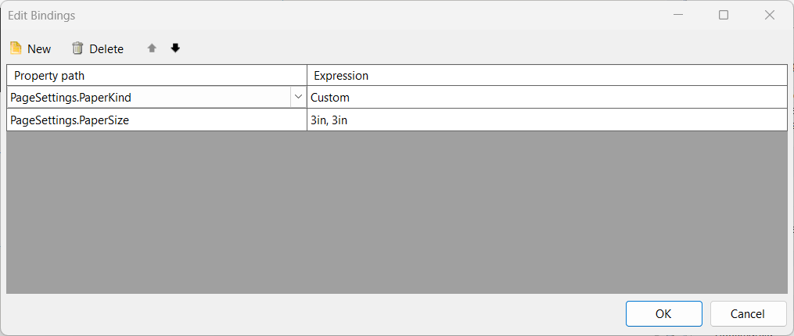

## Environment

<table>
    <tbody>
        <tr>
            <td>Product</td>
            <td>Reporting</td>
        </tr>
    </tbody>
</table>

## Description

I need to dynamically adjust the page size of a Telerik report based on a report parameter. I want to use a binding expression for `PageSettings.PageSize` without relying on an external function. I am looking for a solution where the page size can be dynamically controlled using expressions.

## Solution

To adjust the page size dynamically based on the report parameter, use a binding expression that passes the parameter value as a string. Follow these steps:

1. Ensure the report parameter, such as `sizeParameter`, is of type String.
1. Set up the binding expression for the `PageSettings.PageSize` property using the parameter value.

    

Or you can use an expression like below, but the parameter should be a String:

`= Parameters.sizeParameter.Value`

When this expression is used, the `PageSettings.PageSize` property will dynamically adjust based on the parameter values provided by the user.

## See Also

* [Using Expressions in Binding]()
* [Report Parameters Overview]()
