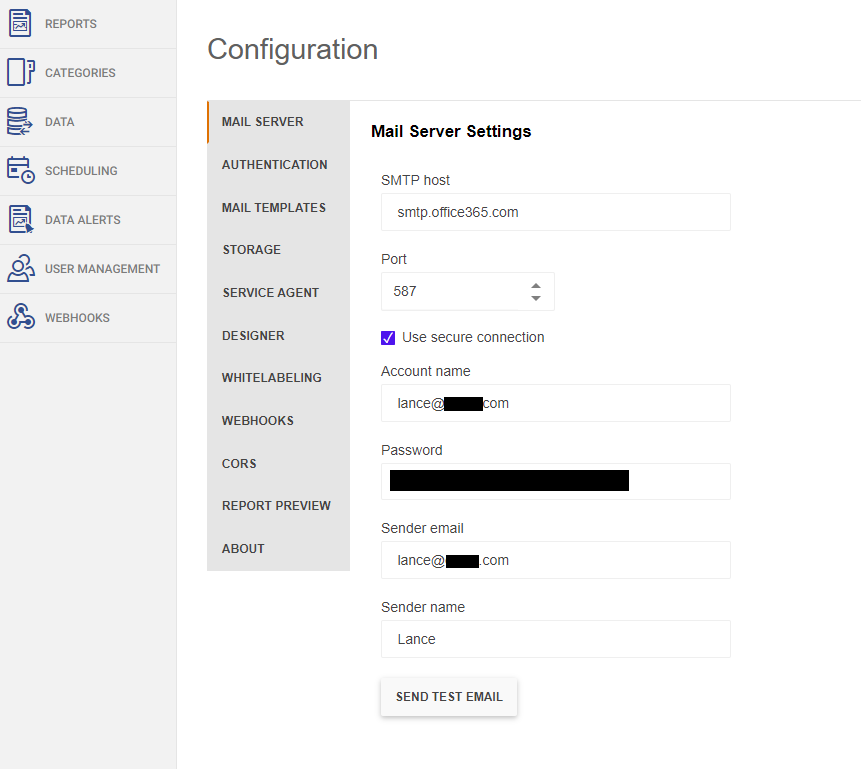

## Environment
<table>
	<tbody>
		<tr>
			<td>Product Version</td>
			<td>8.2.22.914</td>
		</tr>
		<tr>
			<td>Product</td>
			<td>Progress® Telerik® Report Server</td>
		</tr>
	</tbody>
</table>

## Description
This article explains how to configure the Mail Server settings of the Report Server. 

## Solution
The following steps describe how to implement the required configuration:
1. Go to the **Configuration** page of the Report Server.
2. Enter your email provider's SMTP address and Port Number.
   * For example `smtp.gmail.com` and Port `465` for Gmail or `smtp.office365.com` and Port `587` for Outlook.
3. If using an SSL connection, select **Use secure connection**.
4. For **Account Name**, enter the email being used to send the report.
5. For **Password**, use the password for the email account entered above. 
6. Enter the sender's email.
7. Enter the name of the sender.

## Notes
If the email service has two factor authentication, you may need to get an app specific password. More information on this can be found in [the Manage App Passwords | Microsoft article](https://support.microsoft.com/en-us/account-billing/manage-app-passwords-for-two-step-verification-d6dc8c6d-4bf7-4851-ad95-6d07799387e9).

