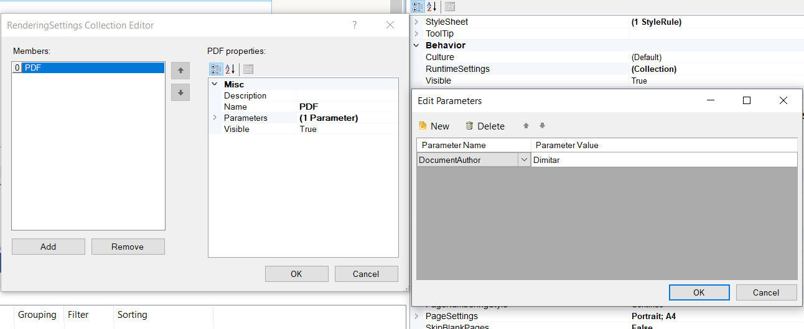

## Environment

<table>
	<tbody>
		<tr>
			<td>Product Version</td>
			<td>15.1.21.512 and higher</td>
		</tr>
		<tr>
			<td>Product</td>
			<td>Progress® Telerik® Reporting</td>
		</tr>
		<tr>
			<td>Rendering Format</td>
			<td>All</td>
		</tr>
	</tbody>
</table>


## Description

Starting with [Progress® Telerik® Reporting R2 2021 (15.1.21.512)](https://www.telerik.com/support/whats-new/reporting/release-history/progress-telerik-reporting-r2-2021-15-1-21-512), you can specify device information settings per particular report as part of its definition, configuring the [RuntimeSettings](/api/telerik.reporting.report#Telerik_Reporting_Report_RuntimeSettings) report property.

Besides setting the export parameters for particular extension, it allows hiding it and changing its description when listed to the end-user.

The property in question can be set up from the report designer tools as well as through code.

> For [Report Books]() only the RuntimeSettings of the first report will be respected.

## Solution

### Set the RuntimeSettings in the Report Designers



### Set the RuntimeSettings with code

````CSharp
Report report = new Report()

var pdfSettings = new RenderingSettings() { Name = "PDF" , Visible = false }; 
// Setting Visible to false of a rendering extension means that that rendering extension will not be visible in the export dropdown
// when the report is displayed in a report viewer.
pdfSettings.Parameters.Add(new Parameter() { Name = "DocumentAuthor", Value = "Dimitar" });
report.RuntimeSettings.Add(pdfSettings);
````

## Notes

When exporting a report programmatically, you may also provide it with specific to the report device information settings.

The respective method takes a [HashTable](https://learn.microsoft.com/en-us/dotnet/api/system.collections.hashtable?view=net-7.0) argument representing the desired export parameters for this particular rendering operation: [RenderReport](/api/telerik.reporting.processing.reportprocessor#Reporting_Processing_ReportProcessor_RenderReport_System_String_Telerik_Reporting_ReportSource_System_Collections_Hashtable_).

> The names of the properties in Device Information Settings are __Case-Sensitive__.

## See Also

* [extensions Element]()
* [How to limit export options in the report viewer]()
