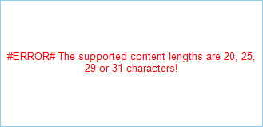

## Environment

<table>
	<tr>
		<td>Product</td>
		<td>Progress® Telerik® Reporting</td>
	</tr>
	<tr>
		<td>Report Items</td>
		<td>Barcode</td>
	</tr>
</table>

## Description

A descriptive error message is shown that the encoder requires a specific length for the barcode value. 

## Cause  

Some encoders, such as Intelligent Mail and PLANET, require the barcode values to have specific lengths. For the Intelligent Mail barcode the supported lengths are 20, 25, 29 or 31 characters. For the PLANET barcode the supported lengths are 11 or 13 characters. 

## Solution 

Satisfy the requirements of the encoder. 

