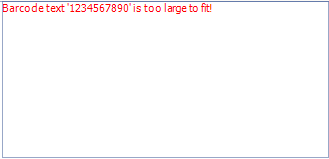

## Environment

<table>
	<tr>
		<td>Product</td>
		<td>Progress® Telerik® Reporting</td>
	</tr>
	<tr>
		<td>Report Items</td>
		<td>Barcode</td>
	</tr>
</table>

## Description

When `ShowText` is set to `true` and the size of the text exceeds the bounds of the Barcode item, an error message is rendered to indicate the problem.

## Solution 

To handle the issue, change the font size, pick another font or increase the size of the item. 

