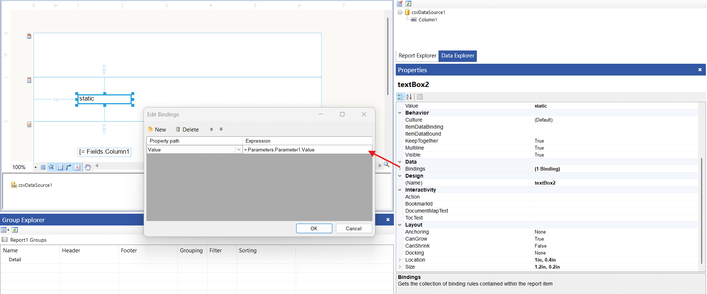

## Environment

<table>
    <tbody>
        <tr>
            <td>Product</td>
            <td>Progress® Telerik® Reporting</td>
        </tr>
        <tr>
            <td>Rendering Format</td>
            <td>CSV</td>
        </tr>
    </tbody>
</table>

## Description

I want to exclude the dynamic content of the [Report Header/Footer Section]() from appearing in the CSV export of a report in Telerik Reporting. 

Despite using the `NoStaticText = true` [CSV device info setting](), dynamic content from the report header section still appears in the CSV export. 

## Solution

To exclude dynamic content from the `reportHeaderSection` in CSV export, use one of the following methods:

### Method 1: Use Value Bindings

1. Configure the `NoStaticText = true` [CSV device info setting]().
1. For each `TextBox` in the `reportHeaderSection`, avoid direct expressions in the `Value` property.
1. Instead, use [bindings]() for the `Value` property. For example:

### Method 2: Use Curly Braces in Expressions

Replace the `=` symbol at the beginning of expressions with curly braces `{}`, or in other words - [embedded expressions](). For example: `Hi Mr. {Fields.LastName}, {Fields.FirstName}!`.

## See Also

* [Report Header and Footer Sections - Telerik Reporting]()
* [Configuring the CSV Rendering Extension]()
* [Bindings in Telerik Reporting]()
* [Device Information Settings for the CSV rendering format]()
