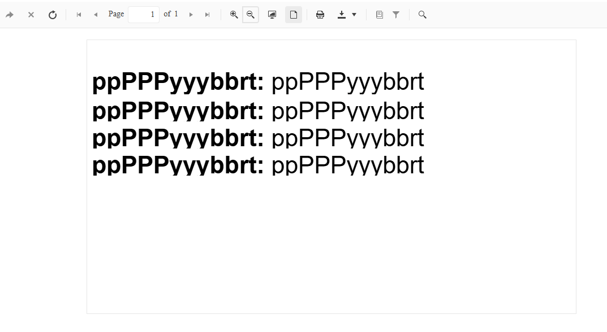
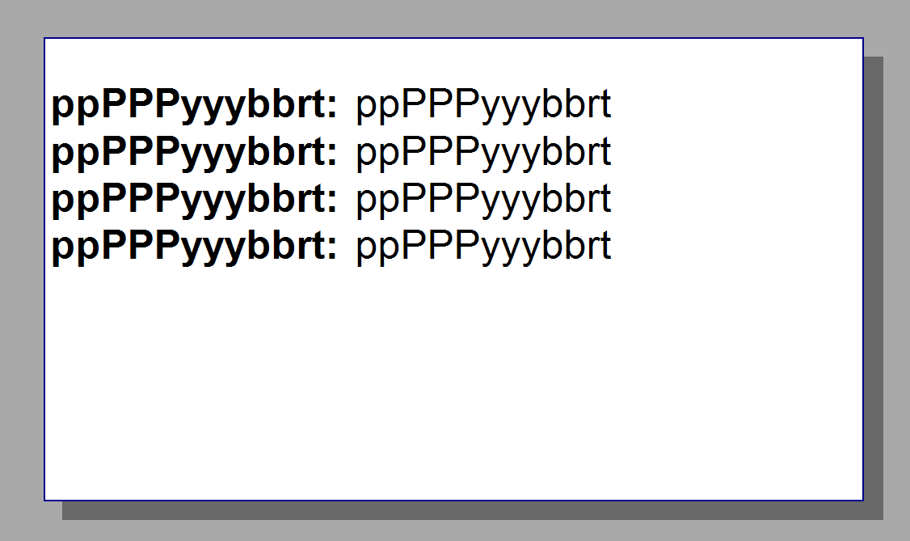

## Environment

<table>
    <tbody>
        <tr>
            <td> Product </td>
            <td> Reporting </td>
        </tr>
        <tr>
            <td> Version </td>
            <td> 19.1.25.716 </td>
        </tr>
    </tbody>
</table>

## Description

I noticed that some letters are cut off when viewing reports in the Web Report Viewer. The report displays correctly in the Standalone designer and when printed. Testing the issue in an empty project showed the same behavior, indicating it is not related to custom styling.

Web Report Viewer:

Standalone Designer:

## Solution

To resolve the issue, adjust the size and properties of the [TextBox]() controls in your report:

1. Increase the size of each `TextBox` element to ensure adequate space for text rendering.
1. Set the `CanShrink` property of each `TextBox` to `False`. This prevents the control from shrinking beyond the required dimensions for proper text display.
1. Switch the measurement units for your report to pixels (`px`) instead of millimeters (`mm`). Using pixels minimizes inaccuracies that can occur when switching between units.
1. Convert the `RowHeight` from millimeters to pixels using a unit-conversion tool like [Convert Millimeter to Pixel (X)](https://www.unitconverters.net/typography/millimeter-to-pixel-x.htm).

## See Also

* [TextBox Documentation]()
* [HTML5 Report Viewer Overview]()
