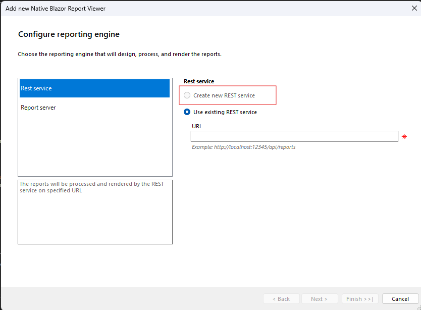

## Environment

<table>
    <tbody>
        <tr>
            <td> Product </td>
            <td>
                Reporting,  
                ReportViewer
            </td>
        </tr>
        <tr>
            <td> Version </td>
            <td> 19.1.25.716 </td>
        </tr>
    </tbody>
</table>

## Description

While adding the native ReportViewer to a Blazor WebAssembly project, the "Create new REST service" option is unavailable. This happens because Blazor WebAssembly operates strictly as a client-side application, running directly on the browser UI thread. As a result, the Reports Web Service cannot be hosted within the same project.

## Solution

To resolve this issue, host the Reporting REST Service in a separate project. Follow these steps:

1. Create a new ASP.NET Core project for the Reports Web Service.
1. Implement the Reporting REST Service in the new project using Minimal API. Refer to the article [Hosting the Reporting REST Service in ASP.NET Core with Minimal API]().
1. Integrate the separately hosted Reporting REST Service with your Blazor WebAssembly project.

## See Also

- [Hosting the Reporting REST Service in ASP.NET Core with Minimal API]()
- [Blazor WebAssembly vs. Server](https://docs.telerik.com/blazor-ui/introduction#blazor-webassembly-vs-server)
- [Embedding Reports in Applications]()
