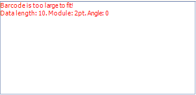

## Environment

<table>
	<tr>
		<td>Product</td>
		<td>Progress® Telerik® Reporting</td>
	</tr>
	<tr>
		<td>Report Items</td>
		<td>Barcode</td>
	</tr>
</table>

## Description

The generated barcode size is greater that the available size from the item and instead of the actual barcode, an error message is shown.

## Solution 

To work around this issue, increase the size of the Barcode item by setting the `Barcode.Stretch` property to `true` or by using a smaller value for the `Barcode.Module` property. 

  
