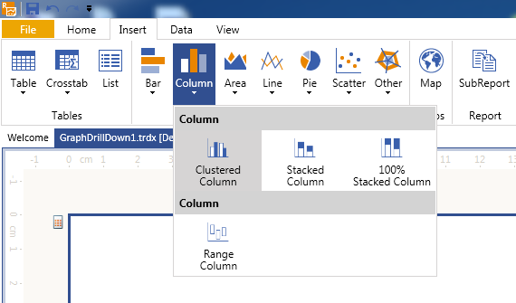
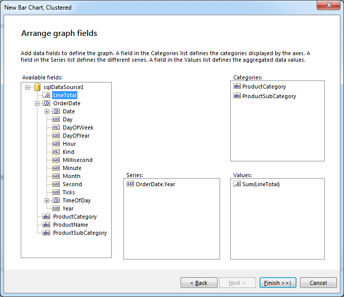
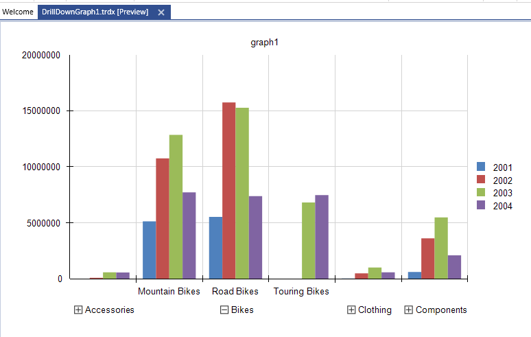

## Environment

<table>
	<tbody>
		<tr>
			<td>Product</td>
			<td>Progress® Telerik® Reporting Graph Report Item</td>
		</tr>
	</tbody>
</table>


## Description

How can I create a [Column chart]() and add [drill-down capabilities]() to its category groups by using the [Graph](/reporting/api/Telerik.Reporting.Graph) item and the [AdventureWorks](https://learn.microsoft.com/en-us/previous-versions/sql/sql-server-2008/ms124659(v=sql.100)) sample database? 

## Solution 

The demonstrated solution includes a chart that will display the amount of sales by product categories per year, and the attached drill-down actions provide a more detailed view over the sales, showing the subcategories for the selected product category. 

For the purposes of the suggested solution, use either the [Standalone Telerik Report Designer]() or the [integrated Visual Studio Report Designer](). 

1. Start the report designer and create a new report: 

	+ (Standalone Report Designer) **File** > **New** > **Blank Report** 
	+ (Visual Studio Report Designer) **File** > **New Project** > **Telerik Report Library {{site.suiteversion}}** > **Blank Report**. 

1. Add a new [SqlDataSource component](): 

	* (Standalone Report Designer) Double-click the SqlDataSource in the __Data tab__. 
	* (Visual Studio Report Designer) Double-click the SqlDataSource item in the VS Toolbox.

	As a result, the [SqlDataSource Wizard]() will start.

1. On the **Choose Data Connection** page, either select an existing connection to the __AdventureWorks__ database, or create a new one by specifying the SqlClient Data Provider and a valid connection string to an AdventureWorks database. 

	On the **Data Connection options** page, save the newly created connection string by name in the `CONFIG` file of the current project or embed it with all details in the `SqlDataSource.ConnectionString` property. 

	On the **Configure Data Source Command** page, paste the following SQL query in the **Select Statement** window: 

	````SQL
	SELECT
		PC.Name AS ProductCategory
		, PS.Name AS ProductSubCategory
		, P.Name AS ProductName
		, SOD.LineTotal
		, SOH.OrderDate
	FROM
		Production.Product AS P
	INNER JOIN 
		Production.ProductSubcategory AS PS
	INNER JOIN 
		Production.ProductCategory AS PC
	ON 
		PS.ProductCategoryID = PC.ProductCategoryID
	ON 
		P.ProductSubcategoryID = PS.ProductSubcategoryID
	INNER JOIN
		Sales.SalesOrderDetail AS SOD
	ON 
		P.ProductID = SOD.ProductID
	INNER JOIN 
		Sales.SalesOrderHeader AS SOH
	ON 
		SOD.SalesOrderID = SOH.SalesOrderID
	````

	Click **Next** and, then, the __Execute Query...__ button to make sure that everything is fine with your data connection and that the data is fetched from the database. Click __Finish__ when ready to close the SqlDataSource Wizard. 

1. Select the report in the Report Designer and increase its Width to `11in`. To provide more space for the content in the designed report, open the [**PageSettings** properties]() of the report and set the following configurations: 

	+ `Landscape` to `True`.

	+ `Margins` (`Top`, `Right`, `Bottom`, `Left`) to `0` (zero) units.

1. Now that the data source is configured, configure the Graph item and start the Graph wizard: 

	* (Standalone Report Designer) Select the **Detail** section of the report. From the **Insert** tab, click **Charts** > **Column** > **Clustered Column**.

	* (Visual Studio Report Designer) From the VS Toolbox, drag and drop the __Graph Wizard__ icon to the **Detail** section of the report. On the first page, select **Column** > **Clustered Column**. 

	

1. Select the data source previously created and click __Next__. 

	On the **Arrange graph fields** page, drag the __ProductCategory__ and __ProductSubCategory__ fields consecutively to the **Categories** box. The wizard will determine the master-detail relations between them and will automatically create the toggle visibility actions. 

	To display the sales amount by year, expand the __OrderDate__ field and drag its __Year__ field to the **Series** box. Then, drag the __LineTotal__ field to the **Values*** box where it will be displayed as __Sum(LineTotal)__ because __Sum()__ is the default aggregate function. 

	

1. Click __Finish__ to see the product categories of the Graph grouped by year. To increase its width for a better preview, click __Preview__ and click the toggle mark of the desired category to display its subcategories. 

	

1. To see the result from the Graph Wizard actions, examine the [`CategoryGroups`](/reporting/api/Telerik.Reporting.Graph#Telerik_Reporting_Graph_CategoryGroups) of the report item. 

	The Graph wizard has created a `CategoryGroup` instance for the product categories and has added a child group to it for the product subcategories (`CategoryGroups` > `ChildGroups`). 

	The wizard has also created a [`ToggleVisibilityAction`](/reporting/api/Telerik.Reporting.ToggleVisibilityAction) and set its  [`Targets`](/reporting/api/Telerik.Reporting.ToggleVisibilityAction#Telerik_Reporting_ToggleVisibilityAction_Targets) to the `ProductSubCategoryGroup` enabling you to show or hide this group by clicking the toggle mark of its parent. 

	Initially, the `ProductSubCategoryGroup.Visible` property is set to `false` to provide a more compact view. The expanded view of the `CategoryGroups` looks similar to the following image: 

	
